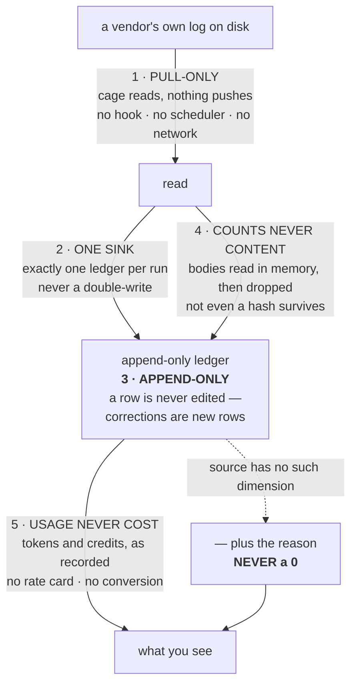

# ADR-LAWS — the five laws that bind every metered thing

---

## §1 · For humans

**In one line:** five rules decide what cage is allowed to record and print, and every
agent-specific decision is downstream of them.

They are not style. Each one was bought — usually by a failure that cost real time — and
each one closes off a shortcut that looks reasonable right up until it produces a number
nobody can defend.

### The five



<details><summary>Same diagram, ASCII</summary>

```text
   a vendor's own log on disk
        |
        |  1 . PULL-ONLY             cage reads; nothing pushes
        |                            no hook, no scheduler, no network
        v
      read
        |   \
        |    +-- 4 . COUNTS NEVER CONTENT   bodies read in memory, then dropped
        |                                   (not even a hash survives)
        |  2 . ONE SINK              exactly one ledger per run, never a double-write
        v
   +--------------------------------------------------+
   |  append-only ledger                               |
   |  3 . APPEND-ONLY   a row is never edited;         |
   |                    corrections are new rows       |
   +--------------------------------------------------+
        |                                    \
        |  5 . USAGE NEVER COST               +--- source has no such dimension
        |     tokens and credits, as recorded          |
        |     no rate card, no conversion              v
        |                                       "—" plus the reason, NEVER a 0
        v                                              |
   what you see  <----------------------------------- -+
```
</details>

### What each one is protecting you from

| law | the shortcut it forbids | what that shortcut would cost |
|---|---|---|
| **1 · Pull-only** | a hook or background agent that pushes usage as it happens | a wired-but-dead hook reads as *installed* while capturing nothing. One did, for **9 days**, with a green health check |
| **2 · One sink** | writing to both a project ledger and the global one | the same turn counted twice, invisibly, because both figures are individually correct |
| **3 · Append-only** | updating a row when a better number arrives | history stops being reproducible, and a crash mid-update loses both numbers |
| **4 · Counts, never content** | storing a hash of your code or prompts instead of the text | a hash set is a membership oracle — anyone holding it can test whether a given line was in your source |
| **5 · Usage, never cost** | multiplying tokens by a price to show dollars | a confident number nobody can check against an invoice, on a rate card the vendors have already moved away from |

### The principle underneath all five

> **Cage can never be more precise than its source.**

Where a source has no project, no session, no timestamp, or no token count, cage prints
`—` **with the reason** — never a `0`, and never a split it invented. A `0` asserts a
measurement that was never taken.

---

## §2 · For agents

### Context

- Cage's per-agent records ([ADR-CLAUDE](0004_claude.md) · [ADR-COPILOT](0005_copilot.md) ·
  [ADR-KIRO](0006_kiro.md) · [ADR-GRAPHIFY](0008_graphify.md)) each assume these five and
  restate none of them. Without a current-spec home, each record would either repeat them
  — four copies to drift — or cite a decision a reader cannot open as law.
- **The 2026-08-14 restructure created exactly that gap.** The eleven numeric ADRs were
  archived under a header that says *never cite anything here as current spec*. But the
  five laws' full reasoning and veto conditions lived **only** in those records. From that
  moment the sole current-spec statement of *counts, never content* was a one-line table
  row with no veto attached — while the code enforces it in four modules and a test.
- A law with no veto condition is not a law, it is a habit. The archived records had the
  vetoes; the table row did not carry them.

### Decision

**The five laws are stated here, in current spec, each with its ratification and its veto.
This record is the only place a law may be added, amended, or reversed.**

> **Archived records are named, never cited** (Arpit, 2026-08-14). Each law below names the
> archived ADR that ratified it, **without linking to it as backing**. An archived file is
> history: it may have been edited, rewritten or corrected since, so it can support nothing.
> The law as written here is the whole spec. Full rule: [work/archive/README.md](../../work/archive/README.md).

**Law 1 — Capture is pull-only.**
`cage import` and capture-on-read sweep each agent's on-disk log into the resolved ledger.
No hook writes usage — `cage setup --hooks` (L1) and `--skills` (L3) also wire surfaces,
but neither is a capture path — cage installs **no OS scheduler** (no
launchd/systemd/cron/schtasks, no `cage scheduler`), the capture and read paths touch
**no network**, and MCP is the only surface cage wires **by default**. Hands-off
automation is the user's *own* cron line calling
`cage import` — documented, never created by cage.
*Ratified as* archived ADR 0002 and 0003 — **named, not cited** (see *Archived records are named, never cited* below).

**Law 2 — One sink per run.**
Resolution is `--ledger`/`CAGE_BASE` → nearest project `.cage/` from cwd → global
`~/.cage` (`paths.resolve_root`). Exactly one active sink per run, never a double-write.
**`project` is a derived view, not a capture scope** — a `project` field stamped where the
log exposes a cwd, not a per-project ledger. Kiro's IDE log is the one routed exception,
and it is an *application* of this law rather than a hole in it: a source with no project
dimension is a machine fact ([ADR-KIRO](0006_kiro.md)).
*Ratified as* archived ADR 0002 — **named, not cited**.

**Law 3 — Append-only; no row is ever mutated.**
A cumulative source is reconciled with **delta rows**, never by rewriting the earlier row.
A number of a different *shape* gets its own row **kind**, decided on schema and never on
which vendor produced it. Ids carry the only entropy, so re-import dedupes and history
self-heals rather than double-counting.
*Ratified as* archived ADR 0004 — **named, not cited**.

**Law 4 — Counts, never content.**
Prompts, responses, diffs, tool commands and tool output may be read **transiently, in
process memory**, and must be dropped when the read ends. What persists is counts, ids and
opaque hashes of *content signatures* — never a body, and **never a hash of a source
line**, because a line hash is a membership oracle over the file. Ledger rows carry no
prompt text by construction. Each store's boundary is named in its own record; a new
exception is added **at the law it excepts**, or it becomes an unnoticed one.
*Ratified as* archived ADR 0008 and 0009 — **named, not cited**. The live homes of both
carve-outs are [ADR-AUTHORSHIP](0009_authorship.md) and [ADR-KIRO](0006_kiro.md).

**Law 5 — Usage, never cost.**
Cage records **two units — tokens and credits — both counts**, each read back verbatim
from the store that wrote it. Cage ships no price table and no rate card, and **converts
between nothing**: tokens↔credits↔currency, in any direction, is forbidden. Credits are
never summed or ranked **across agents** (`units.summable`) — a Copilot credit is GitHub's
tokens×rates figure and a Kiro credit is an AWS credit; they share a column heading and
nothing else. Savings are reported **gross**, and said to be gross.
*Ratified as* archived ADR 0011 — **named, not cited**.
*Enforced mechanically:* `tests/test_usage_only.py` AST-scans every module and fails the
suite on a returning currency identifier or a rendered `$N`.

**The principle underneath — cage can never be more precise than its source.**
Where a dimension does not exist in the source, cage renders `—` **with the reason**
(`units.ABSENT`, `ledger.ABSENT_SPINES`), never `0` and never an invented split. Two
absences that differ in *kind* — a vendor law versus a missing file — carry different
sentences, so a future agent cannot mistake the permanent one for a bug or the fixable one
for permanent.

### Laws that bind equally and are NOT restated here

These live in `CLAUDE.md`, which is current spec and always loaded. Naming them prevents a
reader concluding that a law absent from this record is a law that stopped applying:

- **Determinism** — no clocks or randomness in a derived view; same ledger + same policy ⇒
  same tables. The one admitted wall clock is the export run-stamp, and it is admitted on
  terms that leave the law intact: the stamp is never an input to a cell, and stdout stays
  clock-free by default.
- **`method` is sacred** — every cell is tagged; a reconstruction may never read as
  `measured`.
- **Fail-open on the write path** — `ledger.append` returns `False`, it never raises;
  metering never propagates an error into a request path. **Fail-open but never silent:**
  every swallow site logs under `CAGE_DEBUG`, and that is tested.
- **`$0` / stdlib only** — `dependencies = []`; ML is opt-in extras, never on the default
  path.

### Consequences

- **A per-agent ADR that restates a law is a bug**, not redundancy — it creates a second
  copy that can drift, and drift here is invisible until it produces a wrong number.
- Adding a metered thing means checking it against five laws **before** writing its record.
  Several plausible designs are ruled out at that gate rather than after implementation.
- The archive keeps the *arguments* — the alternatives weighed and why each lost. That is
  why the archived records remain worth reading even though they are not spec: this record
  states the verdicts, not the debates.
- Any exception to Law 4 must be written **at the law it excepts** (kiro's whitelist
  comment names its one carve-out inline). An exception recorded only in the feature that
  needed it is how a documented boundary becomes an undocumented one.

### Alternatives rejected

- **Leave the five as a table in `docs/adr/README.md`.** Lost on the veto: an index row can
  carry a claim but not the numbered trigger that reopens it, so the laws would have been
  unreopenable-by-measurement — the exact failure the veto device exists to prevent.
- **Amend the archive header to make five records "still spec".** Lost on the split it
  creates: readers would need to know *which* archived records are law and which are
  history, and that distinction is invisible from a file listing.
- **Restate each law in each per-agent ADR.** Lost on drift — four copies, four
  update-rules, and no way to tell which one is current when they disagree.
- **Fold the laws into `CLAUDE.md` instead.** Lost on audience and on format: CLAUDE.md is
  an always-loaded contract with no veto sections, and it is already the home for the four
  invariants named above. The laws that were *ratified by ADR* keep their ADR lineage.
- **One ADR per law (five records).** Lost on the point of the restructure: the set is
  small and readable because it maps to things cage meters, plus this one record for what
  binds them all.

### Reference

- Each law cites the archived record that ratified it, above. Those records carry the
  measurements — the 9-day silent-capture failure behind Law 1, Copilot session `8073abba`
  (70,071 + 37,510 → 227,298) behind Law 3, the membership-oracle argument behind Law 4,
  and the CLAUDE-DEDUP 2.00× measurement behind Law 5.
- The gap this record closes was created by the ADR restructure of the same day
  (`CHANGELOG.md`, v0.50.0) — the laws' reasoning moved into a tree that must not be cited
  as spec, and nothing carried it forward.

### Veto condition (when to revisit)

**1 · Falsifiable triggers, numbered.**

1. **Law 1 (pull-only) reopens on a named latency figure** — a workflow where a read must
   reflect a turn that a capture-on-read sweep has not yet picked up, *and* the staleness
   is shown to matter (e.g. "a live dashboard needs sub-`N`-second freshness that
   capture-on-read cannot meet"). It returns as a **new, additive** surface, never by
   resurrecting the removed hook machinery, and it may **not** fail open to `exit 0` in a
   way `cage doctor` reports as healthy. **"No OS scheduler" is not covered by this
   trigger** — see invariants.
2. **Law 3 reopens only on a measured non-monotonic cumulative source** — one that rewrites
   an earlier figure *downward*, so the delta goes negative and the reset rule misreads it.
   **Name the session and the two figures.** Lands in the affected parser, never a storage
   redesign.
3. **Law 5 reopens only on a source, never an argument** — a provider exposing a
   per-request **billed amount** cage can read from a store it already parses, on **≥ 80%
   of its rows**, measured on a real install and written up in `work/research/` before any
   code moves. It lands as an additive optional field plus one rendered column — **not** a
   price table, **not** a rate config, **not** a `prices` command group. Below 80% the
   column would be mostly `—`, which is worse than no column.

**2 · Contingent vs. invariant.**

- **Contingent (auto-revisits on the evidence above):** whether a real-time capture surface
  exists at all (Law 1); which sources are cumulative (Law 3); whether cage displays a
  currency figure (Law 5).
- **Invariant — moves only by ratified reversal of this record:**
  - **cage installs no OS scheduler.** Not volume-gated. A product value.
  - **No ledger row is ever mutated.**
  - **No body, and no line hash, is ever persisted.** Not performance-gated, not
    volume-gated — it is why the authorship feature is allowed to exist at all.
  - **No conversion between units, in any direction.** No measurement makes arithmetic
    valid that would invent a unit; the cross-agent credit law is the same statement.
  - **Absence renders `—` with a reason, never `0`.**
  - **A reconstruction is never tagged `measured`.**

**3 · Deliberately not taken.**

- **A sixth law for determinism and the method law.** They bind equally and are listed
  above, but their home is `CLAUDE.md` and duplicating them here would violate the
  single-home discipline this record exists to enforce. **Threshold to reconsider:** either
  one acquires a genuine veto condition — a named measurement that would justify relaxing
  it — at which point it needs the ADR format and moves here.
- **A user-supplied rate applied locally and labelled `modeled`** (Law 5). Declined, not
  dogmatically rejected: a user asserting their own contract is honest in a way a shipped
  rate card is not. Not taken because it reintroduces the whole pricing surface — a ladder,
  a config section, an UNPRICED refusal, a per-view basis split — to serve a number only
  its author can check. **Threshold:** more than one user asks for it *by name*, and it
  lands as a display multiplier over an existing recorded count, never as a second pricing
  basis a total can silently span.
