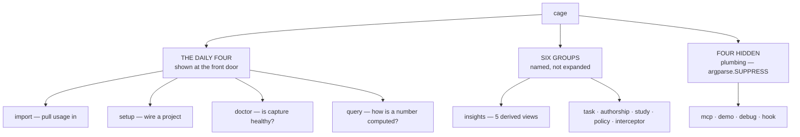

# ADR-CLI — the command surface, and what it deliberately does not offer

> The five laws in [ADR-LAWS](0001_laws.md) bind this record already and are **not**
> restated here. Cite this record in prose as its NAME, never by number.

**Why this is an ADR and not a manual.** It is both, and the pairing is the point: a
command surface is a series of decisions — what is a daily verb, what hides in a group,
what was removed and what its user is told instead — and a reference that drifts from
those decisions is worse than none. §2 is the complete reference **and** the evidence for
§1's claims, kept true by a test rather than by discipline.

---

## §1 · For humans

**In one line:** four verbs do the daily work, five groups hold everything else, and the
front door shows you the four rather than all twenty-seven.

### The shape of the surface



<details><summary>Same diagram, ASCII</summary>

```text
   cage
    |
    |-- THE DAILY FOUR  (shown at the front door)
    |     import   pull usage in
    |     setup    wire a project
    |     doctor   is capture healthy?
    |     query    how is a number computed?
    |
    |-- SIX GROUPS  (named, not expanded)
    |     insights  5 derived views
    |     task | authorship | study | policy | interceptor
    |
    +-- FOUR HIDDEN  (plumbing; argparse.SUPPRESS)
          mcp | demo | debug | hook
```
</details>

### What to reach for

| you want to | run |
|---|---|
| record what your agents used | `cage import` |
| see which conversation spent the tokens | `cage insights chats` |
| make a project metered | `cage setup` |
| find out why a number looks wrong | `cage doctor` |
| understand how any number is computed | `cage query <topic>` |

### Two things the surface deliberately does not do

- **It does not price anything.** There is no `roi`, no `budget`, no `verdict`, no
  `prices`. Those commands existed and were deleted; running one prints a direction
  rather than a bare error. See [ADR-LAWS](0001_laws.md), Law 5.
- **It does not run in the background.** No scheduler is installed, ever. `cage import`
  is a thing you run, or that a read triggers — not a daemon. See ADR-LAWS, Law 1.

### The one rule that keeps this page honest

Every command and flag named below **must exist in the parser**, and every command and
flag the parser knows **must appear below**. A rename that misses this page turns the
test suite red — so if you are reading it, it is true.

---

## §2 · For agents — the complete reference

**Every `cage` command in one place.** 14 top-level entries — 4 daily verbs, 6 groups,
4 hidden plumbing commands — resolving to **28 addressable commands**. The front door
(`cage --help`) shows only the curated four plus the group names; this section is the
whole surface.

This record is **checked against the live parser** by
[`tests/test_cli_reference.py`](../../tests/test_cli_reference.py) — every command and
flag named here must exist, and every command and flag the parser knows must appear
here. A rename that misses this record turns the suite red. See
[Maintaining this record](#maintaining-this-record).

---

## Conventions

- **`cage <group> <command>`** — the four real subparser groups (`insights`, `task`,
  `authorship`, `data`) accept `--help` at both levels.
- **`cage <group> <action>`** — `prices`, `study` and `policy` take their action as a
  **positional choice**, not a subparser, so their `--help` is the group's, not the
  action's. See [Known gaps](#known-gaps).
- **No argparse abbreviation.** Shortening `report` to `rep` is an error, not a
  prefix match.
- **Exit codes:** `0` ok · `1` error (`error: <msg>`; full traceback only under
  `CAGE_DEBUG=1`) · `2` argparse usage · `130` interrupt. `cage authorship verify` is
  report-only and **always exits 0**, and so is every `cage hook` event — the budget
  block that once returned `2` went with the money subsystem (ADR 0011). **`cage hook`
  is the one verb that does NOT exit `2` on a usage error**: to the HOST, `2` already
  means *block the tool call*, so an argparse failure exits `0` with the fix on stderr
  (see the `hook` section).
- **Two error regimes, never mixed.** Write paths are fail-open (return `False`,
  swallow, never raise into a request). Only the read/CLI boundary raises.

### Capture-on-read flags

Every read view takes these three, so they are documented once here rather than
repeated in each table:

| Flag | Meaning |
|---|---|
| `--no-import` | skip the capture-on-read pre-sweep for this read |
| `--quiet` | silence capture confirmations (or set `CAGE_QUIET=1`) |
| `--why-ledger` | print which ledger resolved and why (to stderr) |

They are global too, so `cage --no-import insights chats` works. `cage study export`
carries `--no-import` with a *different* meaning — it skips the bundle's own
import-first refresh and bundles the ledger exactly as-is.

### Export flags

Every `cage insights` view plus the two other report-shaped views —
`cage authorship summary` and `cage study report` — take these two, so
they are documented once here rather than repeated in each table
([`cage/viewexport.py`](../../cage/viewexport.py), `cage query view-export`):

| Flag | Meaning |
|---|---|
| `--export [PATH]` | write this view to disk. Bare = `<ledger>/.cage/output/<view>-<stamp>/` holding every format the view has; `PATH.txt` / `.md` / `.csv` / `.json` = exactly that file; any other `PATH` = a per-run folder under it |
| `--stamp` | prepend the generated-at metadata block to **stdout** too |

Three rules make this safe to rely on:

- **`--export` never changes stdout.** The view prints byte-for-byte what it would
  have printed without the flag; the write confirmation goes to stderr. Pinned by
  [`tests/test_view_export.py`](../../tests/test_view_export.py).
- **Every artifact carries the stamp; stdout does not unless you ask.** Mandatory in a
  file (a number with no as-of outlives its terminal), optional on a terminal. Set
  `CAGE_RUN_STAMP` to pin the clock for a byte-reproducible artifact.
- **`--csv` and `--json` are unchanged**, on stdout *and* to a path — a `--csv PATH` is
  a stream redirected to a file, `--export` is an artifact, and only the artifact grows
  the block.

A format the view cannot produce (`--export x.csv` on a view with no CSV renderer) is
a refusal, not an empty file. Bare `cage` (the headline) has **no** `--export`: a
root-level optional-value flag would swallow the following subcommand. `.cage/output/`
is deliberately not `.cage/out/` (which was the deleted local server's docroot — the
separation is kept so a future server could not publish exported artifacts), and no
cleanup class prunes it: cage never deletes an artifact it wrote.

---

## Global

`cage` with no command prints the headline.

| Flag | Meaning |
|---|---|
| `--version` | print the version (labels `(zipapp)` when run from `cage.pyz`) |
| `--json` | machine-readable output (bare `cage`: the headline dict) |
| `--ledger DIR` | use this cage base dir as the active ledger, overriding project/global resolution (the `.cage`-equivalent holding `ledger/`, `state/` and the policy file) |
| `--help` | the curated front door |
| `--no-import` · `--quiet` · `--why-ledger` | see [Capture-on-read flags](#capture-on-read-flags) |

Ledger resolution order: `--ledger` / `CAGE_BASE` → project `.cage/` → global
`~/.cage`. `cage --why-ledger` prints which won and why.

---

## Daily verbs

### `cage import`

Pull every agent's usage into the resolved ledger. Idempotent and incremental (a
per-agent high-water cursor). Works with no hooks and no project.

| Argument / flag | Meaning |
|---|---|
| `BUNDLE …` | study bundle zip(s) from `cage study export` — merged by row identity, idempotent (plan §4.9) |
| `--agent {claude,copilot,kiro,all}` | which agent to meter (default: `all`) |
| `--path PATH` | a transcript file or dir to scan (log-bearing agents only) |
| `--project PROJECT` | restrict to one repo's sessions (Claude only) |
| `--since WINDOW` | only transcripts modified within a window like `7d` / `24h` / `2w` |
| `--rescan-graphify` | re-run graphify savings detection over every matched log, ignoring the incremental cursor |
| `--rescan-metrics` | re-parse every matched log into `ledger/{claude,copilot,kiro}/`, ignoring the incremental cursor |

`--rescan-graphify` is a **backfill**, and it exists because the cursor is right for
calls and wrong for savings: an unchanged log is skipped, so a graphify route that ships
*after* a session was ingested can never see that session again. Detection only — it
re-ingests no call or credit rows — and idempotent by receipt id, so re-running it files
nothing the second time. Use it once after upgrading into a release that adds a route
(v0.47 added copilot VS Code and kiro CLI).

`--rescan-metrics` is the same backfill for the **per-agent metric ledgers**, and it
exists for the same reason one level over: the three metric kinds ride the calls sweep's
cursor-filtered file list, so every store ingested before those routes shipped is skipped
forever (METRICS-CURSOR-BLIND). Metrics only — no call or credit re-ingest — idempotent by
row id, and it deliberately **advances no cursor**, so a backfill of one kind can never
blind another. Use it once after upgrading into v0.50. It always prints what it added,
per kind, **including when that is nothing** — a silently-skipped store and an empty one
are the confusion the flag exists to end; verify with `cage doctor`'s
`claude-metrics` / `copilot-metrics` / `kiro-metrics` lines.

Kiro's IDE log is a machine fact, not a project fact, so those rows route to `~/.cage`
even during a project sweep
([ADR-KIRO](0005_kiro.md)); the summary
line names the sink, and a total never includes a row that landed elsewhere.

### `cage setup`

Scaffold `.cage/` and wire agents. Idempotent and byte-identical across machines — two
teammates running it must not churn a committed diff.

| Flag | Meaning |
|---|---|
| `--claude` · `--copilot` · `--kiro` | set up that agent |
| `--all` | set up all three agents |
| `--project-only` | scaffold `.cage/` + graphify + PATH only; skip MCP wiring |
| `--wire-only` | wire agent(s) only; skip scaffold and graphify |
| `--status` | report which agents are wired (no changes) |
| `--global` | initialize the global ledger (`~/.cage`) for project-less capture, then exit |
| `--no-project` | skip the per-project `.cage/` scaffold + MCP wiring |
| `--no-graphify` | skip the graphify interceptor |
| `--python-launcher` | persist `[wiring] python_launcher = true` and wire everything via `python3 -m cage` / `py -3 -m cage` — no exe probed or executed (`cage query restricted-env`) |
| `--hooks` | also wire the opt-in **L1** lifecycle hooks (agent identity at capture, auto task-close, budget blocking). OFF by default; re-running without it **removes** them. CLI sessions only — hooks do not fire under a VS Code extension |
| `--skills` | also install the opt-in **L3** skills — one source text delivered as a Claude skill, a Copilot prompt and a Kiro steering doc. OFF by default; re-running without it removes them |
| `--no-hooks` | explicitly assert the hookless floor (the default) — for a script that wants to state the intent rather than rely on it |
| `--sync-sources` | refresh the cage-managed `[sources]` block in `cage.toml` from the built-in defaults, preserving user-added entries; run after upgrading cage |

The agent surface is a four-layer ladder — **L0** hookless (this is cage, never
optional) → **L1** `--hooks` → **L2** MCP (wired by default) → **L3** `--skills`.
Adding or removing any layer changes **no number**; `tests/test_floor.py` proves it.

### `cage doctor`

Is capture healthy? Never sweeps — it diagnoses.

| Flag | Meaning |
|---|---|
| `--json` | machine-readable output |
| `--bundle [PATH]` | write one redacted diagnostics archive (counts-never-content): doctor output, path probe, debug log + heartbeats, version/platform, footprint paths + row counts, policy provenance, cursor state |
| `--paths` | read-only path probe: every candidate log location per agent on this OS — found/missing, files matched, parseable rows, cursor state, and why a location missed (writes nothing) |
| `--wiring` | installed-artifact inventory: every wired file (project + global/user), its status (`current`/`stale`/`dead`/`foreign`), and a per-agent fully/partially/not-wired verdict (read-only) |

### `cage query`

Ask cage how any number or mechanism works. Stdlib token-overlap matching over a
curated registry — **no LLM, no network**. No match ⇒ it suggests the closest ids
rather than guessing.

| Argument / flag | Meaning |
|---|---|
| `question` | a question in prose, or an exact topic id |
| `--list` | list every explainer topic |
| `--kind {calculation,concept}` | filter `--list` to one kind |
| `--all` | show the top matches, not just the best |
| `--json` | machine-readable output |

---

## `cage insights` — 5 derived views

| Command | What it answers |
|---|---|
| `cage insights chats` | per-chat detail: tokens/credits by `(agent, surface, session)`, titled where the store has a title (local-only by construction — no team view) |
| `cage insights graphify` | per-chat graphify usage & GROSS saving: recorded tokens · the without-graphify counterfactual · `saved%` (tokens only) |
| `cage insights commits` | one row per commit: tokens, human hours, and the `agent / human~ / unattr / unkn` line split. **No USD on this surface, by design** (the v1 veto, kept) |
| `cage insights commit SHA` | one commit in detail: tokens · origin + confidence · the four line buckets · suggested-vs-kept counts · per-file table · wall/agent/human time |
| `cage insights why CALL_ID` | full provenance: a call + every receipt against it |

Flags, beyond the [capture-on-read three](#capture-on-read-flags) and the
[export two](#export-flags) — **every view in this group takes `--export`/`--stamp`**
([`tests/test_view_export.py`](../../tests/test_view_export.py) gates the fan-out, so a
new insight cannot ship un-exportable):

| Command | Flags |
|---|---|
| `cage insights chats` | `--since WINDOW` · `--agent {claude,copilot,kiro,all}` · `--all` (every chat; default is top 20 by `tokens_in`) · `--json` · `--csv [PATH]` |
| `cage insights graphify` | `--since WINDOW` · `--agent {claude,copilot,kiro,all}` · `--all` (every receipt-bearing chat; default is top 20 by `saved`) · `--all-chats` (include chats with no graphify receipts too) · `--json` · `--csv [PATH]` |
| `cage insights commits` | `--since WINDOW` · `--all` (every commit; default is the 20 newest) · `--json` · `--csv [PATH]` |
| `cage insights commit SHA` | positional `SHA` (short or full) · `--files` (every file; default is the 8 largest) · `--json` · `--csv [PATH]` |
| `cage insights why CALL_ID` | positional `CALL_ID` · `--json` |

Savings printed here are **GROSS** — `raw_alternative − actual`, excluding the cost of
*using* the tool. The word `gross` appears on every surface that prints the number;
`cage query gross-vs-net` explains why.

`commits` / `commit` carry **no dollar figure at all** — not gated, absent. They are
the rebuilt agent-vs-human axis (v1 died pricing an inferred gap), so tokens and hours
are the whole vocabulary; valuation stays in your spreadsheet. A commit with no
joinable call renders `—`, never `0`: *nothing joined here* and *this cost nothing* are
different claims. See `cage query agent-authorship`.

**Twelve views were removed in v0.50 (SURFACE-CUT)** — `attrib`, `adoption`, `compare`,
`estimate`, `calibration` here, plus the top-level report verb and the whole `data`
group. See
[Removed and renamed verbs](#removed-and-renamed-verbs). Capture is unchanged: every
row those views read is still recorded.

---

## `cage task` — 3 commands

| Command | What it does | Flags |
|---|---|---|
| `cage task outcome TASK` | close a task with its outcome (`ok` by default) | `--redo` (mark as needing a redo) · `--label WORD` (one short token: letters/digits/`._-`, ≤32 chars, recorded on the task row; its readers went in v0.50 — never a path or free text) |
| `cage task time DURATION` | attest how long **you** spent on a task — `45m` · `2h` · `1h30m` · a bare number of minutes. Written as `human_minutes` + `human_minutes_method = "attested"` | `--task ID` (default: the most recent) |

`cage task time` is the **only** unmarked human number cage will ever print: it always
outranks the wall-clock estimator in `cage insights commits` (rendered `*`, versus the
estimator's `~`), and **no rate, hourly figure or dollar amount is derived from it,
anywhere** — that pairing is what killed the v1 axis. Parsing is strict, not fail-open
(a typo is refused, never silently a different number), and `0` is rejected because the
absence of an attestation already means unknown.

`cage task outcome` is the **task-close verb** the whole cost-impact surface
(compare / estimate / calibration / net savings) depends on. It is also the single
write tool exposed over MCP (`cage_task_outcome`), through the same code path — so the
label guard cannot be laxer on the agent-facing side.

---

## `cage authorship` — 5 commands

Who wrote which files in which commit (plan §3.5). Its own closed enums, separate from
the ledger's: `method ∈ {hooked, transcript, heuristic}`, `origin ∈ {human, agent,
agent-autonomous, unknown}`.

| Command | What it does | Flags |
|---|---|---|
| `cage authorship origin SHA` | authorship attribution for a commit | `--attest {human,agent,agent-autonomous}` (record a human-triage attestation) · `--agent NAME` (attach to `--attest`) · `--json` |
| `cage authorship summary` | how much of this repo's history cage can speak to at all — **unknown-rate first**, then the recorded rows by agent/method and the suggested-vs-kept counts | `--since WINDOW` · `--json` · `--csv [PATH]` |
| `cage authorship verify` | report-only consistency check over the provenance ledger — **never fails the build, always exits 0** | — |
| `cage authorship notes-sync` | merge the buffered provenance into `refs/notes/cage-provenance` | `--write` (push; default is dry-run unless `CAGE_NOTES_WRITE=1`) · `--json` |

`origin = "human"` is reachable **only** via explicit attestation, and is always paired
with `method = "heuristic"` (enforced at construction). `unknown` is a read-time
default, never a written row. Automated rows are written by the **import sweep**
(`cage/authorcapture.py`, [ADR-AUTHORSHIP](0009_authorship.md)),
gated by its own consent switch `[authorship] capture` / `CAGE_AUTHORSHIP` — this is
the one path that reads your diffs, and that is a different permission from metering
spend. Both sync commands are **CI-sole-writer**: a dev machine
defaults to a dry-run print.

---

## `cage study` — 6 actions

The P5 fleet study (plan §4.9). Opaque random machine id, **opt-in by enrollment** — an
unenrolled ledger stamps nothing and stays byte-identical to legacy.

| Action | What it does |
|---|---|
| `cage study join PHASE` | enroll this machine: wire + start + doctor |
| `cage study start PHASE` | switch phase (one short token) |
| `cage study stop` | end the current phase |
| `cage study report` | coverage first, then the paired delta — the **only** study action that is a rendered view, and so the only one carrying `--csv`/`--export`/`--stamp`. A marker verb does not have those flags at all (argparse usage error, exit 2); it used to reach them from the group and refuse at runtime |
| `cage study export [PATH]` | write the one-file fleet bundle (rows + phase markers + a counts-only manifest) for the analyst. **The bundle's only route since v0.50** — it lived on the deleted data-export verb's study flag. Stays jsonl: it is the one export that is also an *import* source (`cage import bundle*.zip`), which is why it carries no CSV or OTel form |
| `cage study id` | print the opaque machine id (never a hostname) |

Flags: `--json` on every action; `--csv [PATH]` · `--export [PATH]` · `--stamp` on
`report` only; `--since WINDOW` and the [capture-on-read three](#capture-on-read-flags)
on `export` (its `--no-import` skips the bundle's own import-first refresh). Bare `cage study` prints the action list. The sample unit is the
**machine-day**; the paired
delta is `estimated` with a work-mix caveat, gated on `MIN_COMPARE_N`
machines-with-both-phases.

---

## `cage policy` — 2 actions

| Action | What it does |
|---|---|
| `cage policy diff` | dry-run categorized view (add / update / keep / orphan) |
| `cage policy sync` | the same view; `--apply` writes |

| Flag | Owner |
|---|---|
| `--apply` | `sync` — write adds/updates and stamp `[meta] policy_version`. **Not a flag on `diff`** (CLI-GAPS(b)): passing it there is an argparse usage error, not a runtime refusal |
| `--yes SECTION.KEY` | `sync` — confirm one non-reconstructable row (repeatable; `all` confirms every one shown) |
| `--json` | every action |

Customized values are never modified and orphans never deleted. **Nothing ever
auto-applies this** — hints recommend, humans run.

---

## `cage interceptor` — 1 command

The **machine door** a tool interceptor calls. Not a human verb — but **visible**, not
`argparse.SUPPRESS`, and that is the decision worth recording: its predecessor — the
`graphify` leaf of the `data` group — was deleted wholesale by SURFACE-CUT (v0.50) while
both interceptor twins went on probing it, so every `cage setup` after that shipped a shim
that could never meter, on every OS, for every agent. **A verb the shims depend on is a
contract, and a hidden contract is the F1 class.**

| Action | What it does |
|---|---|
| `cage interceptor graphify` | run a third-party `graphify` and file one savings receipt — invoked by `bin/graphify`, never typed |

| Flag | Owner |
|---|---|
| `--task ID` | `graphify` — task id to bind the saving to (default: the project dir name) |
| `argv` | `graphify` — positional `REMAINDER`: `-- <REAL-graphify> <query\|path\|explain> …` |

Named `interceptor`, not `graphify`, on purpose: [ADR-GRAPHIFY](0007_graphify.md) §2
designates its behaviour contract *"the template every future tool interceptor copies"*,
so a second tool lands as a sibling leaf here with no restructuring.

**Machine doors move in; human-read surfaces stay put.** Deliberately **not** under this
group: `cage insights graphify` · `cage query graphify-shims` / `graphify-coverage` ·
doctor's five graphify checks · `cage import --rescan-graphify`. Moving the doctor checks
in particular would re-introduce F1 by reorganisation — they are what caught this bug.

---

## Hidden plumbing

Callable but deliberately absent from `cage --help`.

| Command | What it does | Flags |
|---|---|---|
| `cage mcp` | run the MCP server over stdio — 9 read tools + exactly one write tool (`cage_task_outcome`). Wired automatically by `cage setup` | — |
| `cage demo` | seed the plan §4.4 worked example into the ledger | — |
| `cage debug` | tail the metadata-only debug log (`CAGE_DEBUG=1` to populate) | `--tail N` (default 20) · `--json` (one JSON event per line) |
| `cage hook EVENT` | the opt-in **L1** lifecycle entry point, invoked by wired agents, not by hand | positional `EVENT ∈ {session-start, session-end, tool}` · `--agent NAME` (required — stamped, never inferred) · `--session ID` · `--command CMD` (hashed for attestation, never stored) |

`cage hook` is **fail-open absolute, and now unconditionally**: every event exits `0`,
on any internal failure and otherwise. The budget block was the only non-zero this verb
ever returned, and it went with the money subsystem (ADR 0011).

**That absoluteness extends to the argparse boundary, and it is the reason `hook` is
exempt from the usual exit `2`.** Exit `2` is the block verdict, wired to
`PreToolUse`/`Bash` — so an unknown event name (what a rename against stale committed
wiring produces) would otherwise block **every** Bash call in the session, silently: a
blocked tool call reads as the agent refusing, not as cage failing. Instead cage exits
`0` and prints the live event list plus `cage setup --hooks` on stderr. The direction
is derived from the accepted events, never a hand-kept map of old spellings — the same
reason `wiringscan` detects against the live parser.

---

## Examples — one per command

**All 28 addressable commands, each with a runnable line.** Examples are inline code
spans, not fenced blocks, **on purpose**: `tests/test_cli_reference.py` skips fences (a
diagram is an illustration, not a citation), so an example inside one would be invisible
to the gate — and a documented example naming a dead verb is the F1 failure class in its
most convincing disguise. Written this way, every line below is checked to parse and
every flag it names is checked to exist.

### The daily four

| command | example | what it does |
|---|---|---|
| import | `cage import` | sweep every agent's on-disk log into the resolved ledger |
| import | `cage import --agent claude --since 7d` | one agent, only logs touched in the last week |
| import | `cage import --rescan-metrics` | re-parse every matched log into the per-agent metric ledgers, ignoring cursors |
| setup | `cage setup --all` | scaffold `.cage/`, wire MCP for all three agents, install the graphify interceptor |
| setup | `cage setup --global` | initialize `~/.cage` so a project-less agent still captures |
| setup | `cage setup --status` | report which agents are wired, changing nothing |
| doctor | `cage doctor` | is capture actually working here? |
| doctor | `cage doctor --paths` | read-only probe of every candidate log location on this OS |
| doctor | `cage doctor --bundle` | one redacted diagnostics archive, counts-never-content |
| query | `cage query --list` | every topic the explainer can answer |
| query | `cage query agent-authorship` | how a single number is computed, with live values |

### `cage insights` — the five derived views

| command | example | what it does |
|---|---|---|
| chats | `cage insights chats` | one row per chat — which conversation used the tokens |
| chats | `cage insights chats --agent claude --since 30d --csv` | one agent, one window, machine-readable |
| graphify | `cage insights graphify --all-chats` | per-chat graphify savings, including chats with no receipt |
| commits | `cage insights commits --since 14d` | agent-vs-human authorship per commit |
| commit | `cage insights commit HEAD --files` | one commit, broken down file by file |
| why | `cage insights why c_01J2X` | full provenance for one call: the call plus every receipt against it |

### `cage task` · `cage authorship` · `cage study` · `cage policy`

| command | example | what it does |
|---|---|---|
| task outcome | `cage task outcome t_0042 --label refactor` | close a task as `ok` with a one-token label |
| task outcome | `cage task outcome t_0042 --redo` | close it as needing another pass |
| task time | `cage task time 45m --task t_0042` | attest how long **you** spent — an attestation, never a measurement |
| authorship origin | `cage authorship origin HEAD` | who wrote which lines in this commit |
| authorship origin | `cage authorship origin HEAD --attest human` | assert human authorship where cage cannot observe it |
| authorship summary | `cage authorship summary --since 90d` | how much of this history cage can speak to at all |
| authorship verify | `cage authorship verify` | report-only consistency check; always exits 0, never a CI gate |
| authorship notes-sync | `cage authorship notes-sync` | dry-run print of what would merge into `refs/notes/cage-provenance` |
| authorship notes-sync | `cage authorship notes-sync --write` | the CI-only write (`CAGE_NOTES_WRITE=1`) |
| study start | `cage study start` | record the phase marker that opens a fleet-study window |
| study stop | `cage study stop` | close it |
| study id | `cage study id` | this machine's opaque study id |
| study join | `cage study join` | enroll this machine — until then it stamps nothing |
| study export | `cage study export` | write the one-file bundle for merging elsewhere |
| study report | `cage study report --csv` | coverage first, then the paired delta |
| policy diff | `cage policy diff` | what this project's `cage.toml` has that the bundled defaults do not |
| policy sync | `cage policy sync --apply` | write the adds/updates (comment-preserving, never a whole-file rewrite) |

### `cage interceptor`

| command | example | what it does |
|---|---|---|
| interceptor graphify | `cage interceptor graphify -- graphify query "auth flow"` | runs the real graphify unchanged, files one savings receipt |

### Hidden plumbing

Not shown at the front door, and listed here because undocumented surface is worse than
unadvertised surface.

| command | example | what it does |
|---|---|---|
| mcp | `cage mcp` | run the MCP server on stdio — how an agent reads cage |
| demo | `cage demo` | seed the plan's worked example and print it |
| debug | `cage debug --tail 50` | tail the metadata-only debug log (`CAGE_DEBUG=1` to populate) |
| hook | `cage hook SessionEnd --agent claude` | the opt-in L1 entry point, invoked by a wired agent; **every event exits 0** |

---

## Removed and renamed verbs

Every old spelling below still **prints a direction and exits 1** rather than failing
silently — the map is [`cage/verbmap.py`](../../cage/verbmap.py) `REMOVED`. Renaming or
removing a top-level verb is a **wiring migration**, not just a CLI change: add the
entry to `verbmap`, update this file, then sweep every wire module, `install.sh`,
`justfile` and `tools/dummyrepo`.

| Old spelling | Now |
|---|---|
| `init` | `cage setup` |
| `import-claude` | `cage import` with `--agent claude` |
| `why` | the same name under `cage insights` |
| `report` · `attrib` · `adoption` · `compare` · `estimate` · `calibration` | **removed outright in v0.50** (SURFACE-CUT) — the ledger rollup and the task-comparison family. Capture is unchanged; the surviving reads are per chat and per commit |
| `matrix` · `roi` · `verdict` · `budget` · `forecast` · `regression` · `recommend` · `prices` · `quality` | **removed outright in v0.51** with the money subsystem ([ADR-LAWS](0001_laws.md) Law 5) |
| `outcome` · `quality` | the same name under `cage task` |
| `origin` · `verify` · `notes-sync` | the same name under `cage authorship` |
| `ledger-sync` | **removed outright in v0.50** — the team-view flag it fed was its only reader, so the ref could be written and never displayed |
| `export` · `cleanup` · `watch` · `serve` · `proxy` · `meter` · `graphify` | **removed outright in v0.50** — the whole `data` group. Capture is pull-based: use `cage import`. The fleet bundle moved to `cage study export` |
| `human` · `human-record` · `trend` | **removed outright** — the Tier-1 human axis was amputated in v0.36 and does not return without a proposal doc |
| `hook-session-start` · `hook-stop` · `hook-session-end` · `hook-post-tool-use` · `hook-post-commit` · `hook-prepare-commit-msg` | **removed outright** — replaced by the single `cage hook EVENT` |

---

## Known gaps

Recorded here rather than quietly worked around; tracked in [OPEN-WORK.md](../../work/OPEN-WORK.md).

**None open.** Both entries that stood here are closed:

1. ~~`data migrate-savings` missing from the front door~~ — fixed 2026-08-03
   (CLI-GAPS(a)) by listing the whole group; the group itself was deleted in v0.50. The
   front door stays gated bidirectionally against the live parser, which is what makes
   a deletion this size safe.
2. ~~`prices`/`study`/`policy` take their action as a positional choice~~ — converted to
   real subparsers 2026-08-11 (CLI-GAPS(b)). Each action now owns its `--help` and its
   own flags, so an inapplicable flag is an argparse usage error (exit 2) instead of a
   flat union plus a runtime refusal. Every group in cage now behaves the same way.

---

## Maintaining this record

**Trigger: any change to the CLI surface** — a new command, a renamed or removed verb,
an added or dropped flag, or a changed choice list. Update this record *in that same
change*, and bump its row in [DOC-REGISTRY.md](../../work/DOC-REGISTRY.md).

The gate is [`tests/test_cli_reference.py`](../../tests/test_cli_reference.py), which is
**bidirectional** against `cli.build_parser()`:

- every leaf command the parser knows appears here (no silently undocumented surface);
- every command path named in a code span here resolves in the parser (no dead verbs in
  prose — the F1 failure class, in documentation form);
- every long flag named here exists somewhere in the parser, and every flag the parser
  knows is named here — except the three shared capture-on-read flags, declared once
  above;
- a flag that exists on exactly **one** command must be documented in that command's
  section, so a shared vocabulary can't paper over a misfiled flag.

A doc that only *promises* to stay current is the class of doc this repo has already
watched go stale twice. This one fails the suite instead.
