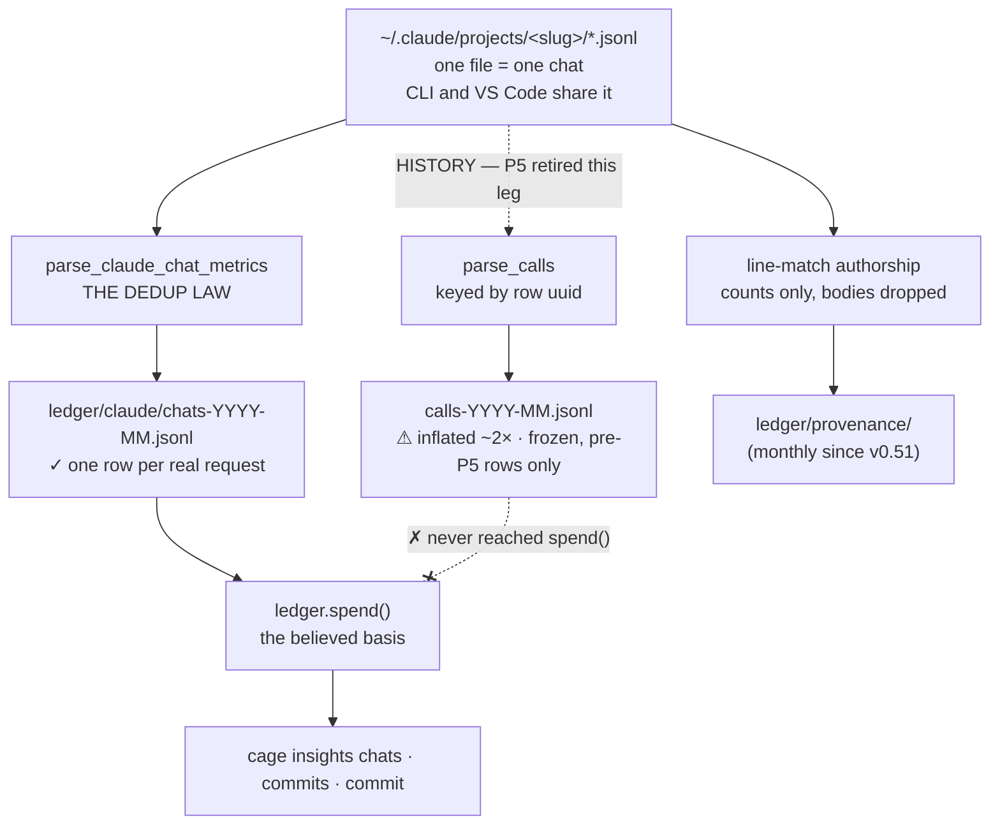

# ADR-CLAUDE — Claude Code is metered from its own transcripts, folded once per request

> The five laws in [ADR-LAWS](0001_laws.md) bind this record already and are **not**
> restated here. Cite this record in prose as its NAME, never by number.

---

## §1 · For humans

**In one line:** Claude Code writes every conversation to disk; cage reads those files,
counts each API request **exactly once**, and reports tokens — never dollars.

The one thing worth knowing: the same request appears in the transcript **two to three
times**. Cage's original reader counted all of them and was inflating Claude by **2.00×**.
The reader that replaced it folds the duplicates away. Both readers still run; only the
folded one is believed.

### For the meeting

> Absorbed from `docs/claude-capture.md`, which is removed.

- We meter Claude from **Claude Code's own transcript records** — on-disk, no vendor API,
  no network, zero infra cost. Tokens are the vendor's numbers, recorded verbatim.
- Per chat we can state tokens in/out **and both cache directions**, plus the cache-write
  TTL split, thinking share, server-tool counts, and subagent attribution — correctly
  folded, one row per real API request.
- **Honesty flag, scoped:** the original `calls` surface still carries a double-count
  defect that inflates Claude token figures ~2×. It no longer feeds any number anyone
  sees; the corrected ledger is immune to it **by construction**, not by patching.
- **No billed unit exists for Claude.** Subscriptions meter by 5-hour/7-day rate-limit
  windows, not per-chat credits, and nothing billed reaches disk.
- **The vendor deletes its own records after ~30 days** — cage's capture is the durable
  history, regular import is the whole defence, and `cage doctor` nudges before the window
  closes.

### The flow



<details><summary>Same diagram, ASCII</summary>

```text
  ~/.claude/projects/<slug>/*.jsonl        (one file = one chat; CLI + VS Code share it)
        |
        |-- parse_calls .... HISTORY — P5 retired this leg ---> calls-YYYY-MM.jsonl
        |                                                        (!) inflated ~2x, frozen
        |                                                            |
        |                                                            X  never reached spend()
        |
        |-- parse_claude_chat_metrics ... THE DEDUP LAW ---> ledger/claude/chats-*.jsonl
        |                                                        (v) one row per request
        |                                                            |
        |                                                        ledger.spend()
        |                                                            |
        |                                      cage insights chats | commits | commit
        |
        +-- line-match authorship ....... counts only ------> ledger/provenance/
                                          (bodies dropped)
```
</details>

### What we can say, and how much to trust it

| number | where it comes from | trust |
|---|---|---|
| tokens in / out, per chat | the transcript's own `usage` block, folded per request | vendor-recorded |
| cache read / cache write | same block — Claude persists both directions | vendor-recorded |
| cache-write 5-minute vs 1-hour split | same block | vendor-recorded |
| thinking tokens, web search / fetch counts | same block | vendor-recorded |
| subagent share of a chat | subagent rows, joined back to the parent chat | vendor-recorded |
| project name | the working directory on the row, **basename only** | derived by cage |
| how much the reader was inflating | duplicate rows seen vs. real requests | derived by cage |
| agent-vs-human authorship (see [ADR-AUTHORSHIP](0009_authorship.md)) | exact line match against the commit's added lines | derived by cage |
| **credits** | — | **absent: Claude Code records no credit unit on disk** |
| **dollars** | — | **absent by decision: cage measures usage, never cost** |

### What we can't say, and why

- **There is no billed number for Claude anywhere on disk.** Subscriptions meter by
  5-hour and 7-day rate-limit windows, not per-chat credits. That is a vendor fact, not
  a cage gap — and it is why no dollar figure exists here at all.
- **Claude Code deletes its own transcripts after ~30 days.** Cage's copy is the durable
  history; running `cage import` regularly is the entire defence. `cage doctor` nudges
  once the newest transcript passes 25 days.
- **Human authorship is never measured, only inferred as a leftover.** It prints as
  `human~` — the tilde is the point. Lines nothing proposed print as `unattributed`.
- **Repeated edits to one file depress the authorship match rate** (only the final state
  gets committed). Measured at 44.3% repo-wide. That is the honest shape, not a miss.

---

## §2 · For agents

### Context

- **One store, two readers, two answers.** `transcript.parse_calls` keys on the row
  `uuid`; every duplicate assistant row becomes a `calls` row.
  `transcript.parse_claude_chat_metrics` folds on `(requestId, message.id)`, last
  occurrence wins. Over a full matched window (2026-07-12 → 2026-08-14) the two disagreed
  by exactly **2.00×** — 43,973 `calls` rows against 21,955 folded requests. **The folded
  count is the correct one.**
- Two `calls`-path defects produced that gap and are still open **in `parse_calls`**:
  **CLAUDE-DEDUP** (duplicate assistant rows counted) and **CLAUDE-SUBAGENT-KEY** (a
  subagent transcript's rows keyed by filename, landing spend in a phantom chat).
- `calls` could not be repaired into metric rows retroactively: the vendor fields were
  never captured then, and fabricating them violates counts-never-content. Past ~30 days
  the source transcripts are gone regardless.
- **CORRECTED 2026-08-14 — this record used to say Claude is the *only* agent whose store
  carries the text of a proposed edit. That was false.** Copilot's CLI `events.jsonl` and
  VS Code `chatSessions` both carry it, and cage already opens both files every sweep;
  kiro's IDE execution logs carry the before *and* after text. Claude is the only agent
  with a **parser**, which is a gap and not a law. The evidence, the per-store confidence
  and the build order now live in [ADR-AUTHORSHIP](0009_authorship.md); the claim is
  recorded here because this is where a reader met it for six weeks.

### Decision

> **⟲ The authorship buffer is month-partitioned (P3c, v0.51).** The note that
> recorded the reversal — and enumerated all five readers that must span shards —
> moved to [ADR-AUTHORSHIP](0009_authorship.md) *Consequences* on 2026-08-14 with
> `provenance`'s ownership. It is not restated here.


**Claude's spend resolves from `ledger/claude/` for all of history. `calls` is retained,
never mutated, and is not a spend source.** Authorship — *measured on the agent only, in
counts, with human as a labelled residual* — is [ADR-AUTHORSHIP](0009_authorship.md)'s
decision as of 2026-08-14, and is stated there rather than restated here.

- **THE DEDUP LAW.** A request is `(requestId, message.id)`; the last occurrence wins.
  `tokens_in = input_tokens + cache_read_input_tokens + cache_creation_input_tokens`.
  Every fold is recorded alongside its own evidence: `raw_rows` (usage-bearing rows seen)
  against `requests` (distinct folded requests). The inflation is a captured number, not
  a claim.
- **The spine is the `request` grain, never the chat grain.** `SPEND_SOURCES["claude"] =
  ("request",)`. The chat-grain row is a whole-life total for the *same* traffic; adding
  it would double every chat. This is the point-in-time-never-cumulative rule.
- **`metric_id` folds the chat's recorded values into a sha1 and deliberately excludes
  `ts`** — a data-derived timestamp would fork the id on wall-clock noise. A grown chat
  appends a fresh row; an unchanged one dedupes. `ledger.claude_metrics` resolves the
  latest per session at read time.
- **Sidechains join to the parent chat by the row's own `sessionId`**, never by filename.
  `sidechain_tokens_in`/`_out` split it out without removing it from the chat total.
- **`calls` keeps two jobs and only two:** the one-constant rollback path, and
  `ledger.join_table`'s resolution of a receipt's `call` id. It is a lookup table, never
  a sum source.
- **Chat titles are labels, never facts.** The `summary` record lands as a name in
  `imports.jsonl` and is joined at render time. It never becomes a row field.
- **The claude leg of authorship is `transcript.parse_edits` and nothing else.** What the
  matcher does with those edits, what is persisted, how the buckets render and which
  agents are covered are all [ADR-AUTHORSHIP](0009_authorship.md)'s — including the five
  persisted integers, the `(ts_{i-1}, ts_i]` window, the `human~`/`unattributed`/`unknown`
  ladder, and the separate `[authorship] capture` permission. **Do not restate them
  here**: two copies of a rule drift, and this pair already drifted once.
- **No credit unit exists**: `units.ABSENT["claude"][CREDITS]` renders `—` with *"Claude
  Code records no credit unit on disk"*. Never a `0`.

> **⟲ The transcript→`calls` leg is RETIRED (P5, v0.51).**
> `ledger/claude/` has been the spend basis for all of history since METRICS-PRIMARY, so
> the `calls` row was a **second, inflated copy of the same traffic that no view resolved
> from** — measured at **1.979× on rows and 1.881× on tokens** over one sweep of the real
> store ([cross-check](../../work/regression/2026-08-14-calls-vs-metric-crosscheck.md)).
> Verified after the change on the same store: 22,802 claude rows in `spend`, and **zero**
> claude rows in `calls`.
>
> **`transcript.parse_calls` and `_usage_to_row` are KEPT and UNTOUCHED**, reachable only
> through `importcmd._PARSERS` as the `[sources.<name>] format` custom-source contract
> (deleting them breaks user config silently). **CLAUDE-DEDUP and CLAUDE-SUBAGENT-KEY are
> therefore not fixed and never will be here** — this record forbids repairing them on the
> way out, because the measurement has to outlive the code. A custom source declaring
> `format = "claude"` inherits both, which [ADR-CONSUMERS](0006_consumer.md) states
> outright so its author does not have to discover it.
>
> **Four things had to move with the leg, and each was a silent failure if missed:** the
> capture manifest (built from the retired leg's rows — every new chat would have lost its
> title), the cursor (`_ingest_claude_metrics` had none; it rode this leg's, and without it
> every sweep re-reads every transcript forever), gate 3 / doctor health (`calls`-based —
> a healthy install would report *never captured*), and the `[sources] surface` restamp.

### Consequences

- Claude spend post-flip is **~2× lower** than the pre-metric `calls` history, and that is
  the correction landing, not a regression. Pre-metric `calls` rows resolve to nothing in
  every derived view; they are never deleted.
- **CLAUDE-DEDUP and CLAUDE-SUBAGENT-KEY are closed for every number anyone sees**, and
  still open in `parse_calls`. That quarantine is deliberate: fixing the parser would
  rewrite what history recorded. A future agent must not "finish the job" by patching
  `parse_calls` — the defects are contained, not pending.
- **Metric rows carry no `task`**, so task-grouped analysis sees zero for claude. Filed as
  **TASK-GRAIN-SPINE** — a real gap, not a design choice.
- **Metric stores carry no route field**, so a route breakdown collapses to `chat`.
  `_spend_row` defaults rather than inventing one.
- The authorship agent share can only be **under**-counted. Inflation would require a
  human to type a ≥4-character line byte-identical to an agent proposal, in a file that
  same session proposed in, in that same commit. The safe direction is the one it fails in.
- Capture stays dual-write, so the flip remains a one-constant rollback rather than a
  data-loss event.

### Capture reference — store → property → row

> Absorbed from `docs/claude-capture.md`, which is removed. **One transcript file = one
> chat**; the CLI and the VS Code extension share the store. Capture is pull-based
> (`cage import` / capture-on-read) — no hooks, no network, `$0`. Counts-never-content:
> usage numbers and ids only; never prompts, responses, or `tool-results/`.

**`calls` rows** — the original path, retained, no longer a spend source:

| number | store → property | lands as |
|---|---|---|
| tokens in (total) | `~/.claude/projects/<slug>/**/*.jsonl` → assistant rows' `message.usage`: `input_tokens` + `cache_read_input_tokens` + `cache_creation_input_tokens` | `calls.tokens_in` (`c_`+uuid, agent `claude-code`) |
| tokens out | same row → `output_tokens` | `calls.tokens_out` |
| cached in (read) | same row → `cache_read_input_tokens` | `calls.cached_in` |
| cached out (write) | same row → `cache_creation_input_tokens` | `calls.cache_write_in` — Claude persists this; Copilot doesn't |
| project | row envelope `cwd` (basename only) | `calls.project` |
| chat title | `summary` record | `imports.jsonl` name only — never a call row |

**`.cage/ledger/claude/chats-YYYY-MM.jsonl`** — one row per chat, folded correctly at
capture, deliberately kept OUT of `calls` so it can't inherit that path's defects:

| number | store → property | lands as |
|---|---|---|
| tokens in/out (deduped) | THE DEDUP LAW folds every duplicate assistant row per `(requestId, message.id)`, last occurrence wins | `claude/*.tokens_in` / `tokens_out` — NOT inflated |
| cache-write TTL split | `cache_creation.ephemeral_5m_input_tokens` / `ephemeral_1h_input_tokens` | `ttl_5m` / `ttl_1h` |
| thinking tokens | `output_tokens_details.thinking_tokens` | `thinking` |
| server-tool calls | `server_tool_use.web_search_requests` / `web_fetch_requests` | `web_search` / `web_fetch` |
| sidechain (subagent) split | `isSidechain` rows, joined to the PARENT chat via the row's own `sessionId` | `sidechain_tokens_in` / `sidechain_tokens_out` |
| inflation evidence | usage-bearing rows seen vs. distinct folded requests | `raw_rows` / `requests` |
| per-model breakdown | `message.model` on each folded row | `model_totals` |

Parsers: `transcript.parse_calls` · `transcript.parse_claude_chat_metrics`
(via `_fold_claude_chat`) · `transcript.parse_provenance` / `parse_edits` (authorship).
Reader: `ledger.claude_metrics` (latest per session) / `claude_metrics_raw`.
Ingest: `importcmd._ingest_claude_metrics`, own kind `"claude"`, own id namespace `clm_`.
Health: `cage doctor`'s `claude-metrics` check reports raw vs. collapsed row counts and
nudges when the newest transcript is >25 days old.

### Known gaps and defects (open)

- **CLAUDE-DEDUP** *(calls path only)* — `calls` keys by row `uuid` and counts every
  duplicate assistant row; that surface stays inflated ~2–3× (3.17× measured live, 2.00×
  over the full matched window). Dodged by construction in the metric ledger; **not fixed
  in `parse_calls`, and deliberately so.**
- **CLAUDE-SUBAGENT-KEY** *(calls path only)* — `calls` keys a subagent transcript's rows
  by filename, landing their spend in a phantom chat. Also dodged, not fixed.
- **Credits: none exist** — no credit unit for Claude Code anywhere on disk. Subscription
  quota is a rate-limit window, not a per-chat spend meter. Permanently honest-absent;
  **not a cage gap.** Claude Code also **stopped writing `costUSD` in v1.0.9**, so nothing
  billed is on disk in any form — which is why no dollar figure for Claude was ever an
  invoice, even before the money subsystem was deleted.
- **30-day retention** — Claude Code auto-deletes transcripts (`cleanupPeriodDays`,
  default 30); import cadence must beat it.
- **TASK-GRAIN-SPINE** — metric rows carry no `task`, so task-grouped analysis sees zero
  for claude. A real gap, not a design choice; tracked in `work/OPEN-WORK.md`.
- **No read surface yet for `.cage/ledger/claude/`** beyond the spine — a per-chat view of
  the TTL split, thinking share and subagent columns is parked in `work/OPEN-WORK.md`,
  not built.

### Alternatives rejected

- **Fix `parse_calls` and keep one row kind.** Lost on history: the corrected parser would
  re-derive six months of rows that were recorded under the old law, and the source
  transcripts are gone past ~30 days. The two kinds are the honest record of both.
- **Migrate `calls` history into metric rows.** Impossible without fabricating vendor
  fields that were never captured.
- **Stop writing `calls`.** Removes the rollback path and breaks `join_table`'s receipt
  resolution, for no gain.
- **Include the chat-grain row in the spine** — doubles every chat; the two grains are
  overlapping views of the same traffic.
- **Persist line hashes instead of bodies** — lost on PII, not on cost. A hash set is a
  membership oracle. *Counts* has to mean counts.
- **Resolve edits against `HEAD` at import time** — lost on correctness; it makes
  attribution a function of when the sweep ran.
- **A single `human` bucket.** On cage's own repo it printed **human~ 76.6%**, 89% of it
  one commit of generated JSON. A residual presented as a finding is exactly the mistake
  that got the v1 human axis amputated.
- **Fuzzy / similarity line matching** — lost on the method law: a similarity threshold is
  a tunable that silently moves the headline.

### Reference

- **The 2.00× measurement**, full matched window, 43,973 `calls` rows vs 21,955 requests:
  [work/regression/2026-08-14-calls-vs-metric-crosscheck.md](../../work/regression/2026-08-14-calls-vs-metric-crosscheck.md).
  *(Re-pointed 2026-08-14: this cited archived ADRs 0010 and 0011, which under
  **named-never-cited** back nothing. The live measurement doc is the grounding.)*
- **Authorship, measured on cage's own 103-commit repo against 81 real transcripts** —
  68.7% verbatim match inside proposed files, the gate sweep, and the rejected
  single-bucket split:
  [work/regression/2026-08-02-p1-authorship-dogfood.md](../../work/regression/2026-08-02-p1-authorship-dogfood.md).
- **The autopsy this record answers to** — the v0.36 human-axis removal, whose handoff is
  archived and therefore **named, not cited**. What survives of it is the `human~` residual
  rule, which lives in [ADR-AUTHORSHIP](0009_authorship.md) and is grounded there.
- The per-chat fetch spec:
  [work/research/2026-08-13-claude-per-chat-usage-fetch-spec.md](../../work/research/2026-08-13-claude-per-chat-usage-fetch-spec.md).
- Ratified as archived ADRs 0008 (authorship) and 0010 (the spine) — **named, not cited**.
  Their live homes are [ADR-AUTHORSHIP](0009_authorship.md) and this record's own §2.

### Veto condition (when to revisit)

**1 · Falsifiable triggers, numbered.**

1. **The dual write ends** only after **one full retention window (~30 days) of clean
   metric capture with zero gaps** — measured from `cage doctor`'s per-source lines, not
   asserted. Not before 2026-09-13, and then only with the gap count at literal zero.
   Lands in `importcmd`, not in a storage redesign.
2. **The exact matcher** reopens if a dogfood run over **≥50 commits** shows the verbatim
   match rate inside *proposed files* below **40%** (68.7% today). Only with that number.
   The change lands in `linematch.match_file` alone — windows, buckets and the PII line
   are out of scope for that revisit.
3. **`MIN_MATCH_CHARS = 4`** reopens if a measured sweep shows the gate moving the match
   rate by more than **2 points** between 3 and 6 (today: 0.1 points). A gate that steers
   the headline is a tuning knob, and a tuning knob must not be a constant.
4. **Patch-id chasing** across rewritten history reopens only if dangling shas exceed
   **10%** of attributed commits on a real repo.

**2 · Contingent vs. invariant.**

- **Contingent (auto-revisits on evidence):** whether `parse_calls` is retired; the
  matcher and its gate; which grains `SPEND_SOURCES["claude"]` names; whether a `task`
  grain becomes capturable (TASK-GRAIN-SPINE).
- **Invariant (moves only by ratified reversal of this ADR):** **no ledger row is ever
  mutated**; **no line body and no line hash is ever persisted**; **`human` is never
  written without an attestation**; **unknown is never redistributed**; **no USD, rate,
  or valuation on any surface built from these rows**; a spine source is **point-in-time,
  never cumulative**. None of these are volume- or performance-gated.

**3 · Deliberately not taken.**

- **Hunk-range fingerprints** — line *ranges*, not just per-file counts — would sharpen a
  commit where one file has two authors. Declined because the counts already answer the
  asked question and ranges widen the persisted surface toward *where in the file*.
  **Threshold to reopen:** a real commit where two agents' claims on one file overlap and
  the per-file split is materially wrong. Not a hypothetical one.
- **Writing receipts against metric-row ids.** Declined *for now*: every receipt cage's
  own shims file is call-less by construction, so the linkage matters only for
  `cage.meter` callers passing `call=`, which `join_table` resolves exactly.
  **Threshold to reopen:** a measured count of receipts carrying a `call` id that
  `join_table` fails to resolve. It was **0 of 9** when this was written. Do not ship the
  id change speculatively.
