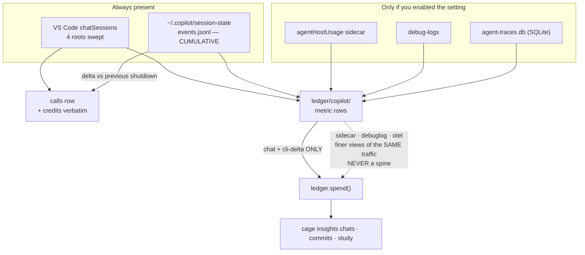

# ADR-COPILOT — five stores, one spine, and the credit is the vendor's own arithmetic

> The five laws in [ADR-LAWS](0001_laws.md) bind this record already and are **not**
> restated here. Cite this record in prose as its NAME, never by number.

---

## §1 · For humans

**In one line:** Copilot is the only agent that records what it actually charged you —
GitHub writes a **credit** figure per request — and cage captures that number verbatim,
alongside tokens from up to five different on-disk stores.

Two things shape everything here. First, Copilot's CLI writes **running totals**, not
per-turn numbers, so a resumed session re-reports everything it already reported —
cage stores the difference, never overwrites the earlier row. Second, three of the five
stores only exist if you turned on a VS Code debug setting; cage reads them when they are
there and says which are missing when they are not.

### For the meeting

> Absorbed from `docs/copilot-capture.md`, which is removed.

- We meter Copilot from its **own on-disk records** — no vendor API, no network, zero
  infra cost. The numbers are the vendor's, recorded verbatim.
- Per chat we can state **tokens in/out**, and — where GitHub recorded it — the **actual
  billed credits** (premium requests). Credits are the billing truth.
- **Coverage is partial by the vendor's doing:** only some requests carry a credit
  (**~3% observed on real data**, all on the auto-router). Cage reports what exists; it
  never fills gaps with guesses, and never derives a credit from tokens or the reverse.
- **A second, richer ledger sits alongside the spine:** per-chat cached tokens,
  authoritative session credits, and — where three optional VS Code settings are on —
  per-model-call detail from three more stores. Recorded, not surfaced: evidence banked
  for the next read-surface build, not a number anyone sees.
- **Nothing here is a dollar.** Cage measures usage; the credit is GitHub's own
  computation and cage reports it as a count.

### The flow



<details><summary>Same diagram, ASCII</summary>

```text
  ALWAYS PRESENT
    VS Code chatSessions (4 roots) ---------> calls row (+ credits verbatim)
    ~/.copilot/session-state/events.jsonl --> calls row, as a DELTA vs previous shutdown
        (CUMULATIVE at source)                (never an overwrite)

  ONLY IF THE SETTING IS ON
    agentHostUsage sidecar  \
    debug-logs               >-------------> ledger/copilot/ metric rows
    agent-traces.db (SQLite)/                        |
    (chatSessions + CLI also feed it) ---------------+
                                                     |
                             spine = "chat" + "cli-delta" ONLY
                             sidecar/debuglog/otel are finer views
                             of the SAME traffic -> never a spine
                                                     |
                                              ledger.spend()
                                                     |
                                cage insights chats | commits | study
```
</details>

### What we can say, and how much to trust it

| number | where it comes from | trust |
|---|---|---|
| tokens in / out, VS Code chat | per-request fields in the chat store | vendor-recorded |
| **credits per request** | GitHub's own charge, copied verbatim | vendor-recorded |
| tokens + cached, CLI | running totals, differenced per shutdown | derived by cage (from vendor totals) |
| session credits | max/last, **never summed** | vendor-recorded |
| the real routed model | the sidecar store, when enabled | vendor-recorded |
| time-to-first-token, wait time | debug logs / chat store, when enabled | vendor-recorded |
| **cache-write tokens** | — | **absent: no Copilot store persists them** |
| **dollars** | — | **absent by decision: cage measures usage, never cost** |

### What we can't say, and why

- **Most requests carry no credit at all** — about **3% do**, observed on real data, all
  on the auto-router. Cage reports what exists and never back-fills a credit from tokens,
  in either direction. An absent credit stays absent; it is never a `0`.
- **Cache-write tokens are persisted by no Copilot store.** Claude records them; Copilot
  does not. Permanently honest-empty — a vendor limitation, not a cage gap.
- **A Copilot credit cannot be added to a Kiro credit.** One is GitHub's tokens×rates
  computation, the other is an AWS credit. They share a column heading and nothing else,
  and cage refuses the total rather than inventing a unit.
- **The three optional stores are off by default.** When they are off cage names the
  setting that would enable each, rather than showing a silent zero.

---

## §2 · For agents

### Context

- Copilot writes a **cumulative** `session.shutdown` per shutdown. A resumed session
  (`--continue`, or a VS Code chat spanning restarts) appends a second shutdown whose
  `modelMetrics` already include the first. Keying the call id on session+model index
  alone made the second, higher shutdown collide with the first and get dedup-dropped —
  a **16–18% undercount**, unbounded in principle. Verified on real session `8073abba`:
  shutdown-1 `inputTokens=70,071`, shutdown-2 `107,581`.
- The tempting fix — "on re-seeing a session id, *update* the row to the last cumulative"
  — mutates a ledger row, breaking append-only, determinism, crash-safety and
  concurrent-import safety at once, and is *less* precise: it collapses the per-turn
  breakdown into one moving number.
- **Since 2026-06-01 a Copilot credit *is* GitHub's own tokens×rates computation**, done
  with rates cage cannot see. Cage's price table was reconstructing a number the provider
  had already computed correctly and recorded.
- Copilot's stores overlap heavily: the sidecar, debug-log and OTel stores are **finer
  views of the same traffic** the chat store already describes. A machine that enabled one
  would silently double its own spend if all were spined.
- Chats were being swept from only two `chatSessions` roots; two more exist.

### Decision

**A cumulative source is reconciled with append-only delta rows; the vendor's recorded
credit is captured verbatim and never derived; and only two of the five sources are a
spend spine.**

- **Delta rows, never mutation.** Each `session.shutdown` yields a row carrying the
  per-shutdown delta (`cumulative_n − cumulative_{n-1}` per model). The id encodes the
  shutdown **ordinal**, and **ordinal 0 is byte-identical to the pre-fix id** — so a
  legacy ledger *self-heals* on re-import: ord 0 dedupes against the row already there,
  only ord≥1 appends, and the rows sum to the true cumulative. `totalPremiumRequests` is
  cumulative too and gets the same treatment. **No row is ever mutated.**
- **The reset rule, not a clamp.** A decrease means the counter reset, so the new value
  *is* the delta. Clamping a negative delta to 0 silently discards real spend.
- **`SPEND_SOURCES["copilot"] = ("chat", "cli-delta")`.** `chat` is per-request, durable
  and ungated. `cli-delta` is the point-in-time twin `parse_copilot_cli_metrics` emits
  beside every cumulative `cli` row — the `cli` row itself is preserved verbatim (that is
  why the kind exists) and is listed in `CUMULATIVE_SOURCES` as deliberately excluded.
  **Never sum the two.** `sidecar`/`debuglog`/`otel` are opt-in finer views and are
  never a spine.
- **Four chatSessions roots are swept**, not two: the per-workspace store,
  `no-workspace/`, `emptyWindowChatSessions/` and `transferredChatSessions/`.
- **Credits are a recorded count, captured verbatim and never converted.** Session credits
  collapse as **max/last, never summed**. Absence stays absence — a request with no
  recorded credit is never given one derived from tokens, and pro-rata splitting of a
  group credit by token share is refused.
- **Credits are never summed or ranked across agents** (`units.summable`). The column name
  is the whole of the temptation, so the rule is enforced in code, not by convention.
- **Group billing** carries one `billed_with` carrier row per multi-model shutdown;
  siblings are named, not silently dropped.
- **The metric rows are a separate kind** (`schema.make_copilot_metric`), never a widened
  `calls` row. `ledger.copilot_metrics` collapses last-write-wins per
  `(source, session, surface, request, call)`.
- **Cache-write is honest-empty**: no Copilot store persists it. Not modelled, not zeroed.

### Consequences

- History self-heals rather than double-counting — the one property that made shipping the
  delta fix safe against ledgers already in the field.
- A grown cumulative source costs one extra row per shutdown. Rows are cheap; precision
  is not.
- `cage doctor`'s `copilot-metrics` check names per-source coverage **and the enabling
  setting for each gated store**, so a missing optional source reads as *off*, not as
  *empty*.
- Copilot is the only agent carrying both units, which makes it the one place a
  cross-agent credit total looks arithmetically plausible. `units.cross_agent_note` states
  the refusal in one fixed phrasing — a re-worded refusal reads as a different rule.
- **Metric rows carry no `task`** (TASK-GRAIN-SPINE) and no route field, exactly as for
  claude.
- Enabling a gated store adds capture and changes **no** number, by construction. That is
  the point of keeping the spine at two sources.

### Capture reference — store → property → row

> Absorbed from `docs/copilot-capture.md`, which is removed. Capture is pull-based
> (`cage import` / capture-on-read) — no hooks, no network, `$0`. **Absence ≠ zero:** a
> request with no recorded credit stays absent, never derived from tokens in either
> direction.

**`calls` rows** — the priced-shaped surface (now a usage surface):

| number | store → property | lands as |
|---|---|---|
| tokens in/out (VS Code chat) | `workspaceStorage/*/chatSessions/*.jsonl` → per-request `promptTokens`/`completionTokens` | `calls` row (`c_cop<hash>`, surface `vscode`) |
| credits per request (VS Code) | same row → `copilotCredits` (float, verbatim) | `calls.credits` — the only thing that meters `copilot/auto`, where the routed model is unknown |
| tokens + cached (CLI) | `~/.copilot/session-state/*/events.jsonl` → `session.shutdown` per-model cumulative, delta'd | `calls` rows incl. `cached_in` (surface `cli`) |
| credits (CLI) | `session.shutdown` → `totalPremiumRequests` (float, cumulative, delta'd) | `calls.credits` (+ legacy int `premium`, unused) |
| group billing | `billed_with` — one carrier row per multi-model shutdown | siblings named, never silently dropped |

Chats land from **four** `chatSessions` roots: the per-workspace store, `no-workspace/`,
`emptyWindowChatSessions/` and `transferredChatSessions/` — previously only the first two
were swept.

**`.cage/ledger/copilot/` rows** — a deliberately separate kind
(`schema.make_copilot_metric`), never a widened `calls` row, verbatim from all five
on-disk stores:

| source | store | what lands |
|---|---|---|
| `chat` | VS Code chatSessions (same 4 roots) | per-request `model_totals` (per-model cached tokens), `session_credits` (max/last, **never summed**), `elapsed_ms`/`waiting_ms` |
| `cli` | `session-state/*/events.jsonl` | per-shutdown **cumulative-verbatim** `model_totals`, `credits`, `nano_aiu` — no delta math |
| `cli-delta` | derived twin of `cli` | the point-in-time delta row — **the spine source**; never summed with `cli` |
| `sidecar` | `agentHostUsage/*.jsonl` *(gated: `chat.agentHost.agentDebugLog.enabled`)* | per-model-call tokens + cached + `nano_aiu`, the REAL routed model |
| `debuglog` | `.../debug-logs/<sessionId>/*.jsonl` *(gated: `github.copilot.chat.agentDebugLog.fileLogging.enabled`)* | per-request tokens + ttft (**whitelist read** — the same lines carry prompt bodies) |
| `otel` | `agent-traces.db`, SQLite read-only *(gated: `github.copilot.chat.otel.dbSpanExporter.enabled`)* | per-model-call tokens + cached — the only per-call cached-token source for classic-extension chats |

Parsers: `transcript.parse_copilot_calls` · `parse_copilot_vscode_calls` ·
`parse_copilot_vscode_metrics` · `parse_copilot_cli_metrics` ·
`parse_copilot_sidecar_metrics` · `parse_copilot_debuglog_metrics` ·
`parse_copilot_otel_metrics`.
Reader: `ledger.copilot_metrics` collapses last-write-wins per
`(source, session, surface, request, call)`.
Health: `cage doctor`'s `copilot-metrics` check names per-source coverage **and the
enabling setting for each gated store**. `cage query copilot-metrics` explains it.

### Known gaps (open)

- **CLI credit-delta loss** — the credit delta is dropped when the first-listed model has
  no token delta. Open in the *calls* CLI parser only; the metrics CLI parser records
  cumulative verbatim and structurally dodges it.
- **Cache-write tokens** — persisted by **no** Copilot store. Permanently honest-empty;
  not a cage gap. (Measured: 0 of 57 vscode rows carried `cached_in`, 2026-08-14.)
- **No read surface for `.cage/ledger/copilot/`** — a `cage insights copilot` view, or new
  chats-view columns, are parked in `work/OPEN-WORK.md`, not built. No view reads the four
  gated stores' detail today: recorded, not surfaced.
- **TASK-GRAIN-SPINE** — metric rows carry no `task`; task-grouped analysis sees zero.

### Alternatives rejected

- **Mutate the row to the latest cumulative** — breaks append-only, determinism,
  crash-safety and concurrent-import safety, and is *less* precise. Rejected outright.
- **A fresh id for every shutdown** (dropping ord-0 identity) — a legacy ledger would then
  add ord 0 twice (70,071 double-counted). Byte-identity of ord 0 is exactly what makes
  self-heal work.
- **Clamp a negative delta to 0** — silently discards real spend. The reset rule is
  correct and is reused from `parse_copilot_cli_calls`.
- **Spine every source cage captures** — the sidecar, debug-log and OTel stores describe
  the same traffic as `chat`; a machine that enabled one would double its own spend.
- **Spine the cumulative `cli` row instead of its delta twin** — a cumulative row carries
  its session's entire life stamped at the latest capture, so a straddling session lands
  twice, invisibly, because both figures are individually correct.
- **A separate ledger per agent** — separation by *source* is arbitrary; the real axis is
  the *shape* of the number.
- **Derive a credit from tokens where one is absent** (or tokens from a credit) — that is
  a conversion between units, forbidden in both directions.
- **Pro-rata splitting of a group credit by token share** — same objection; it derives
  per-row credits from tokens.

### Reference

- **Worked example, real data:** session `8073abba` — delta rows sum to 107,581
  (`70,071 + 37,510`), recovering the exact undercount and reaching the hand-counted
  truth 227,298. Self-heal proven end to end: legacy row → re-import → exact total →
  third import adds 0.
  [work/regression/2026-07-28-finding-copilot-resumed-undercount.md](../../work/regression/2026-07-28-finding-copilot-resumed-undercount.md) ·
  [work/regression/2026-07-28-capture-precision-fixes.md](../../work/regression/2026-07-28-capture-precision-fixes.md)
- **Cache-write measured absent** — 0 of 57 vscode rows carried `cached_in` on
  2026-08-14: `cage/units.py` module docstring.
- Ratified in full: [0004](../../work/archive/adr/0004-append-only-delta-rows-and-separate-by-schema.md)
  (delta rows, separate by schema) ·
  [0010](../../work/archive/adr/0010-metric-ledgers-are-the-spend-source-forward-only-cutover.md)
  (`SPEND_SOURCES`, point-in-time-never-cumulative).

### Veto condition (when to revisit)

**1 · Falsifiable triggers, numbered.**

1. **The delta-row design** reopens only on a **measured** case where per-shutdown deltas
   cannot reconstruct the true cumulative — a source that *rewrites* an earlier
   shutdown's figure **downward**, so the delta goes negative and the reset rule
   misreads it as a reset. **Name the session and the two figures** when reopening; an
   argument that it "might" happen is not enough. The change lands in
   `transcript.parse_copilot_calls` (negative handling), not a storage redesign.
2. **The open CLI credit-delta defect** — the credit delta is dropped when the
   first-listed model has no token delta. Open in the *calls* CLI parser only; the metric
   CLI parser records cumulative verbatim and structurally dodges it. Reopen with the
   count of affected shutdowns from a real store.
3. **`SPEND_SOURCES` membership.** A new store joins the spine **only** if it is
   point-in-time **and** covers a surface no existing spine covers. Adding a store to the
   metric kind does **not** add it to the spine — that separation is the design.
4. **Cage displays a currency figure again** only when a store carries a per-request
   currency amount on **≥ 80% of its rows**, measured on a real install and written up in
   `work/research/` before any code moves. It would land as an additive optional field on
   the metric row and one rendered column — **never** a price table, a rate config, or a
   `prices` command group.

**2 · Contingent vs. invariant.**

- **Contingent (auto-revisits on evidence):** which sources are cumulative; which stores
  are gated and by which setting; the four chatSessions roots; whether cache-write ever
  becomes available; the CLI credit-delta defect.
- **Invariant (moves only by ratified reversal of this ADR):** **no ledger row is ever
  mutated**; **credits are never summed or ranked across agents**; **no conversion between
  tokens, credits and currency in any direction**; **absence is never rendered as `0`**;
  a spine source is **point-in-time, never cumulative**.

**3 · Deliberately not taken.**

- **A read surface dedicated to `.cage/ledger/copilot/`** — the four gated stores hold
  detail (per-model-call cached tokens, real routed model, ttft) that no view renders.
  Recorded now, surfaced never yet: it is evidence banked, and the absence of a view is a
  scoping choice, not an oversight. **Threshold to reopen:** a question a user actually
  asks that the spine cannot answer and one of these stores can.
- **A user-supplied credit→currency rate, applied locally and labelled `modeled`.**
  Declined, not dogmatically rejected — a user asserting their own contract is honest in
  a way a shipped rate card is not. Not taken because it reintroduces the entire pricing
  surface to serve a number only its author can check. **Threshold to reconsider:** more
  than one user asks for it *by name*, and it lands as a display multiplier over an
  existing recorded count — never a second pricing basis a total can silently span.
