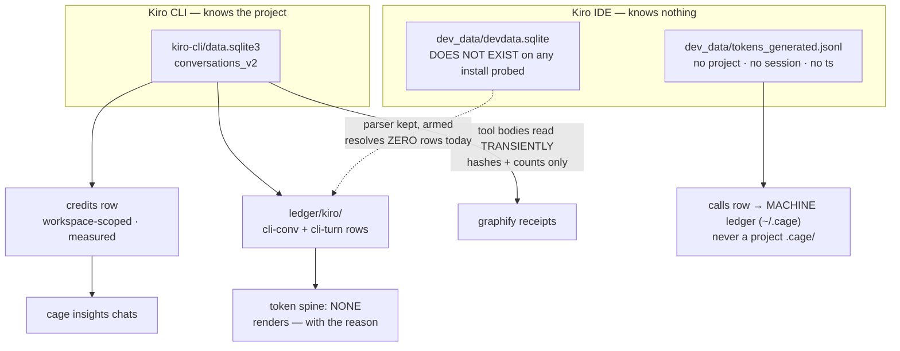

# ADR-KIRO — two stores with opposite properties; the IDE half is a machine fact and has no token spine

---

## §1 · For humans

**In one line:** Kiro keeps the thinnest records of anything cage meters — its CLI records
what AWS charged you and no tokens at all, its IDE records tokens so coarse they cannot be
added up — so cage reports credits, and says `—` where a number would be fiction.

The single most important thing here: **Kiro has two stores that behave in opposite ways.**
The CLI store knows which project you were in. The IDE store knows nothing — no project,
no session, no timestamp. Treating them the same would either destroy real attribution or
invent fake attribution. Cage treats them separately, on purpose.

### For the meeting

> Absorbed from `docs/kiro-capture.md`, which is removed.

- We meter Kiro from its **own on-disk records** — no vendor API, no network, zero infra
  cost. The numbers are the vendor's, recorded verbatim.
- **Credits are the billing truth** for Kiro CLI: AWS's own per-conversation charge,
  captured exactly and tagged `measured`.
- **Kiro's IDE keeps the thinnest records of any agent we meter** — output tokens usually
  0, model usually the generic `"agent"`. We report what AWS persists; where its log has
  no project dimension we count at machine level rather than invent a per-project split.
- **Token and cache precision exists, but AWS throws it away.** The backend streams exact
  token and cache counts plus per-request credits with every response; Kiro persists
  almost none of it. Full fidelity would need cage in the request path — a vendor
  limitation, not a metering gap.
- **A standing upgrade-watch is armed:** the day Kiro's own store starts persisting
  per-turn tokens, cage captures them with **zero code change**, and `cage doctor`
  announces the flip.

### The flow



<details><summary>Same diagram, ASCII</summary>

```text
  KIRO CLI  -- knows the project ------------------------------------------------
    kiro-cli/data.sqlite3 (conversations_v2)
        |-- credits row -----------> workspace-scoped, tagged MEASURED --> insights chats
        |-- ledger/kiro/ ----------> cli-conv (per conversation) + cli-turn (per turn)
        `-- tool-run bodies -------> read TRANSIENTLY; only hashes + counts persist
                                     -> graphify receipts

  KIRO IDE  -- knows NOTHING (no project, no session, no timestamp) --------------
    dev_data/tokens_generated.jsonl
        `-- calls row -------------> MACHINE ledger (~/.cage) ONLY
                                     never a project .cage/
    dev_data/devdata.sqlite
        `-- DOES NOT EXIST on any install probed
            parser kept + armed; resolves ZERO rows today

  TOKEN SPINE FOR KIRO: none.  Renders "—" with the reason.  Never a 0.
```
</details>

### What we can say, and how much to trust it

| number | where it comes from | trust |
|---|---|---|
| **credits per conversation, CLI** | AWS's own per-conversation charge | vendor-recorded |
| context % used, turn count, model | the same conversation record | vendor-recorded |
| per-turn timing and size, CLI | chunks, prompt/response bytes, tool uses | vendor-recorded |
| graphify savings from CLI tool runs | command + output hashed in memory, then dropped | derived by cage |
| IDE tokens | a coarse global log — **machine-level only** | vendor-recorded, unusable for projects |
| **a per-project kiro number** | — | **absent: the IDE store has no project dimension** |
| **a kiro token total** | — | **absent: no IDE token store on this install** |
| **cache tokens, per-chat IDE credits** | — | **absent: they exist only on the wire, never on disk** |
| **dollars** | — | **absent by decision: cage measures usage, never cost** |

### What we can't say, and why

- **A per-project kiro cost has never been correct, and cage now refuses to print one.**
  The IDE log is one global append-only file with no project field, so every ledger that
  imports it pulls kiro's entire global history. Measured in the lab: a fresh workspace
  showed 28 rows, of which **22 were turns from work done in a different workspace**.
  Cage stores those rows once per machine instead — a project report gains no kiro
  section, and loses nothing real.
- **Kiro has no usable token count at all.** The obvious source was probed on
  2026-08-14: 28 rows totalling **1,576 in / 0 out**, model `"agent"` on every row, with a
  byte-identical 6-row block repeated. It is not summable. Building a total on it would
  be a fabricated number, so cage renders `—` and names the reason.
- **AWS throws away precision it already has.** The backend streams exact token and cache
  counts plus per-request credits with every response; Kiro persists almost none of it.
  Full fidelity would need cage in the request path. That is a vendor limitation.
- **Cage reads the CLI store but never writes to it** — read-only, immutable connection,
  every time.

---

## §2 · For agents

### Context

- **Two stores, opposite attribution properties.** Applying one rule to both destroys
  something either way:

  | store | parser | carries | verdict |
  |---|---|---|---|
  | **IDE** `dev_data/tokens_generated.jsonl` | `parse_kiro_calls` | no project · `session="kiro"` · no `ts` | **machine fact** |
  | **CLI** `conversations_v2` (SQLite) | `parse_kiro_cli_credits` | **keyed by cwd** · real `conversation_id` · real `updated_at` | **project-attributable** |

- Row ids are stable across ledgers (`c_kiro{line_index}{sha1(line)[:8]}`), so an IDE row
  imported twice is **the same row stored twice**, not two rows. Every id-merging path
  dedupes it correctly; only naive summing of two ledger *files* breaks. But the damage is
  larger than "don't sum": importing the log into a *new* project pulls kiro's entire
  global history. **Kiro is a paid tool, so this is a correctness problem, not a reporting
  nicety.**
- **Kiro CLI records credits and no tokens at all** — the token fields in its SQLite store
  are NULL even with an explicit non-`auto` model. A call row with `tokens_in=0` would be
  a lie that poisons every token average.
- **`devdata.sqlite` does not exist.** Through v0.50, `ABSENT_SPINES` pointed at it — a
  live-looking source resolving zero rows forever (KIRO-IDE-METRIC-ROW). The 2026-08-14
  field probe settled it: `dev_data/` holds only `tokens_generated.jsonl`.
- **The CLI store's law is written as a key whitelist**, uniquely among cage's sources:
  content and metadata share one row, so there is no schema boundary to hide behind. The
  parser touches only a closed whitelist of numeric/metadata keys and never
  `history[].user`, `history[].assistant`, `content`, `text`, `transcript`, `next_message`.
- graphify savings were **structurally dark on kiro** — not partial, absent — because the
  command lives at `history[].assistant.ToolUse.tool_uses[].args.command` and its output
  at `history[].user.content.ToolUseResults.tool_use_results[].content[].Json.stdout`.
  **Both are inside the whitelist's exclusion zone.**

### Decision

**Kiro IDE rows are machine facts and are written to the global ledger only. Kiro has no
token spine and says so. CLI tool-run bodies may be read transiently, in one named
function, and nothing but hashes and counts persists.**

- **Routing (inherited, never re-decided).** IDE rows go to `~/.cage` — never a project
  `.cage/`. An explicit `--ledger`/`CAGE_BASE` still wins, so the lab keeps its isolation.
  One copy exists per machine, so double-counting is impossible **by construction** rather
  than by warning. CLI rows are cwd-keyed and attribute honestly; `cli-conv`/`cli-turn`
  metric rows ride the same workspace scoping the credits leg resolves.
- **`SPEND_SOURCES["kiro"] = ()`** and `ABSENT_SPINES["kiro"] = "no IDE token store on
  this install"`. Every view renders `—` **with that sentence**, never a `0`.
  `transcript.parse_kiro_ide_metrics` is deliberately **kept** for the day a Kiro ships
  the store, and `cage doctor`'s kiro-IDE check distinguishes **db absent / table missing
  / column drift** so the flip announces itself.
- **Credits are their own row kind** (`credits-<month>.jsonl`, `schema.make_credit`,
  `unit="credits"`), with their own id namespace, read by no call-based view — so they can
  never perturb a token number. Last-write-wins per session. Retagged **`measured`**: they
  were `estimated` only while standing in for dollars cage could not see.
- **`cli-conv` is cumulative and is NOT a spine** — listed in `CUMULATIVE_SOURCES`. That is
  not a gap: kiro-CLI spend never lived in `calls` at all; it is credits-only, folded as
  its own group. Excluding it loses nothing.
- **The tool-run carve-out is exactly one function:** `transcript.parse_kiro_cli_tool_runs`
  (with helper `_kiro_cli_tool_runs`), **named in the whitelist comment itself**, so a
  reader of the law meets the exception at the same moment. `_kiro_cli_credit_row` — and
  every function that writes a ledger row from this store — stays fully bound. **The
  carve-out widens what may be read, never what may be written.**
- **What persists is what persists on every other graphify route:** `args_hash`,
  `answer_hash`, a token count, `source_files` as an integer, `op`, and the deterministic
  `receipt_id`. No command string, no output byte, no file path.
- **The store is never written to** — `mode=ro&immutable=1`, always.
- **A truncated stdout files nothing.** Kiro caps tool output at ~2000 tokens; a truncated
  answer under-counts `actual` and would *inflate* the modelled saving, so it is
  `unmeasurable`. The marker is matched **anchored at the end of the string**, never as a
  substring.
- **`cli-turn` rows record the NULL token slots anyway** — the upgrade-watch. The moment
  Kiro starts filling them, cage captures them with zero code change; `cage doctor`
  announces the flip.

### Consequences

- A project report gains no kiro section — and doctor says *why* rather than staying
  silent. That number was fiction.
- **Kiro contributes no tokens to any total.** That is the decision, stated, not a bug to
  fix. `units.ABSENT["kiro"][TOKENS]` carries the reason to every renderer.
- kiro-CLI joins claude and copilot as a first-class graphify surface — the three-agent
  invariant holds for that capture path instead of being aspirational.
- **This route refuses often, and that is correct.** Most real `graphify query` output
  exceeds the ~2000-token cap, so the query route files nothing on those runs. The
  report-read route is unaffected. A thin kiro column is *expected*, and the reason is
  named out loud rather than left as a silent zero.
- **The whitelist comment is now load-bearing in two directions** — it states a law *and*
  its single exception. A second exception must be added there, or the comment starts
  lying about the store's cardinality.
- Cage reads the CLI store twice per sweep (credits, then tool runs). Both read-only over
  a store measured at ~1 MB / 19 conversations; not material at that scale.
- Kiro credits and Copilot credits share a column heading and nothing else — the
  cross-agent sum is refused in code, not by convention.

### Capture reference — store → property → row

> Absorbed from `docs/kiro-capture.md`, which is removed. Capture is pull-based
> (`cage import` / capture-on-read) — no hooks, no network, `$0`.

**`calls` / `credits` rows:**

| number | store → property | lands as |
|---|---|---|
| tokens in/out (IDE) | `kiro.kiroagent/dev_data/tokens_generated.jsonl` → `promptTokens`/`generatedTokens` per call | `calls` row (`c_kiro…`, surface `ide`) — **machine ledger only** |
| credits (CLI, per conversation) | `kiro-cli/data.sqlite3` → `conversations_v2.value` → `user_turn_metadata.usage_info[]` (unit `credit`, summed) | `credits` row (`k_cred…`, surface `cli`), workspace-scoped, last-write-wins per session |
| context % · turns · model (CLI) | same conversation JSON → `request_metadata.context_usage_percentage` (last) · `len(history)` · `model_info` | same `credits` row |
| tool savings (CLI, graphify) | `history[]` tool runs, read **transiently** | `savings/graphify/` receipts |

**`.cage/ledger/kiro/` rows** — a deliberately separate kind (`schema.make_kiro_metric`),
store-verbatim at three grains:

| source | store | what lands |
|---|---|---|
| `ide` | IDE `dev_data/devdata.sqlite`, table `tokens_generated` (SQLite, read-only) — **this file does not exist on any Kiro install probed so far**, so this source resolves **zero rows** | per-call tokens *if the store ever ships*: the same counter the jsonl reads, plus a `timestamp` and a cursorable `id` the jsonl never carried |
| `cli-conv` | CLI SQLite store, per conversation | credits (`usage_info` sum, None-sentinel when the list is absent), context %, turn count — cumulative-verbatim. **Cumulative ⇒ never a spine** (`CUMULATIVE_SOURCES`) |
| `cli-turn` | same store, per `history[]` turn | populated timing/size/tool-use fields (`chunks`, `prompt_bytes`, `response_bytes`, `tool_uses`, `context_pct`), PLUS the token slots that are NULL on every real store probed — **the upgrade-watch** |

Parsers: `transcript.parse_kiro_calls` · `parse_kiro_ide_metrics` (kept, armed) ·
`parse_kiro_cli_credits` · `parse_kiro_cli_metrics` · `parse_kiro_cli_tool_runs`
(**the one carve-out**).
Reader: `ledger.kiro_metrics` collapses last-write-wins per
`(source, session, turn, row_ref)`.
Health: `cage doctor`'s `kiro-metrics` check names per-source coverage and the
upgrade-watch state (armed vs. tripped); its kiro-IDE check distinguishes **db absent /
table missing / column drift**. `cage query kiro-metrics` explains it.
Routing is inherited, never re-decided: `ide` rows ride the routed kiro sink (machine
ledger); `cli-conv`/`cli-turn` ride the same workspace scoping the `credits` leg resolves.

### Known gaps (open)

- **Kiro has NO token spine, and cage says so rather than showing a zero.**
  `SPEND_SOURCES["kiro"]` is empty and `ledger.ABSENT_SPINES` carries the reason — *"no
  IDE token store on this install"* — which every view renders as `—`.
  - Through v0.50 that entry pointed at `devdata.sqlite`, **a file that is not there**: it
    read as a live source while resolving zero rows forever (KIRO-IDE-METRIC-ROW).
  - Emitting an `ide` spine from `tokens_generated.jsonl` instead was **rejected on the
    field probe** — see §2's *Alternatives rejected*.
- **IDE log is coarse by the vendor's doing** — output tokens usually 0, model usually the
  generic `"agent"` (real 16-call probe: 198 in / 0 out). Not fixable from this store.
- **Cache tokens + per-chat IDE credits: persisted by NO kiro store.** They exist only on
  the wire (`metadataEvent.tokenUsage`, `meteringEvent`). Permanently honest-empty from
  disk; not a cage gap.
- **CLI token slots are still NULL** on every real store probed (kiro-cli 2.16.0) —
  `cli-turn` rows record them the moment Kiro starts filling them (upgrade-watch armed,
  zero code change needed).
- **No read surface for `.cage/ledger/kiro/`** — a `cage insights kiro` view, or new
  chats-view columns, are parked in `work/OPEN-WORK.md`, not built. (The CSV export that
  was also parked went with `cage data`, deleted by SURFACE-CUT.)
- **One real-store probe still pending** — whether IDE session JSONs embed per-message
  usage. The other (the `devdata.sqlite` column list) was **answered 2026-08-14: the file
  does not exist.** The parser survives either answer (explicit-column SELECT, fail-open).

### Alternatives rejected

- **Store IDE rows at project level anyway** — invents a precision the source cannot
  support, which is the exact failure cage exists to catch in other tools.
- **Import-cursor partition** (a fresh ledger seeks to EOF, splitting turns by import
  order) — attribution becomes an artefact of *when you ran import*: arbitrary and
  unreproducible.
- **A marker plus read-time exclusion** (rows land anywhere, views drop them) — more
  machinery for the same outcome, and it leaves the wrong rows on disk.
- **Emit an `ide` spine from `tokens_generated.jsonl`** — rejected on the field probe:
  1,576 in / **0 out** across 28 rows, model `"agent"` throughout, a byte-identical 6-row
  block repeated. Not summable; a spine on it would be fabricated, not measured.
- **A kiro `tokens_in=0` call row** — poisons every average. The lie is worse than the gap.
- **Leave kiro dark for graphify** — not a limitation but an absence: cage would publish
  per-tool savings that silently exclude a whole agent.
- **Detect graphify runs from credit-row metadata alone** (turn counts, context %) — none
  of it identifies *which command ran*. A guess wearing a number.
- **Persist the command string to make receipts auditable** — counts-never-content is a
  product invariant; an auditable receipt that leaks a prompt is worth less than an opaque
  one that doesn't.
- **File a partial saving from truncated stdout, marked lower-confidence** — confidence
  grades *inference quality*, not *missing data*. A truncated answer is wrong in a known
  direction, and a lower confidence dresses that up rather than refusing it.
- **A separate mini-parser instead of touching `transcript.py`** — would put the carve-out
  somewhere the law does not mention, which is precisely how an undocumented exception
  becomes an unnoticed one.

### Reference

- **The cross-ledger double-count, measured in the lab** — workspace-off 22 rows,
  workspace-on 28, of which 22 were the same turns from another workspace:
  [work/regression/2026-08-01-finding-kiro-rows-double-count-across-ledgers.md](../../work/regression/2026-08-01-finding-kiro-rows-double-count-across-ledgers.md).
- **The 2026-08-14 field probe** that killed the token spine (28 rows, 1,576 in / 0 out,
  repeated block) and the five-values-on-the-wire finding:
  [work/research/2026-08-13-kiro-per-chat-usage-fetch-spec.md](../../work/research/2026-08-13-kiro-per-chat-usage-fetch-spec.md).
- **The 2026-08-07 store probe** establishing the tool-run shapes, the truncation marker,
  and that no metadata alternative exists (kiro-cli 2.16.0, two live `execute_bash` runs,
  19 conversations):
  [work/research/2026-08-07-graphify-store-evidence.md](../../work/research/2026-08-07-graphify-store-evidence.md).
- **ADR 0006 scoping observed in the field**, not assumed:
  [work/regression/2026-08-07-gfx-cov-kiro-field-run.md](../../work/regression/2026-08-07-gfx-cov-kiro-field-run.md).
- The governing principle — *cage can never be more precise than its source* —
  [work/cage-lab/03-verify.md](../../work/cage-lab/03-verify.md) §1.
- Ratified in full: [0006](../../work/archive/adr/0006-kiro-rows-are-machine-facts-not-project-facts.md)
  (routing) · [0009](../../work/archive/adr/0009-kiro-cli-tool-run-bodies-read-transiently-never-persisted.md)
  (the carve-out) · [0004](../../work/archive/adr/0004-append-only-delta-rows-and-separate-by-schema.md)
  (credits as a distinct kind).

### Veto condition (when to revisit)

**1 · Falsifiable triggers, numbered.**

1. **Routing** reopens the moment kiro's **IDE** log gains a project, workspace, or cwd
   field. The trigger is a **named field in a shipped kiro version**, not a plan or a
   rumour. Then kiro is attributed like any other agent.
2. **The absent token spine** reopens the moment an `ide` metric row can actually be
   parsed — a shipped `devdata.sqlite`, or any IDE store that is summable. That is a
   contained parser change; `cage doctor`'s three-way probe (db absent / table missing /
   column drift) announces which case is true.
3. **Read cost.** The second CLI read is justified while the store is small: **1.0 MB /
   19 conversations** on 2026-08-07. If a real store reaches **≥ 200 MB or ≥ 5,000
   conversations**, or the two reads add **> 250 ms** to a sweep, fold both into a single
   pass over `conversations_v2`. That is a *performance* change and **must not become a
   reason to reopen the persistence rule**.
4. **The truncation cap.** The guard is keyed to the literal marker
   `... (truncated to ~2000 token budget)`. If a kiro-cli release changes that string or
   removes the cap, the test keeps passing while the real store starts filing inflated
   savings — a green test asserting nothing. **Re-probe the marker on any kiro-cli major
   bump** and record the probed version.
5. **graphify coverage.** If, after a real evidence run, the kiro query route files on
   **< 10%** of observed graphify invocations, the honest product answer may be
   report-read-only plus a named gap. Reopen with the measured hit rate, not an impression.

**2 · Contingent vs. invariant.**

- **Contingent (auto-revisits on evidence):** IDE routing; the absent spine; the second
  read pass; the marker literal; the ~2000-token cap; whether the query route earns its
  place; the CLI token slots (upgrade-watch, armed).
- **Invariant (moves only by ratified reversal of this ADR):** **a source with no project
  dimension is not stored at project level** — it does not become wrong because a user
  wants a per-project kiro number, because that number would still be fiction; **no
  command or output byte is ever persisted**; **the store is never written to**; **a
  truncated or failed run files nothing**; **the credits parser stays bound by the
  whitelist**; **absence renders `—` with a reason, never `0`**; **credits are never
  summed across agents**.

**3 · Deliberately not taken.**

- **Kiro IDE as a graphify source.** Its `workspace-sessions/` store was probed and
  persists **no** assistant output at all (26/26 completions empty, zero tool blocks) — so
  there is nothing to carve out. Left open, not closed: **if a future Kiro IDE release
  persists tool calls with their results, that store becomes eligible under exactly the
  terms of this ADR** — transient read, hashes only, truncation refuses — needing a probe
  and a route, not a new decision.
- **One real-store probe still pending:** whether IDE session JSONs embed per-message
  usage. The parser survives either answer (explicit-column SELECT, fail-open).
- **A read surface for `.cage/ledger/kiro/`** — a `cage insights kiro` view or new
  chats-view columns. Recorded, not surfaced. **Threshold to reopen:** a question a user
  actually asks that the credits row cannot answer and these rows can.
