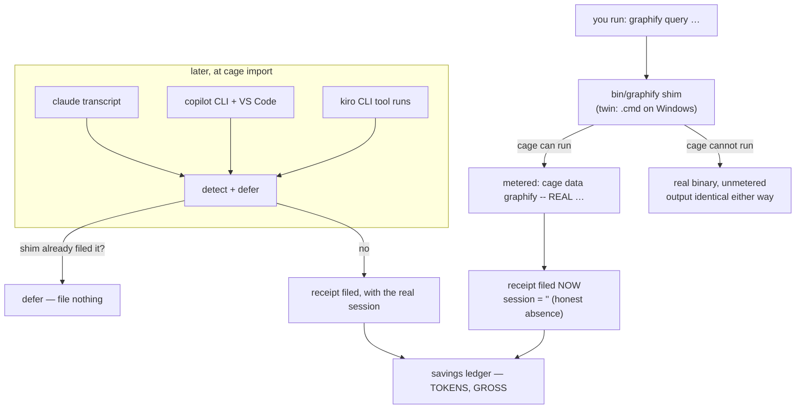

# ADR-GRAPHIFY — four routes, one receipt, and a shim that provably cannot recurse

> The five laws in [ADR-LAWS](0001_laws.md) bind this record already and are **not**
> restated here. Cite this record in prose as its NAME, never by number.

---

## §1 · For humans

**In one line:** graphify answers codebase questions from a pre-built graph instead of
reading files, and cage measures what that saved — in tokens, never dollars, and never
counting the same run twice.

graphify is the one thing cage meters that isn't an agent. Cage can see a graphify run
from **four different directions**, and two of them routinely see the *same* run. Filing
it twice would inflate the one number that must never inflate, so the routes are ordered:
whoever gets there first files, and the others step aside.

Underneath sits a small shell script that pretends to be `graphify` so cage can watch the
call. Getting a program to intercept itself without calling itself forever is the trickiest
thing in this repo — it has **four independent reasons** it cannot recurse, and it cost
nine days and two wrong hypotheses to learn why one of them was needed.

### The flow



<details><summary>Same diagram, ASCII</summary>

```text
   you run:  graphify query ...
        |
        v
   bin/graphify shim  (twin: bin/graphify.cmd on Windows)
        |
        |-- cage CAN run  --> metered:  cage data graphify -- <REAL> ...
        |                        |
        |                        `--> receipt filed NOW, session = "" (honest absence)
        |
        `-- cage CANNOT run --> real binary, unmetered
                                (stdout/stderr/exit code identical either way)

   LATER, at `cage import`:
        claude transcript      \
        copilot CLI + VS Code   >--> detect, then ASK: did the shim already file this?
        kiro CLI tool runs      /            |
                                             |-- yes -> DEFER, file nothing
                                             `-- no  -> file, with the real session
                                                          |
                        savings ledger -- TOKENS, GROSS ---'
```
</details>

### The three things worth knowing

1. **The same query in two different chats is two savings, not one.** Per-chat
   attribution is a product requirement, so the session is baked into the receipt's
   identity. A slightly-low total is tolerable; a wrong per-chat number is not.
2. **The shim honestly says it doesn't know the session** rather than guessing. It used to
   stamp the folder name into a field labelled *session* — a fabricated value that
   guaranteed the two routes never matched. It was fixed at the source, not worked around.
3. **The saving is gross and cage says so.** It is *not* netted against the cost of asking
   the question. Netting was a dollar computation and dollars are gone; the gross/net
   distinction is not, so cage reports gross and labels it.

### What we can't say, and why

- **A run whose output got truncated files nothing.** A truncated answer would make the
  saving look *bigger* than it was. Cage refuses the number rather than publishing one
  wrong in a known direction — so kiro's column is thin by design, and the reason is
  printed rather than left as a silent zero.
- **The double-count rate is not yet instrumented.** Cage counts every time a route
  correctly stepped aside, but nothing counts the times it should have and didn't. That
  gap is named below rather than assumed to be zero.
- **Windows is CI-asserted, not field-proven.** The honest statement is *"fixed on POSIX,
  CI-asserted on Windows"* — never *"fixed"*.

---

## §2 · For agents

### Context

- graphify savings can be captured by **four routes**: the PATH shim, graphify's native
  receipt shim, the transcript detector, and report-reads. Two routes can see the *same*
  run — the shim files at query time, and `cage import` later re-detects that same
  `graphify query` in the transcript.
- **Both naive fixes fail.** A content-derived, **session-excluded** id makes the routes
  collide — but then the identical query run in sessions A and B shares one id, so A
  absorbs the whole saving and B reads zero. A session-inclusive id with nothing else
  fails cross-route dedupe, because the shim runs as a subprocess with no session env var
  and its id can never match the transcript's.
- **Root cause of the disagreement:** the shim was stamping a **cwd basename into a field
  that claims to be a session** — a fabricated value guaranteeing the mismatch.
- `cage/data/shims/graphify` was a single extensionless bash script. **Windows resolves a
  bare name only through `PATHEXT`, which has no extensionless entry**, so the shim could
  never be *found* there and the route was structurally absent on Windows.
- **Two stacked shims that each stripped only their own PATH directory resolved to each
  other and recursed forever.** A real machine's `bin/graphify` also probed a pre-rename
  verb and silently captured nothing for **9 days** while `cage doctor` reported OK.

### Decision

**The receipt id includes `session`; cross-route convergence is a content-key deferral,
not id-collision; the shim stamps its session honest-empty; and the interceptor is a
hand-paired twin installed on every OS against one written contract.**

- **`id = "s_" + sha1(session | op | args_hash | answer_hash)`**
  (`graphifymeter.receipt_id`). Session-inclusive ⇒ the same query in two sessions is two
  receipts. Re-importing one transcript reproduces the id exactly ⇒ `union_by_id` collapses
  re-imports with zero derived-row growth.
- **Cross-route dedupe is a deferral.** Before filing, the transcript route computes the
  shim's **session-empty** id and defers if it is already in the ledger — snapshot-before,
  defer-if-present, the mechanism that already dedupes the native shim. **Ordering makes
  it unidirectional and sufficient:** the shim files synchronously at query time and
  `cage import` always runs strictly later, so the shim always files first.
- **`args_hash`/`answer_hash` are route-independent** (`content_signature`): the binary
  spelling (`argv[0]`) is dropped and the answer text stripped before hashing, so
  `graphify query X`, `/venv/bin/graphify query X` and the transcript-parsed command all
  sign identically.
- **Dedupe lives IN the id**, not in a per-consumer content-key check — so `union_by_id`
  carries it everywhere for free (local ledger, notes merge, bundle import) instead of
  each path needing its own check that one of them will eventually forget.
- **`savings_id` is an additive optional kwarg** on `make_savings`/`savings.record` — no
  new row field, no enum change.
- **Both twins install on every OS.** `cage setup` writes `bin/graphify` *and*
  `bin/graphify.cmd` regardless of host; `adoptcmd.refresh_shim` completes whichever is
  missing. `paths.GRAPHIFY_SHIMS` is the one enumeration every writer and reader shares.
- **Hand-paired, not templated.** Two files, written and reviewed independently, kept in
  sync by **the interceptor contract below** and tests — never generated from one source. **cmd has no `exec`**; batch and POSIX sh share essentially no syntax subset
  once control flow gets this involved, so a shared template would be two templates
  wearing one name.
- **The contract lives in this ADR, not beside the shims.** `cage/data/shims/*` is
  bundled package data shipped inside the wheel/pyz; the contract is project
  documentation, tested from *outside* both shim files. It was a standalone
  `docs/shim-contract.md` until 2026-08-14 and is now §2's *interceptor contract* — one
  document, so a behaviour change and its rationale can no longer drift apart.
- **An interceptor is identified by CONTENT, never by filename** (contract B3) — three
  marker strings, matched case-sensitively, in three places that must move together
  (`grep -Eq` in sh, `findstr /C:` in cmd, `pathshim._INTERCEPTOR` in Python).
- **No real binary ⇒ exit 127**, never a fallback to the bare name — that re-enters a shim
  and recurses.
- **Meter only when cage can actually run**, in two arms: the `cage` command with a
  `--help` capability probe (which is what catches a renamed verb — the 9-day root cause),
  then the interpreter via `python3 -m cage` / `py -3`. Both failing ⇒ run the real binary
  unmetered.
- **A truncated tool result files nothing** — `unmeasurable`, marker matched anchored at
  end of string, never as a substring.
- **Savings are tokens and stay GROSS.** `savings.GROSS_NOTE` outlived the netting module
  on purpose: netting was a dollar computation, the gross/net *distinction* is not.

### The interceptor contract (binding on every twin)

> **Absorbed from `docs/shim-contract.md`, which is removed.** This is the one behaviour
> spec both twins implement and are tested against — two implementations of an unwritten
> contract drift; this is the written one. It is also the **first artifact of the
> tool-integration contract**: every future tool interceptor implements this same shape,
> with only the tool name, the cage verb and the marker strings changing.
> Live-interpolated user-facing summary: `cage query graphify-shims`.
>
> **B1–B8 are binding on every twin. D1–D8 are real and permanent** — cmd cannot do what
> sh does. They are recorded, never papered over.

**B1 — Re-entry guard, both directions.**

| side | rule |
|---|---|
| **read** | `CAGE_GRAPHIFY_SHIM=1` in the environment ⇒ **do not meter**; run the real binary directly |
| **write** | the metering branch sets `CAGE_GRAPHIFY_SHIM=1` in the metered child's environment |

Re-entry skips *metering only*, **not resolution**. The PATH scan (B2) and the 127 rule
(B4) still run. "Straight to the real binary" means "past the cage branch", not "past the
scan" — a re-entrant call with no real binary on PATH still exits 127 rather than falling
back to the bare name.

**B2 — Resolve the real binary by walking PATH, skipping *every* interceptor.**
Walk PATH in order; the **first** candidate that exists, is runnable, and is **not** an
interceptor (B3) wins; stop there. Skip **all** interceptors, not just the shim's own
directory — two stacked shims that each stripped only their own dir resolved to *each
other* and recursed forever. Empty PATH entries are skipped: POSIX reads an empty entry as
the current directory, and the twins decline it deliberately (see D3). The walk visits
each PATH entry at most once and is bounded (B8).

**B3 — An interceptor is identified by CONTENT, never by filename.** Marker strings,
matched case-sensitively; any one of them means "this is a cage interceptor, never select
it as the real binary":

```
cage data graphify              # the current capability probe / invocation
cage graphify                   # the pre-rename (adopt-era) form
graphify metering interceptor   # the header self-identification
```

Every twin must carry at least one marker **in its own text**, so twins skip each other.
Filename matching is forbidden: on Windows the real binary and the twin can share a name,
and on any OS a shim can be renamed. **Three copies of this predicate exist and move
together:** `grep -Eq` in the sh twin · `findstr /C:` in the cmd twin ·
`pathshim._INTERCEPTOR` in Python. The Python copy is a *diagnostic* and sniffs only the
first 8 KiB; the two shims scan the whole file, which is the safe side (a shim is never
mistaken for the real binary).

**B4 — No real binary ⇒ exit 127.** Print to **stderr**:
`graphify: not found - only the metering interceptor shim is on PATH`, then exit `127`.
**Never** fall back to the bare name `graphify` — that re-enters a shim and recurses.

**B5 — Meter only when cage can actually do it.** Two arms, tried in order. The question
is *can cage run*, never *is there a `cage` command* — those differ more often than they
look. Both arms failing ⇒ run the real binary unmetered.

- **Arm 1 — the `cage` command.** Always tried first, so a standard install is unchanged
  in behaviour and in latency: (1) a `cage` command resolves; (2) `cage data graphify
  --help` exits 0 — the capability probe, which is what catches a renamed verb (the F1
  root cause).
- **Arm 2 (B5b) — the interpreter.** Reached only when arm 1 misses. Same two-step shape,
  through `python3 -m cage` (sh) / `py -3` then `python` (cmd — divergence **D8**):
  (3) the interpreter resolves; (4) `<interpreter> -m cage data graphify --help` exits 0.

The metered form is exactly `[<interpreter> -m ]cage data graphify -- <REAL> <args…>`.
**B3's marker set needs no addition** — `cage data graphify` is still a substring of the
arm-2 invocation, so twins still recognise and skip each other.

*Why arm 2 exists (GF-LAUNCHER, verdict B accepted 2026-08-12):* `cage setup
--python-launcher` (`cage query restricted-env`) removes the `cage` command **by design**, so under it neither twin
could ever meter. The same miss covers a `cage.pyz` on `PYTHONPATH`, an unactivated venv,
and any importable-but-not-on-PATH install — arm 2 fixes the superset. Cost is one
interpreter start (~50 ms warm), only on the path that was already going to run unmetered.
*What arm 2 does NOT claim:* verified end to end on POSIX; **CI-asserted on Windows**. The
honest statement is *"fixed on POSIX, CI-asserted on Windows"*, never *"fixed"*. It also
does nothing for the non-shim routes (copilot VS Code, kiro) — see
[restricted-environments.md](../../work/restricted-environments.md).

**B6 — Transparent passthrough.** stdout, stderr and exit code are identical to invoking
the real binary directly, metered or not. Arguments are forwarded verbatim, including
spaces, embedded quotes and `!`.

**B7 — No leaked state, no partial state; delayed expansion is off wherever `%*` is
forwarded.** sh: `set -euo pipefail`. cmd: `@echo off` + `setlocal`. Delayed expansion
(`!var!`) is enabled **only** around the PATH-walk — it needs to read a variable set
earlier in the same parenthesized `for` block, which plain `%var%` cannot do — and is
turned back off, via a second `setlocal DisableDelayedExpansion`, **before** either line
that forwards `%*` to the real binary. Delayed expansion active at a forwarding line would
eat a literal `!` out of the caller's arguments: a real, documented cmd.exe hazard, not a
hypothetical one. Environment mutations (the B1 stamp, scratch variables) never reach the
caller.

**B8 — Resolution is bounded and provably terminating, with no `call`/`goto` back-edge
into the walk.** The sh twin iterates a fixed word list. The cmd twin walks PATH with a
**flat nested `for`** (directories × PATHEXT entries) — no subroutine call, no `goto` jump
back into the loop. It terminates after at most `len(PATH dirs) × len(PATHEXT entries)`
iterations by construction, so no counter is needed.

> **⚠️ Diagnosis corrected 2026-08-02 — an earlier version of this section named the wrong
> cause.** It attributed the real Windows CI failure (`Recursion Count=335, Stack
> Usage=90 percent, ****** BATCH PROCESSING IS ABORTED ******`) to a `call :subroutine` +
> `goto` back-edge leaking cmd.exe stack frames. **That was a hypothesis that did not
> survive.** Rewriting to the flat loop was a real improvement but **did not fix the
> observed failure** — see B8a. The flat `for` is retained on its own merits (provable
> termination, no interpreter bookkeeping to trust); it is **not** load-bearing against
> the recursion abort.

**B8a — No `<` or `>` anywhere inside a parenthesized block, INCLUDING in comments.**
The actual cause of the recursion abort, and the single most expensive Windows fact this
project has bought. A `rem` comment sitting *inside* the nested `for` block read
`"<candidate>"`. **cmd.exe's parser still tokenizes redirection characters inside a
comment when that comment is nested in a multi-line `(...)` block** — the `<`/`>`
corrupted the block's parsing, which surfaced as the recursion abort on *every*
invocation.

The rule, binding on this twin and on every future interceptor: **comments live outside
every parenthesized block.** Never write `<`, `>`, `|` or `&` inside `(...)`, in code *or*
in a `rem`, without escaping — cmd.exe does not have "comments" in the sense the word
implies; `rem` is a command whose line is still tokenized. This is invisible on POSIX,
invisible in review, and produces an error message that points at recursion rather than at
the character that caused it. **It cost five pushes and two wrong hypotheses to find** —
which is exactly why it is written here rather than left in a changelog entry. The
`where graphify` fail-open fallback is likewise a single small loop, never a `goto`-driven
one.

*Test-harness corollary (also bought on CI):* a Windows test that invokes the twin must
leave enough of `PATH` intact for the shim's own `findstr.exe` / `where.exe`
(`%SystemRoot%\System32`) to resolve. Wiping `PATH` to the test's tmp dirs makes the shim
fail for a reason that has nothing to do with the shim. Prepend tmp dirs onto the system
dirs — never the whole inherited `PATH` (that risks exposing a real `cage` and defeating
the "cage absent" assumption), and never nothing.

**Divergences (cmd vs sh) — real, permanent, documented.**

| # | divergence | why | consequence |
|---|---|---|---|
| **D1** | `call "%REAL%" %*` then `exit /b %ERRORLEVEL%`, instead of `exec` | cmd has no `exec` | the real binary is a **child process**, not a replacement. Ctrl-C prompts `Terminate batch job (Y/N)?`; one extra process in the tree; a caller signalling by pid signals the batch. Streams and exit code are still identical (B6 holds). |
| **D2** | candidates come from `PATHEXT`; the bare extensionless name is never tried | cmd.exe cannot execute an extensionless file | the POSIX twin is **invisible** to the cmd twin's scan — half the anti-recursion proof |
| **D3** | the current directory is not searched | cmd.exe resolves cwd *before* PATH; the sh twin deliberately declines the POSIX cwd (an empty PATH entry) | a `graphify.cmd` in cwd but not on PATH ⇒ 127 rather than running. Deliberate: twin parity, no cwd hijack. **Scoped exception:** the pathological-PATH fallback delegates to `where`, which searches cwd first — a fail-open last resort, still content-filtered. |
| **D4** | three `findstr /C:` literals instead of one `grep -E` alternation | findstr has no alternation | identical marker set, OR-ed, case-sensitive in both |
| **D5** | `if exist` only — no execute-bit test | Windows has no execute bit | existence is the whole test |
| **D6** | `%*` instead of `"$@"` | cmd has no argument array | quoting is preserved as *typed*, the closest available; this is why delayed expansion must be off (B7) at both lines that forward `%*` |
| **D7** | the B4 message uses an ASCII hyphen where sh uses an em dash | a `.cmd` is read in the console's OEM codepage; an em dash renders as mojibake | one character of the shim's own diagnostic differs. graphify's own output is untouched. |
| **D8** | arm 2 (B5b) says `py -3` then `python`, where sh says `python3` | `python3` is frequently absent on Windows; the launcher is `py -3`, with bare `python` as the fallback for a PATH install with no launcher | two probes instead of one, in that order. Neither resolving means the call was always going to be unmetered. **Permanent** — it cannot be collapsed without breaking one OS or the other |

**Fail-open last resort (cmd only).** If the PATH walk finds nothing — a pathologically
quoted PATH entry the batch tokenizer cannot split, or an empty `PATHEXT` — the twin asks
Windows' own resolver (`where graphify`) before giving up, and filters that list through
the same B3 content check. Better unmetered-but-working than a broken `graphify`.

**Shared warts (kept for parity, not endorsed).** A **directory** named
`graphify`/`graphify.cmd` passes the existence test in both twins; the content check then
fails, so it is selected and the run fails — pre-existing in sh, and the cmd twin keeps
parity rather than diverging. The Python `pathshim` sniff is capped at 8 KiB while the
shims scan whole files, so a marker beyond 8 KiB classifies differently; the shims'
unbounded scan is the safe side.

**Windows facts that shape the twin.**

- **graphify is a PyPI distribution (`graphifyy`), not npm.** The original handoff assumed
  npm and therefore a real `graphify.cmd`. On Windows, pip/uv writes a console-script
  launcher **`Scripts\graphify.exe`** — so the twin does **not** share a filename with the
  real binary.
- **`.EXE` precedes `.CMD` in the default `PATHEXT`.** Resolution is *directory-major,
  extension-minor*: every extension is tried in one PATH directory before moving to the
  next. So cage's `<root>\bin\graphify.cmd` wins over a `Scripts\graphify.exe` **only**
  because `bin\` comes earlier on PATH. **Never install the twin into the same directory
  as `graphify.exe`** — there `.exe` wins and interception is silently off.
- `.ps1` is absent from the default `PATHEXT`, which is why the twin is not PowerShell.

**Why recursion is impossible — four independent mechanisms, any one sufficient.**

1. **Content skip (B3)** — no interceptor can ever be selected as the real binary, in
   either twin.
2. **Structural blindness (D2)** — the cmd twin only ever considers PATHEXT candidates and
   the sh twin only ever considers the extensionless name, so a `bash + cmd` pair *cannot*
   select each other even if content matching were removed.
3. **Re-entry guard (B1)** — a metered child runs with `CAGE_GRAPHIFY_SHIM=1` and takes
   the unmetered branch.
4. **Bounded walk (B8)** — the scan terminates by construction.

Tested in both pairings (`bash + cmd`, `cmd + cmd`) — `tests/test_win_graphify_shim.py`.

### Consequences

- Per-session graphify attribution is exact. Both acceptance tests pass: same query in two
  sessions ⇒ two receipts; same query via shim+transcript in one session ⇒ one receipt.
- **Recursion is impossible for four independent reasons**, any one of which suffices:
  content skip (B3) · structural blindness (the cmd twin only considers PATHEXT candidates
  and the sh twin only the extensionless name, so a bash+cmd pair *cannot* select each
  other even without content matching) · the re-entry guard (`CAGE_GRAPHIFY_SHIM=1`) ·
  the bounded walk.
- **Hand-pairing means every behaviour change touches two files plus the contract** — real
  ongoing cost, paid deliberately.
- A `bin/` scaffolded on macOS is byte-identical to one scaffolded on Windows, so cloning
  a project across OSes never leaves a machine with only the twin it cannot run. The cost
  is one inert `.cmd` on Linux — cheaper to explain once than to re-litigate per bug report.
- **Residual double-count risk:** if a transcript truncates a very long tool result, its
  `answer_hash` differs from the shim's, the deferral misses, and the run is counted
  twice. Bounded to truncated long results, and it is exactly what the veto names.
- **The contract is documentation, not package data** — a wheel or `cage.pyz` never
  ships it. Anyone auditing the twins reads it from the repo or GitHub, not from an
  installed copy.

### Alternatives rejected

- **Content-only id (session excluded)** — collapses the same query across sessions into
  one receipt: confidently-wrong per-session attribution.
- **Session-inclusive id with no deferral** — the shim can't know the session, so the same
  run files twice.
- **Keep the fabricated cwd-basename session and special-case it in the deferral** — the
  tempting shortcut; it re-encodes a lie the rest of the system then has to know about.
  Fixed at source instead.
- **A separate `tool="graphify-report"` for report-reads** — fragments graphify's
  attribution; the weaker inference is better expressed as `op="report-read"` plus lower
  confidence and a footnote.
- **Windows-only install of the `.cmd` twin** — an inconsistent, unexplained `bin/` on
  non-Windows clones is a worse failure mode than one inert file.
- **A shared template rendering both twins** — the simple `runshim.py` pair is genuinely
  one template; this interceptor is not (recursion guard, capability probe, PATH walk that
  skips every other interceptor, and no `exec` on cmd).
- **The contract as a code-level docstring** — a spec that must be imported from a
  specific module to be read is worse for the human auditing a shell script than markdown.
- **Keeping the contract as its own `docs/shim-contract.md`** — lost 2026-08-14 on drift:
  a behaviour spec and the decision record that justifies it were two files with one
  update-rule between them, and an update-rule spanning two files is one a change can
  half-satisfy.
- **Filing a partial saving from a truncated result, marked lower-confidence** — confidence
  grades inference quality, not missing data.

### Reference

- **The interceptor contract in §2** — **B1–B8** binding behaviours, **D1–D8** permanent
  divergences, and the four-mechanism anti-recursion proof. It is the template every
  future tool interceptor copies, with only the tool name, the cage verb and the marker
  strings changing. `cage query graphify-shims` renders the live user-facing summary.
- **B8a — the single most expensive Windows fact in this project.** A `rem` comment *inside*
  a parenthesized `for` block contained `<candidate>`; cmd.exe tokenizes redirection
  characters inside comments nested in `(...)`, which surfaced as
  `Recursion Count=335 … BATCH PROCESSING IS ABORTED`. **It cost five pushes and two wrong
  hypotheses to find**, and the first diagnosis (a `call`/`goto` back-edge) did not survive.
- **The 9-day silent-capture failure (F1)** — a wired-but-dead hook is worse than no hook,
  because it reads as installed. The grounding example for the capability probe.
- Field runs: [kiro](../../work/regression/2026-08-07-gfx-cov-kiro-field-run.md) ·
  [copilot VS Code](../../work/regression/2026-08-08-gfx-cov-vscode-field-run.md).
- **Why `saved` is gross:**
  [work/regression/2026-08-01-finding-saved-is-gross.md](../../work/regression/2026-08-01-finding-saved-is-gross.md).
- Ratified in full: [0005](../../work/archive/adr/0005-graphify-receipt-ids-session-inclusive-cross-route-deferral.md)
  (ids and deferral) · [0007](../../work/archive/adr/0007-graphify-twin-pair-hand-paired-not-templated.md)
  (the twin pair) · [0009](../../work/archive/adr/0009-kiro-cli-tool-run-bodies-read-transiently-never-persisted.md)
  (the kiro route's transient read).

### Veto condition (when to revisit)

**1 · Falsifiable triggers, numbered.**

1. **The measured double-count rate.** Over runs captured by **both** the shim and the
   transcript, `dc = (both-route runs that filed TWO receipts) / (both-route runs)`.
   **Revisit `answer_hash` iff `dc > 1.0%` measured over at least `MIN_COMPARE_N` (= 5)
   both-route runs** — below that N the rate is noise wearing a percentage, so a smaller
   sample **never** reopens the veto however high its rate.
   ⚠️ **This rate is NOT instrumented.** A deferral *hit* increments `counts["deferred"]`;
   a *miss* silently files a second receipt with nothing tallying it — so `dc` currently
   **cannot be produced**, and this veto is **not yet reopenable-by-measurement**. To arm
   it, the both-route population and the miss count must be surfaced (the same
   `(op, args_hash)` appearing under both the empty-session and a real-session id is a
   miss). **Until it ships, `dc` is UNMEASURED, not assumed-zero.** The eventual change
   lands in `graphifymeter.content_signature` only — the id shape and the deferral
   mechanism stay.
2. **Templating the twins** reopens only when **a third tool interceptor exists** *and* at
   least two of the three (including graphify) share a syntax family close enough that one
   template could render both without becoming two templates wearing one name. Two shims
   sharing nothing but a *shape*, as sh and cmd do, does not meet this bar. The trigger is
   a **named third interceptor**, not an argument that templating would be nice.
3. **The truncation marker.** Re-probe it on any kiro-cli major bump — a changed string
   leaves a green test asserting nothing while the real store files inflated savings.

**2 · Contingent vs. invariant.**

- **Contingent (auto-revisits on evidence):** the `answer_hash` derivation; the shim's
  `session=""` — if a future client exposes its session id to subprocesses, the shim
  **should** stamp the real session and the two routes' ids would match directly, making
  the deferral redundant but harmless; the templating call (trigger 2).
- **Invariant (moves only by ratified reversal of this ADR):** **session is in the id** —
  per-session attribution is a product value, not a tuning knob; **dedupe lives in the id**,
  not in a per-consumer content-key check; **the written contract is the shared artifact
  across every tool interceptor cage ever builds, not the code** — whether there are two
  interceptors or twenty, each gets its own written contract and its own hand-paired
  implementations, because a generated pair hides exactly the divergence a human auditor
  needs to see in plain text; **comments live outside every parenthesized block** in any
  cmd twin (B8a); **no command or output byte is ever persisted**; **savings are reported
  gross and labelled so**.

**3 · Deliberately not taken.**

- **A generator that emits the *test skeleton* from the contract** — codify B1–B8/D1–D8 as
  structured data once and generate per-tool suites. Meaningfully different from templating
  the *shims*, and not built here. Recorded so the agent building the second interceptor
  doesn't rediscover it from scratch — or mistake its absence for an oversight.
- **A real session id for the shim.** If one ever becomes available, that is the **only**
  value that should replace the empty string — **never a cwd basename again**.
- **A net saving.** Cage reports gross and no net at all. A net needs a defensible way to
  compare across tools whose receipts use different units; until such a rule exists and is
  written down, no view should imply one.
