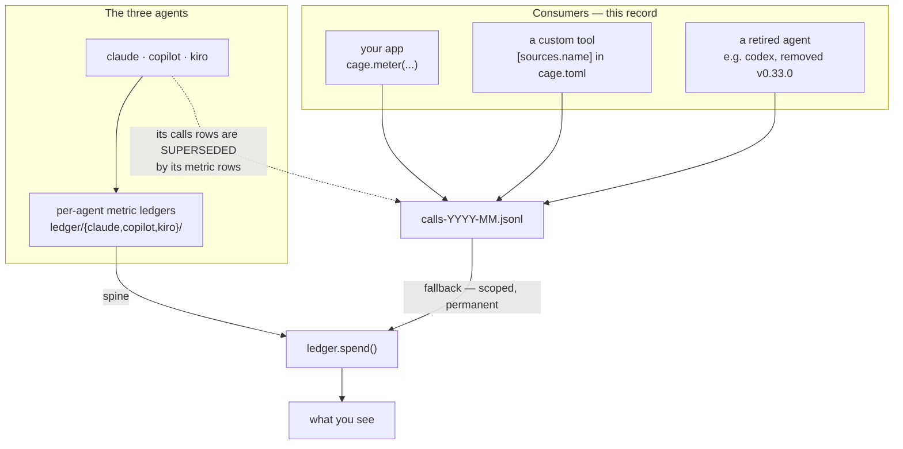

# ADR-CONSUMERS — the things cage meters that are not agents

> The five laws in [ADR-LAWS](0001_laws.md) bind this record already and are **not**
> restated here. Cite this record in prose as its NAME, never by number.

---

## §1 · For humans

**In one line:** not everything cage meters is a coding agent — your own code can report
its usage directly, and those rows are first-class, permanent, and deliberately outside
the per-agent machinery.

Three kinds of thing live here. **Your application**, calling `cage.meter` around an LLM
request. **A custom tool** you pointed cage at through config. **An agent cage used to
support** — Codex was removed in v0.33.0, but its rows are still in real ledgers and are
still counted.

**Two of the three still have no ledger of their own, and never will.** A custom
`[sources]` tool and a retired agent resolve from `calls`, permanently — which is why they
are the one group whose whole history still reads.

**Your application got one in v0.51**, at `ledger/consumer/`. That is a **partial reversal
of this record**, taken so that every producer owns one directory under `ledger/` and
`calls` can stop being *written* by anything current. The facts recorded did not get
richer — see the Decision below, which says so plainly. Nothing was migrated: every row
already on disk stays exactly where it is, and keeps resolving.

### Where they sit



<details><summary>Same diagram, ASCII</summary>

```text
   THE THREE AGENTS
     claude | copilot | kiro ---> ledger/{claude,copilot,kiro}/  --(spine)--.
        :                                                                   |
        :  their calls rows are SUPERSEDED by their metric rows             |
        v                                                                   |
   CONSUMERS  (this record)                                                 |
     your app          cage.meter(...)      --.                             |
     a custom tool     [sources.name]        +--> calls-YYYY-MM.jsonl       |
     a retired agent   e.g. codex (v0.33.0) --'          |                  |
                                                         |                  |
                                     (fallback: scoped, permanent)          |
                                                         |                  |
                                                     ledger.spend() <-------'
                                                         |
                                                   what you see
```
</details>

### What this buys you

| if you | you get | you do not get |
|---|---|---|
| wrap a call in `cage.meter` | tokens recorded in the same ledger as your agents | a per-chat view — there is no chat |
| point cage at a custom log | its rows swept by `cage import` like any agent | a metric ledger of vendor-native fields |
| still have rows from a removed agent | they keep counting, forever | new rows — the parser is gone |

### The one thing to remember

**Metering must never break your application.** If cage cannot record something, it
returns quietly and your request proceeds. A metering error reaching a user is a bug in
cage, not a signal to the caller — so these rows are best-effort by construction, and a
missing row is always possible.

---

## §2 · For agents

### Context

- [ADR-LAWS](0001_laws.md) Law 5's implementation partitions `ledger.spend()` **by
  agent**: an agent with a metric ledger resolves from it, an agent without one resolves
  from `calls`. That rule is stated for the three agents, and it silently decides the fate
  of everything that is *not* one of them.
- **The tempting literal reading — "the metric ledgers are the one basis, so `spend()`
  reads only them" — was measured and rejected.** It zeroes every library, proxy and
  custom-source row: **373 `codex` rows in one real ledger alone**, plus the
  AlphaForge/Anton integration's `agent="lib"` traffic. The `calls` fallback is scoped,
  not vestigial.
- These consumers have **no vendor-native store to build a metric ledger from**. The three
  agents' metric ledgers exist because their vendors persist facts (`cache_creation` TTL
  splits, `copilotCredits`, per-turn context %) that `calls` structurally cannot hold.
  A `cage.meter` caller passes what it passes; there is no richer store behind it.
- `cage.meter`'s rows carry `agent="lib"` by default and are produced by a **context
  manager in a request path**, which makes fail-open a hard requirement rather than a
  preference.
- The **proxy** was one of these consumers and was **deleted by SURFACE-CUT (v0.50)**. Its
  rows persist and still resolve; nothing new is produced.

### Decision

> ## ⟲ PARTIAL REVERSAL — 2026-08-14 (v0.51, P1 of the ledger restructure)
>
> **The library consumer now has a metric ledger: `ledger/consumer/calls-<month>.jsonl`,
> written by `record_call` as a DUAL WRITE beside the `calls` row.** The clause below —
> *"are never given a metric ledger"* — no longer holds for that one population. It still
> holds for custom `[sources]` tools and retired agents, and **every other clause of this
> decision survives untouched**, including the two invariants.
>
> **The original objection was right, and is not being pretended away.** *Alternatives
> rejected* says a metric ledger for consumers would be *"a rename of `calls` with a longer
> path"*, because there is no vendor store behind a library caller. That is still true:
> `schema.make_consumer_metric` carries **no field a call row could not**, and its
> docstring says so. **The reversal is about shape, not richness.** With consumers homed
> in their own directory, every producer owns one — `claude/` `copilot/` `kiro/`
> `consumer/` `graphify/` `provenance/` — and `calls` can stop being written by anything
> current, which is what retiring the three agents' transcript→`calls` writer (P5) needs.
> A cost paid in one near-duplicate kind to make a whole-tree property true.
>
> **What makes the reversal safe — and it is a NARROWING of one invariant, stated here
> rather than smuggled.** This record's third invariant is *"the `calls` fallback is
> scoped by `SPEND_SOURCES` membership, never by `agents.SURFACES`."* `SPEND_SOURCES`
> gains a `"consumer"` key, **but that key is deliberately NOT the suppression test.**
> Suppression of a consumer's `calls` twin is by **id** (`ledger.consumer_twin_calls`):
> `spend()` drops exactly the rows a consumer metric row claims, and nothing else.
>
> An agent-name test would have been the obvious implementation and would have zeroed
> every *historical* `lib`/proxy row — rows written before this kind existed, whose twin
> does not and cannot exist. That is this record's own measured failure (373 codex rows)
> pointed at a different population. The id match cannot make it, and
> `tests/test_consumer_ledger.py` pins the property directly.
>
> **Dual-write is the rollback, not caution.** The `calls` row is unchanged and still
> carries the whole fact; `ledger.join_table` still resolves a receipt's `call=` against
> it. Withdrawing this reversal is deleting one call site, not a migration.
>
> **Two things the reversal did NOT do:** it did not migrate a single existing row, and it
> did not give consumers a per-agent *surface*. They remain invisible to per-chat views,
> `agent%` and the metric-ledger doctor checks — still a consequence of having no chat and
> no vendor store, not a gap to fill.

**Non-agent consumers resolve from `calls` permanently, are never given a metric ledger,
and their write path is fail-open by construction.** *(The metric-ledger clause is
partially reversed — see the block above. The rest stands.)*

- **The `calls` fallback in `ledger.spend()` is scoped and permanent.** A row is
  superseded **only when its own agent has a spine to be superseded by** —
  `SPEND_SOURCES` is the membership test, never `agents.SURFACES`. Kiro sits in that table
  with an **empty tuple**, so its `calls` rows are suppressed by `ABSENT_SPINES` rather
  than by absence from the table; a consumer is simply not in the table at all, and keeps
  resolving. **Deleting that loop is the failure mode this decision exists to prevent.**
- **Three populations, one treatment:**
  - **Library** — `cage.meter(route, …)` / `record_call` / `record_receipt`
    (`cage/metering.py`), default `agent="lib"`.
  - **Custom sources** — a project `cage.toml [sources.<name>]` table extends or replaces
    the built-in log registry (`resolve_log_sources` is the one resolution point;
    absent/empty is byte-identical to the built-in registry).
  - **Retired agents** — rows written before an agent was removed. Codex went in v0.33.0
    as a product decision; its rows were never rewritten, because append-only.
- **The public name is `cage.meter`; the module is `cage.metering`.** Keep them distinct
  or the package attribute shadows the submodule.
- **Fail-open is absolute on this path.** `ledger.append` returns `False` and never
  raises; `meter()` swallows errors in cleanup. A metering failure must never propagate
  into a request. **Fail-open but never silent:** every swallow site logs under
  `CAGE_DEBUG`, audited by `tests/test_debug_coverage.py`.
- **A retired agent's rows are never deleted, rewritten, or re-attributed.** They are
  history that still counts.

### Consequences

- **Consumers are the only population whose entire history still reads.** The three agents
  lost their pre-metric `calls` history as a spend source; a consumer never had a
  supersession event, so nothing of its was displaced.
- **They are invisible to every per-agent surface** — no per-chat row, no `agent%`, no
  metric-ledger doctor check. That is a consequence of having no chat and no vendor store,
  not a gap to fill.
- **They cannot carry a credit.** Credits come from a vendor's own billing computation;
  there is none here. Tokens only.
- **`cage.meter` is the only capture path a user writes code for**, which makes it the one
  place a cage bug can reach a user's request path. Hence fail-open as an invariant rather
  than a policy.
- Adding a store to a metric kind does **not** add it to the spine, and adding a consumer
  does **not** add a kind. Capture stays wide; spend stays single-basis per agent.

### Alternatives rejected

- **`spend()` reads metric ledgers only.** Rejected **on measurement**: 373 `codex` rows
  in one real ledger, plus all `agent="lib"` traffic, silently zeroed. The scoped fallback
  is the correction.
- **Give consumers a metric ledger of their own.** Rejected: a metric kind exists to hold
  *vendor-native facts a caller could not supply*. For a library caller there is no vendor
  store — the kind would be a rename of `calls` with a longer path.
  **⟲ ACCEPTED 2026-08-14 (v0.51) for the library consumer only** — and on the reasoning
  *above*, not against it. The kind IS a near-rename of `calls`; it was taken anyway
  because a uniform per-producer shape is what lets `calls` stop being written. See the
  reversal block in *Decision*. The rejection still stands for custom `[sources]` tools
  and retired agents.
- **Delete a retired agent's rows when its parser goes.** Rejected on append-only: the
  rows were true when written, and a ledger that silently shrinks when a tool is removed
  cannot be reconciled against anything.
- **Re-attribute a retired agent's rows to a surviving one.** Rejected as inventing a
  fact — the same objection as any absent dimension.
- **Raise on a metering failure so the caller can react.** Rejected outright: the caller
  is a request path. An error budget spent on telemetry is the tail wagging the dog.
- **A `[sources]` entry that also creates a row kind.** Rejected as unbounded — a config
  file would then define schema, and the closed enums stop being closed.

### Reference

- **The measurement that killed the metric-ledgers-only reading** — 373 `codex` rows in
  one real ledger, plus the Anton integration's `agent="lib"` traffic: `ledger.spend()`'s
  own docstring, and
  [ADR 0011](../../work/archive/adr/0011-cage-measures-usage-not-cost.md) *Alternatives
  rejected*.
- **The first consumer, in production:** AlphaForge Anton's `LLMGateway` records each
  `ProviderResponse` through a fail-open `cage_meter` adapter, wired as an optional
  `[cage]` extra. It is the worked example this record generalizes.
- **Codex's removal as a product decision, not a capture-quality one:**
  `work/archive/*-codex-removal.handoff.md`.
- The scoping rule and the `SPEND_SOURCES`-as-membership-test detail are
  [ADR 0010](../../work/archive/adr/0010-metric-ledgers-are-the-spend-source-forward-only-cutover.md)'s,
  inherited here rather than re-decided.

### Veto condition (when to revisit)

**1 · Falsifiable triggers, numbered.**

1. ~~**A consumer earns a metric ledger only when a vendor-native store appears behind
   it**~~ — **SUPERSEDED 2026-08-14, and the record of how matters more than the outcome.**
   This trigger never fired: no vendor store appeared, and none is claimed. The library
   consumer was given `ledger/consumer/` for a reason this trigger did not anticipate — a
   **whole-tree shape** property (one directory per producer, so `calls` can stop being
   written), which is not a fact about consumers at all.
   **The lesson, kept because it is the reusable part:** a veto condition phrased as *"X
   happens only when evidence E appears"* is blind to a change motivated by structure
   rather than by evidence about X. It was still doing its job — it stopped a richer
   `cage.meter` argument from becoming a new kind, and that clause stands:
   **a caller-supplied field belongs on the call row, not in a new kind.**
   The trigger that now governs is the one below (3), plus this: **no OTHER consumer
   population gets a directory without a vendor-native store behind it.** Custom
   `[sources]` tools and retired agents resolve from `calls`, and that is invariant.
2. **The `calls` fallback narrows only with a measured zero** — a census showing **0 rows**
   in the non-superseded population across real ledgers. It was 373 for `codex` alone when
   this was written. Below that, narrowing deletes data.
3. **`agent="lib"` splits into named consumers** if a single ledger is measured carrying
   **≥ 2 distinct applications** whose usage a reader needs apart. Today the field is one
   bucket by choice; the fix is an additive optional field, never a new row kind.

**2 · Contingent vs. invariant.**

- **Contingent (auto-revisits on the evidence above):** whether any consumer gains a metric
  ledger; whether `agent="lib"` subdivides; which retired agents still appear in real
  ledgers.
- **Invariant — moves only by ratified reversal of this record:**
  - **Metering never raises into a request path.** Not performance-gated, not
    configurable. It is why a library integration is safe to accept at all.
  - **A retired agent's rows are never deleted, rewritten, or re-attributed.**
  - **The `calls` fallback is scoped by `SPEND_SOURCES` membership**, never by
    `agents.SURFACES` — the two look interchangeable and are not, and kiro's empty tuple
    is the case that proves it. **Narrowed, not broken, in v0.51:** `SPEND_SOURCES` now
    holds a non-agent key (`consumer`), and that key is **not** a suppression test. The
    only thing that suppresses a consumer's `calls` twin is an **exact id match**
    (`ledger.consumer_twin_calls`), so no untwinned row can ever be dropped by it. The
    invariant's purpose — *a row is never suppressed unless something specific replaces
    it* — is strengthened by the id test, not weakened.
  - **Config never defines schema.** A `[sources]` entry may name a log; it may not create
    a row kind.

**3 · Deliberately not taken.**

- **A `cage insights lib` view.** Consumers appear in totals and in `insights why`, but no
  view is dedicated to them. Declined because the question ("what did my app spend") is
  answered by the existing per-agent grouping. **Threshold:** trigger 3 above fires —
  once one ledger holds several applications, a grouping view has something to group.
- **Reviving the proxy** (deleted by SURFACE-CUT) as a consumer-facing capture path. Left
  open, not rejected: it was the only route to Kiro's five wire-only values
  ([ADR-KIRO](0005_kiro.md)). **Threshold:** a named need for wire-level capture that no
  on-disk store can satisfy — and it returns as a new surface with its own record, never
  as a restored module.
