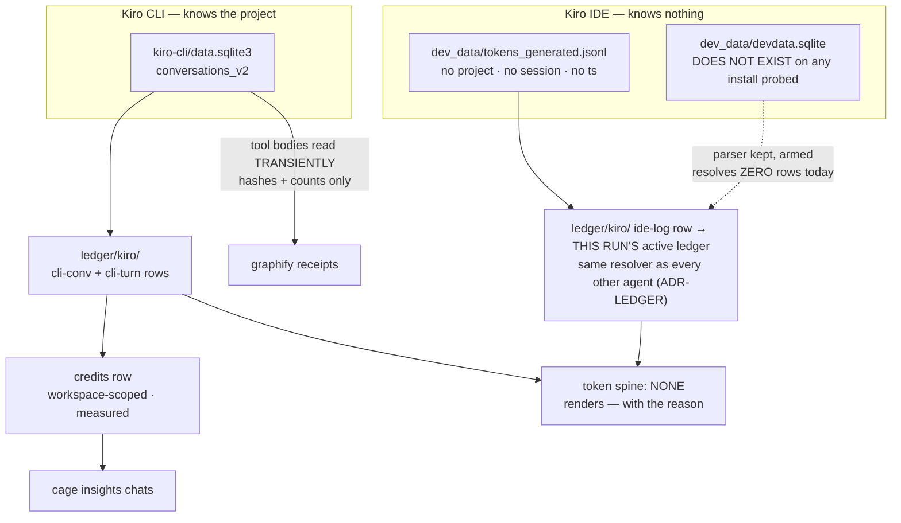

# ADR-KIRO — two stores with opposite properties; the IDE half is coarse and has no token spine

> The five laws in [ADR-LAWS](0001_laws.md) bind this record already and are **not**
> restated here. Cite this record in prose as its NAME, never by number.

---

## §1 · For humans

**In one line:** Kiro keeps the thinnest records of anything cage meters — its CLI records
what AWS charged you and no tokens at all, its IDE records tokens so coarse they cannot be
added up — so cage reports credits, and says `—` where a number would be fiction.

The single most important thing here: **Kiro has two stores that behave in opposite ways.**
The CLI store knows which project you were in. The IDE store knows nothing — no project,
no session, no timestamp. Treating them the same would either destroy real attribution or
invent fake attribution. Cage treats them separately, on purpose.

### For the meeting

> Absorbed from `docs/kiro-capture.md`, which is removed.

- We meter Kiro from its **own on-disk records** — no vendor API, no network, zero infra
  cost. The numbers are the vendor's, recorded verbatim.
- **Credits are the billing truth** for Kiro CLI: AWS's own per-conversation charge,
  captured exactly and tagged `measured`.
- **Kiro's IDE keeps the thinnest records of any agent we meter** — output tokens usually
  0, model usually the generic `"agent"`. We report what AWS persists, verbatim, into
  whichever ledger is active for the run (ADR-LEDGER, 2026-08-15) — the same as every
  other agent, even though its log carries no project dimension of its own.
- **Token and cache precision exists, but AWS throws it away.** The backend streams exact
  token and cache counts plus per-request credits with every response; Kiro persists
  almost none of it. Full fidelity would need cage in the request path — a vendor
  limitation, not a metering gap.
- **A standing upgrade-watch is armed:** the day Kiro's own store starts persisting
  per-turn tokens, cage captures them with **zero code change**, and `cage doctor`
  announces the flip.

### The flow



<details><summary>Same diagram, ASCII</summary>

```text
  KIRO CLI  -- knows the project ------------------------------------------------
    kiro-cli/data.sqlite3 (conversations_v2)
        |-- ledger/kiro/ ----------> cli-conv (per conversation) + cli-turn (per turn)
        |     +-- credits row -----> projected from cli-conv, tagged MEASURED --> insights chats
        +-- tool-run bodies -------> read TRANSIENTLY; only hashes + counts persist
                                     -> graphify receipts

  KIRO IDE  -- knows NOTHING (no project, no session, no timestamp) --------------
    dev_data/tokens_generated.jsonl
        +-- ledger/kiro/ ----------> ide-log rows, THIS RUN'S active ledger
                                     same resolver as every other agent (ADR-LEDGER)
    dev_data/devdata.sqlite
        +-- DOES NOT EXIST on any install probed
            parser kept + armed; resolves ZERO rows today (would land the same way)

  TOKEN SPINE FOR KIRO: none.  Renders "—" with the reason.  Never a 0.
```
</details>

### What we can say, and how much to trust it

| number | where it comes from | trust |
|---|---|---|
| **credits per conversation, CLI** | AWS's own per-conversation charge | vendor-recorded |
| context % used, turn count, model | the same conversation record | vendor-recorded |
| per-turn timing and size, CLI | chunks, prompt/response bytes, tool uses | vendor-recorded |
| graphify savings from CLI tool runs | command + output hashed in memory, then dropped | derived by cage |
| IDE tokens | a coarse global log, captured into whichever ledger is active for the run | vendor-recorded, coarse — no per-turn precision regardless of ledger |
| **a per-project kiro number built from IDE tokens** | — | **absent: the IDE store has no project dimension of its own, so a row's presence in a project ledger is not proof the work happened there** |
| **a kiro token total** | — | **absent: no IDE token store on this install** |
| **cache tokens, per-chat IDE credits** | — | **absent: they exist only on the wire, never on disk** |
| **dollars** | — | **absent by decision: cage measures usage, never cost** |

### What we can't say, and why

- **A per-project kiro cost has never been correct, and still isn't — cage refuses to
  print one.** The IDE log is one global append-only file with no project field, so every
  ledger that imports it pulls kiro's entire global history. Measured in the lab: a fresh
  workspace showed 28 rows, of which **22 were turns from work done in a different
  workspace**. Since ADR-LEDGER (2026-08-15) those rows land in whichever ledger is
  active — cross-project duplication is now an accepted cost rather than a prevented one
  (see ADR-LEDGER for the reasoning); a project report still gains no *correct* kiro
  section, because the rows it holds are not provably its own.
- **Kiro has no usable token count at all.** The obvious source was probed on
  2026-08-14: 28 rows totalling **1,576 in / 0 out**, model `"agent"` on every row, with a
  byte-identical 6-row block repeated. It is not summable. Building a total on it would
  be a fabricated number, so cage renders `—` and names the reason.
- **AWS throws away precision it already has.** The backend streams exact token and cache
  counts plus per-request credits with every response; Kiro persists almost none of it.
  Full fidelity would need cage in the request path. That is a vendor limitation.
- **Cage reads the CLI store but never writes to it** — read-only, immutable connection,
  every time.

---

## §2 · For agents

### Context

- **Two stores, opposite attribution properties.** Applying one rule to both destroys
  something either way:

  | store | parser | carries | verdict |
  |---|---|---|---|
  | **IDE** `dev_data/tokens_generated.jsonl` | `parse_kiro_ide_log_metrics` | no project · `session="kiro"` · no `ts` | **machine fact, still captured everywhere it's imported (ADR-LEDGER)** |
  | **CLI** `conversations_v2` (SQLite) | `parse_kiro_cli_credits` | **keyed by cwd** · real `conversation_id` · real `updated_at` | **project-attributable** |

- Row ids are stable across ledgers (`km_idelog{line_index}{sha1(line)[:8]}` — the
  `c_kiro…` construction carried over intact when the rows changed kinds), so an IDE row
  imported twice into the *same* ledger is **the same row stored twice**, not two rows.
  Every id-merging path dedupes it correctly within one ledger; only naive summing of two
  ledger *files* breaks. But the damage is larger than "don't sum": importing the log from
  a *new* project's ledger pulls kiro's entire global history into that ledger too, as a
  **second, separately-stored copy** of the same underlying turns. **Kiro is a paid tool,
  so cross-project duplication is a correctness problem, not a reporting nicety — it is
  the cost ADR-LEDGER accepts in exchange for "everything in the active ledger, always."**
- **Kiro CLI records credits and no tokens at all** — the token fields in its SQLite store
  are NULL even with an explicit non-`auto` model. A call row with `tokens_in=0` would be
  a lie that poisons every token average.
- **`devdata.sqlite` does not exist.** Through v0.50, `ABSENT_SPINES` pointed at it — a
  live-looking source resolving zero rows forever (KIRO-IDE-METRIC-ROW). The 2026-08-14
  field probe settled it: `dev_data/` holds only `tokens_generated.jsonl`.
- **The CLI store's law is written as a key whitelist**, uniquely among cage's sources:
  content and metadata share one row, so there is no schema boundary to hide behind. The
  parser touches only a closed whitelist of numeric/metadata keys and never
  `history[].user`, `history[].assistant`, `content`, `text`, `transcript`, `next_message`.
- graphify savings were **structurally dark on kiro** — not partial, absent — because the
  command lives at `history[].assistant.ToolUse.tool_uses[].args.command` and its output
  at `history[].user.content.ToolUseResults.tool_use_results[].content[].Json.stdout`.
  **Both are inside the whitelist's exclusion zone.**

### Decision

**Kiro IDE rows are machine facts, coarse by the vendor's doing, and now captured into
whichever ledger is active for the run — never a separate machine-only sink. Kiro has no
token spine and says so. CLI tool-run bodies may be read transiently, in one named
function, and nothing but hashes and counts persists.**

- **Routing — REVERSED by ADR-LEDGER (2026-08-15).** Through 2026-08-15, IDE rows went to
  `~/.cage` unconditionally, never a project `.cage/`, on the reasoning that a source with
  no project dimension of its own should not be stored as if it had one. **ADR-LEDGER
  ratified the opposite call: every source captures into this run's one resolved ledger,
  with no per-agent exception.** IDE rows now ride the same `run_agent(root, "kiro", ...)`
  path as every other agent's rows, `paths.kiro_ledger` always returns the run's own
  `root`, and `paths.kiro_routed` always returns `None`. An explicit `--ledger`/`CAGE_BASE`
  still resolves the run's `root` exactly as it always did — that part of the mechanism is
  unchanged, only the special-casing on top of it is gone. CLI rows are unaffected: they
  were always cwd-keyed and attribute honestly; `cli-conv`/`cli-turn` metric rows keep
  riding the same workspace scoping the credits leg resolves.
  **The row kind change survives this reversal the same way it survived the original
  rule** (KIRO-CALLS-LEG): IDE rows are `ide-log` metric rows, not `calls` rows, and
  nothing about *what* is captured changed here — only *where* it lands. See ADR-LEDGER
  for the full context, the accepted cost, and the veto condition governing this reversal.
- **`SPEND_SOURCES["kiro"] = ()`** and `ABSENT_SPINES["kiro"]` carries the reason. Every
  view renders `—` **with that sentence**, never a `0`. **The sentence was widened in P2**:
  it said *"no IDE token store on this install"*, which named one surface and one cause,
  and a reader could fairly conclude the CLI had tokens. **Both** surfaces lack them, for
  two different vendor reasons — the IDE ships no store at all; the CLI's token columns
  exist and are still null (2.16.0, an upgrade-watch rather than a permanent absence).
  One clause could not carry that distinction, and it is rendered verbatim to users.
  `transcript.parse_kiro_ide_metrics` is deliberately **kept** for the day a Kiro ships
  the store, and `cage doctor`'s kiro-IDE check distinguishes **db absent / table missing
  / column drift** so the flip announces itself.
- **Credits are their own row *shape*** (`schema.make_credit`, `unit="credits"`, its own
  id namespace), read by no call-based view — so they can never perturb a token number.
  Last-write-wins per session. Retagged **`measured`**: they were `estimated` only while
  standing in for dollars cage could not see. **All of that is unchanged.**
- **⟲ Their STORAGE moved in P2 (v0.51): `credits-<month>.jsonl` is no longer written.**
  `ledger/kiro/`'s `cli-conv` rows are the credits home — the same store, the same shared
  reader (`_kiro_cli_conversations`), the same whitelist. The top-level shard was a
  **duplicate** of it, and P0 measured the two at 3 rows / 3 rows over the same sessions
  with **identical** `credits`/`context_pct`/`turns`
  ([cross-check](../../work/regression/2026-08-14-calls-vs-metric-crosscheck.md)).
  `ledger.credits` now reads **both homes forever** — every existing shard still resolves
  and none was migrated, rewritten or deleted.
  - **The one real difference is the skip rule, and it is preserved rather than inherited.**
    A credits row requires an actual usage signal (credits ≤ 0 **and** context ≤ 0 ⇒ no
    row); `cli-conv` is deliberately laxer, emitting whenever the store carried a
    `usage_info` list *including one summing to a real 0.0*, because a store-verbatim kind
    records what the store said. So `cli-conv` is a **superset**, and
    `ledger._credit_from_cli_conv` re-applies the credits rule on projection.
    **Measured: the delta is 0** across all 20 conversations on a real store — which is
    *not* a reason to drop the rule. n = 20 on one machine simply contains no disagreeing
    case; `tests/test_credits_rehome.py` constructs one.
  - **A `cli-conv` `credits` of `None`** (no `usage_info` at all) reads as *no signal*, and
    is never rendered as a recorded `0.0`. Absence and a measured zero stay different facts.
- **`cli-conv` is cumulative and is STILL NOT a spine** — listed in `CUMULATIVE_SOURCES`,
  and being the credits home does not change that. `ledger._spend_row` normalizes every
  spine row to the call-row **token** shape, so a `cli-conv` row inside `spend()` would
  carry credits with zero tokens — the exact lie `make_credit` exists to prevent. Kiro
  gains no spine and keeps rendering `—`; the credits axis stays a separate reader.
- **The tool-run carve-out is exactly one function:** `transcript.parse_kiro_cli_tool_runs`
  (with helper `_kiro_cli_tool_runs`), **named in the whitelist comment itself**, so a
  reader of the law meets the exception at the same moment. `_kiro_cli_credit_row` — and
  every function that writes a ledger row from this store — stays fully bound. **The
  carve-out widens what may be read, never what may be written.**
- **What persists is what persists on every other graphify route:** `args_hash`,
  `answer_hash`, a token count, `source_files` as an integer, `op`, and the deterministic
  `receipt_id`. No command string, no output byte, no file path.
- **The store is never written to** — `mode=ro&immutable=1`, always.
- **A truncated stdout files nothing.** Kiro caps tool output at ~2000 tokens; a truncated
  answer under-counts `actual` and would *inflate* the modelled saving, so it is
  `unmeasurable`. The marker is matched **anchored at the end of the string**, never as a
  substring.
- **`cli-turn` rows record the NULL token slots anyway** — the upgrade-watch. The moment
  Kiro starts filling them, cage captures them with zero code change; `cage doctor`
  announces the flip.

> **⟲ Kiro's transcript→`calls` leg is RETIRED, and its store RELOCATED — KIRO-CALLS-LEG,
> ratified by Arpit 2026-08-15.**
>
> P5 (v0.51) retired that leg for claude and copilot because it was a **duplicate**:
> `ledger/claude/` and `ledger/copilot/` carry the same traffic. Kiro IDE had no such
> twin — `parse_kiro_ide_metrics` reads `devdata.sqlite`, absent on every install ever
> probed — so retiring kiro's leg **unchanged** would not have de-duplicated anything; it
> would have **ended kiro IDE capture**, taken this record's routing decision's subject
> matter with it, and left the upgrade-watch without a baseline. P5 kept the leg and
> flagged it rather than deciding that unilaterally.
>
> **The ratification came with the condition attached: retire it, and capture the store in
> `ledger/kiro/` instead.** So `tokens_generated.jsonl` is now read by
> `transcript.parse_kiro_ide_log_metrics` into this record's own metrics kind as
> `source="ide-log"`. Same file, same four fields, same line-index+content-hash dedupe,
> same machine sink — a different kind.
>
> **Nothing was lost in the move, including the thing that looks lost.** These rows never
> had a real `ts`: the store carries none, so `make_call` stamped import time and
> `make_kiro_metric` stamps it the same way. Both consequences P5 named survive too —
> the routing decision still has rows to route, and the upgrade-watch still has arriving
> rows for the day `devdata.sqlite` ships (`cage doctor` now counts the `ide`/`ide-log`
> pair side by side).
>
> **And the move is an improvement rather than a lateral.** As `calls` rows these were
> spend that every total had to exclude BY NAME (`ABSENT_SPINES["kiro"]` — a maintained
> exception, and one that fails open: forget it once and kiro's `0`-output rows start
> deflating a real average). As metrics rows they are capture-only **by kind**, so the
> exclusion is structural and cannot be forgotten. The handoff's original reason for
> removal — the rows are unsummable — turns out to be an argument for the new home rather
> than for deletion: unsummable facts belong in a kind that is never summed.
>
> `transcript.parse_kiro_calls` is **kept and still exercised** — it is the
> `[sources.<name>] format = "kiro"` custom-source contract, unreachable from the built-in
> path and fully reachable from user config. `tests/test_calls_retired.py` pins the
> retirement and the relocation **together**, because "no kiro `calls` rows" on its own is
> satisfied just as well by deleting the leg outright, and nothing else in the suite would
> notice: kiro was already absent from every total, so silent data loss here changes no
> number a user ever sees.

### Consequences

- **A project report may now show kiro IDE rows that did not happen in that project**
  (ADR-LEDGER's accepted cost) — cage never fabricates a per-project split from them, but
  it no longer withholds them from a ledger they weren't proven to belong to, either.
  `cage query kiro-routing` explains why a row's presence is not proof of provenance.
- **Kiro contributes no tokens to any total.** That is the decision, stated, not a bug to
  fix. `units.ABSENT["kiro"][TOKENS]` carries the reason to every renderer.
- kiro-CLI joins claude and copilot as a first-class graphify surface — the three-agent
  invariant holds for that capture path instead of being aspirational.
- **This route refuses often, and that is correct.** Most real `graphify query` output
  exceeds the ~2000-token cap, so the query route files nothing on those runs. The
  report-read route is unaffected. A thin kiro column is *expected*, and the reason is
  named out loud rather than left as a silent zero.
- **The whitelist comment is now load-bearing in two directions** — it states a law *and*
  its single exception. A second exception must be added there, or the comment starts
  lying about the store's cardinality.
- Cage reads the CLI store twice per sweep (credits, then tool runs). Both read-only over
  a store measured at ~1 MB / 19 conversations; not material at that scale.
- Kiro credits and Copilot credits share a column heading and nothing else — the
  cross-agent sum is refused in code, not by convention.

### Capture reference — store → property → row

> Absorbed from `docs/kiro-capture.md`, which is removed. Capture is pull-based
> (`cage import` / capture-on-read) — no hooks, no network, `$0`.

**`credits` rows** (the IDE store moved to the kiro-metrics table below — KIRO-CALLS-LEG):

| number | store → property | lands as |
|---|---|---|
| credits (CLI, per conversation) | `kiro-cli/data.sqlite3` → `conversations_v2.value` → `user_turn_metadata.usage_info[]` (unit `credit`, summed) | `credits` row (`k_cred…`, surface `cli`), workspace-scoped, last-write-wins per session |
| context % · turns · model (CLI) | same conversation JSON → `request_metadata.context_usage_percentage` (last) · `len(history)` · `model_info` | same `credits` row |
| tool savings (CLI, graphify) | `history[]` tool runs, read **transiently** | `savings/graphify/` receipts |

**`.cage/ledger/kiro/` rows** — a deliberately separate kind (`schema.make_kiro_metric`),
store-verbatim at three grains:

| source | store | what lands |
|---|---|---|
| `ide-log` | IDE `dev_data/tokens_generated.jsonl` (append-only JSONL) — **the only IDE store that exists**, and since KIRO-CALLS-LEG the only place its rows land | per-call `promptTokens`/`generatedTokens` verbatim, `surface="ide"`, `session="kiro"`, into this run's active ledger (ADR-LEDGER, 2026-08-15 — no longer a separate machine ledger). Coarse by the vendor's doing: output usually 0, model usually `"agent"`. No `ts` in the store, so the row carries import time — exactly as the retired `calls` row did |
| `ide` | IDE `dev_data/devdata.sqlite`, table `tokens_generated` (SQLite, read-only) — **this file does not exist on any Kiro install probed so far**, so this source resolves **zero rows** | the SAME counter as `ide-log`, plus a `timestamp` and a cursorable `id` the jsonl never carried. **`ide` and `ide-log` are one counter from two stores**, so exactly one of the pair is manifest-eligible at a time (`importcmd._MANIFEST_SOURCES`, pinned by test) — today `ide-log`. The day the SQLite store ships, flip the pair; never add to it |
| `cli-conv` | CLI SQLite store, per conversation | credits (`usage_info` sum, None-sentinel when the list is absent), context %, turn count — cumulative-verbatim. **Cumulative ⇒ never a spine** (`CUMULATIVE_SOURCES`) |
| `cli-turn` | same store, per `history[]` turn | populated timing/size/tool-use fields (`chunks`, `prompt_bytes`, `response_bytes`, `tool_uses`, `context_pct`), PLUS the token slots that are NULL on every real store probed — **the upgrade-watch** |

Parsers: `transcript.parse_kiro_ide_log_metrics` (the live IDE leg) ·
`parse_kiro_ide_metrics` (kept, armed) · `parse_kiro_cli_credits` ·
`parse_kiro_cli_metrics` · `parse_kiro_cli_tool_runs` (**the one carve-out**) ·
`parse_kiro_calls` (**no longer on any built-in path** — kept solely as the
`[sources.<name>] format = "kiro"` custom-source contract).
Reader: `ledger.kiro_metrics` collapses last-write-wins per
`(source, session, turn, row_ref)`.
Health: `cage doctor`'s `kiro-metrics` check names per-source coverage and the
upgrade-watch state (armed vs. tripped); its kiro-IDE check distinguishes **db absent /
table missing / column drift**. `cage query kiro-metrics` explains it.
Routing since ADR-LEDGER (2026-08-15): `ide`/`ide-log` rows capture into this run's one
active ledger, no separate machine sink; `cli-conv`/`cli-turn` ride the same workspace
scoping the `credits` leg resolves, unaffected by that change.

### Known gaps (open)

- **Kiro has NO token spine, and cage says so rather than showing a zero.**
  `SPEND_SOURCES["kiro"]` is empty and `ledger.ABSENT_SPINES` carries the reason — *"no
  IDE token store on this install"* — which every view renders as `—`.
  - Through v0.50 that entry pointed at `devdata.sqlite`, **a file that is not there**: it
    read as a live source while resolving zero rows forever (KIRO-IDE-METRIC-ROW).
  - Emitting an `ide` spine from `tokens_generated.jsonl` instead was **rejected on the
    field probe** — see §2's *Alternatives rejected*.
- **IDE log is coarse by the vendor's doing** — output tokens usually 0, model usually the
  generic `"agent"` (real 16-call probe: 198 in / 0 out). Not fixable from this store.
- **Cache tokens + per-chat IDE credits: persisted by NO kiro store.** They exist only on
  the wire (`metadataEvent.tokenUsage`, `meteringEvent`). Permanently honest-empty from
  disk; not a cage gap.
- **CLI token slots are still NULL** on every real store probed (kiro-cli 2.16.0) —
  `cli-turn` rows record them the moment Kiro starts filling them (upgrade-watch armed,
  zero code change needed).
- **No read surface for `.cage/ledger/kiro/`** — a `cage insights kiro` view, or new
  chats-view columns, are parked in `work/OPEN-WORK.md`, not built. (The CSV export that
  was also parked went with `cage data`, deleted by SURFACE-CUT.)
- **Cross-project duplication is now possible** (ADR-LEDGER, 2026-08-15): an IDE row
  imported into more than one project's ledger is stored once per ledger, not once per
  machine. Cage does not detect or flag this — see ADR-LEDGER's Known gaps for the
  accepted scope of that decision.
- **One real-store probe still pending** — whether IDE session JSONs embed per-message
  usage. The other (the `devdata.sqlite` column list) was **answered 2026-08-14: the file
  does not exist.** The parser survives either answer (explicit-column SELECT, fail-open).

### Alternatives rejected

- ~~**Store IDE rows at project level anyway** — invents a precision the source cannot
  support, which is the exact failure cage exists to catch in other tools.~~ **This is now
  the decision** (ADR-LEDGER, 2026-08-15): rows land in the active ledger, but cage still
  never invents a per-project *split* from them — it stores the same machine-level facts
  more places, it does not manufacture attribution they don't have. See ADR-LEDGER for
  why the original rejection's reasoning no longer wins.
- **Import-cursor partition** (a fresh ledger seeks to EOF, splitting turns by import
  order) — attribution becomes an artefact of *when you ran import*: arbitrary and
  unreproducible.
- **A marker plus read-time exclusion** (rows land anywhere, views drop them) — more
  machinery for the same outcome, and it leaves the wrong rows on disk.
- **Emit an `ide` spine from `tokens_generated.jsonl`** — rejected on the field probe:
  1,576 in / **0 out** across 28 rows, model `"agent"` throughout, a byte-identical 6-row
  block repeated. Not summable; a spine on it would be fabricated, not measured.
- **A kiro `tokens_in=0` call row** — poisons every average. The lie is worse than the gap.
- **Leave kiro dark for graphify** — not a limitation but an absence: cage would publish
  per-tool savings that silently exclude a whole agent.
- **Detect graphify runs from credit-row metadata alone** (turn counts, context %) — none
  of it identifies *which command ran*. A guess wearing a number.
- **Persist the command string to make receipts auditable** — counts-never-content is a
  product invariant; an auditable receipt that leaks a prompt is worth less than an opaque
  one that doesn't.
- **File a partial saving from truncated stdout, marked lower-confidence** — confidence
  grades *inference quality*, not *missing data*. A truncated answer is wrong in a known
  direction, and a lower confidence dresses that up rather than refusing it.
- **A separate mini-parser instead of touching `transcript.py`** — would put the carve-out
  somewhere the law does not mention, which is precisely how an undocumented exception
  becomes an unnoticed one.

### Reference

- **The cross-ledger double-count, measured in the lab** — workspace-off 22 rows,
  workspace-on 28, of which 22 were the same turns from another workspace:
  [work/regression/2026-08-01-finding-kiro-rows-double-count-across-ledgers.md](../../work/regression/2026-08-01-finding-kiro-rows-double-count-across-ledgers.md).
- **The 2026-08-14 field probe** that killed the token spine (28 rows, 1,576 in / 0 out,
  repeated block) and the five-values-on-the-wire finding:
  [work/research/2026-08-13-kiro-per-chat-usage-fetch-spec.md](../../work/research/2026-08-13-kiro-per-chat-usage-fetch-spec.md).
- **The 2026-08-07 store probe** establishing the tool-run shapes, the truncation marker,
  and that no metadata alternative exists (kiro-cli 2.16.0, two live `execute_bash` runs,
  19 conversations):
  [work/research/2026-08-07-graphify-store-evidence.md](../../work/research/2026-08-07-graphify-store-evidence.md).
- **ADR 0006 scoping observed in the field**, not assumed:
  [work/regression/2026-08-07-gfx-cov-kiro-field-run.md](../../work/regression/2026-08-07-gfx-cov-kiro-field-run.md).
- The governing principle — *cage can never be more precise than its source* —
  [work/cage-lab/03-verify.md](../../work/cage-lab/03-verify.md) §1.
- Ratified as archived ADRs 0006 (routing), 0009 (the carve-out) and 0004 (credits as a
  distinct kind) — **named, not cited**. All three are live in this record's §2 and in
  [ADR-LAWS](0001_laws.md) Laws 3 and 4.
- **The routing reversal itself, ratified by Arpit 2026-08-15**: [ADR-LEDGER](0015_ledger.md),
  which carries the field-probe evidence this record's original routing decision rested on
  and the accepted-cost reasoning for reversing it.

### Veto condition (when to revisit)

**1 · Falsifiable triggers, numbered.**

1. ~~**Routing** reopens the moment kiro's **IDE** log gains a project, workspace, or cwd
   field.~~ **Superseded 2026-08-15 — routing already reopened, by ratified reversal
   rather than by this trigger firing** (ADR-LEDGER). IDE rows still carry no project
   field of their own; if kiro's log ever gains one, that is a separate, still-open
   improvement — real attribution rather than "same ledger as everything else" — and
   would be its own change against ADR-LEDGER, not a re-litigation of this record.
2. **The absent token spine** reopens the moment an `ide` metric row can actually be
   parsed — a shipped `devdata.sqlite`, or any IDE store that is summable. That is a
   contained parser change; `cage doctor`'s three-way probe (db absent / table missing /
   column drift) announces which case is true.
3. **Read cost.** The second CLI read is justified while the store is small: **1.0 MB /
   19 conversations** on 2026-08-07. If a real store reaches **≥ 200 MB or ≥ 5,000
   conversations**, or the two reads add **> 250 ms** to a sweep, fold both into a single
   pass over `conversations_v2`. That is a *performance* change and **must not become a
   reason to reopen the persistence rule**.
4. **The truncation cap.** The guard is keyed to the literal marker
   `... (truncated to ~2000 token budget)`. If a kiro-cli release changes that string or
   removes the cap, the test keeps passing while the real store starts filing inflated
   savings — a green test asserting nothing. **Re-probe the marker on any kiro-cli major
   bump** and record the probed version.
5. **graphify coverage.** If, after a real evidence run, the kiro query route files on
   **< 10%** of observed graphify invocations, the honest product answer may be
   report-read-only plus a named gap. Reopen with the measured hit rate, not an impression.

**2 · Contingent vs. invariant.**

- **Contingent (auto-revisits on evidence):** the absent spine; the second read pass; the
  marker literal; the ~2000-token cap; whether the query route earns its place; the CLI
  token slots (upgrade-watch, armed).
- **Reversed 2026-08-15 (was invariant here, moved by ratified reversal — ADR-LEDGER):**
  *a source with no project dimension is not stored at project level.* That line governed
  IDE routing from this record's ratification until ADR-LEDGER. It is recorded here, struck,
  rather than deleted, so a future reader finds the mechanism that moved it instead of
  wondering why it's gone.
- **Invariant (moves only by ratified reversal of this ADR):** **no
  command or output byte is ever persisted**; **the store is never written to**; **a
  truncated or failed run files nothing**; **the credits parser stays bound by the
  whitelist**; **absence renders `—` with a reason, never `0`**; **credits are never
  summed across agents**.

**3 · Deliberately not taken.**

- **Kiro IDE as a graphify source.** Its `workspace-sessions/` store was probed and
  persists **no** assistant output at all (26/26 completions empty, zero tool blocks) — so
  there is nothing to carve out. Left open, not closed: **if a future Kiro IDE release
  persists tool calls with their results, that store becomes eligible under exactly the
  terms of this ADR** — transient read, hashes only, truncation refuses — needing a probe
  and a route, not a new decision.
- **One real-store probe still pending:** whether IDE session JSONs embed per-message
  usage. The parser survives either answer (explicit-column SELECT, fail-open).
- **A read surface for `.cage/ledger/kiro/`** — a `cage insights kiro` view or new
  chats-view columns. Recorded, not surfaced. **Threshold to reopen:** a question a user
  actually asks that the credits row cannot answer and these rows can.
