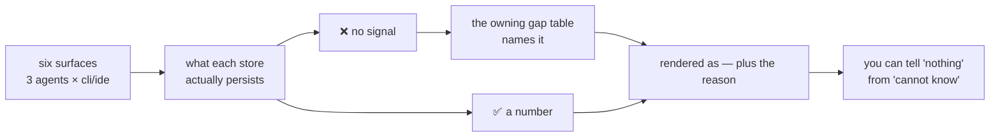

# ADR-COVERAGE — the six surfaces, what each yields, and why an absence is never a zero

## §1 · For humans

**In one line:** cage meters three agents across two surfaces each, the six are **not**
equivalent, and every gap between them is *stated at the point you would otherwise see a
number* — never rounded to zero, never quietly omitted.

Read the matrix as: **✅** works · **⚠️** works with a stated limit · **❌** structurally
cannot, and cage says whose limitation it is.

### The flow



<details><summary>Same diagram, ASCII</summary>

```text
  six surfaces          what the store        -> a number ------------+
  (3 agents x           actually persists                             |
   cli/ide)      ---->                        -> no signal            v
                                                    |            rendered as
                                                    v            a value, or
                                            the owning gap        "—" + reason
                                            table names it            |
                                                    |                 v
                                                    +--------> you can tell
                                                               "nothing" from
                                                               "cannot know"
```
</details>

### What we can say, and how much to trust it

**Usage capture**

| | claude CLI | claude IDE | copilot CLI | copilot IDE | kiro CLI | kiro IDE |
|---|---|---|---|---|---|---|
| Token spend | ✅ | ✅ *same store* | ✅ | ✅ | ❌ credits only | ❌ no token store on this install |
| Credits | ❌ none exist on disk | ❌ | ✅ | ✅ | ✅ *the only credits producer* | ❌ wire only |
| Cache-read tokens | ✅ | ✅ | ✅ | ✅ | ❌ | ❌ |
| Cache-write tokens | ✅ | ✅ | ❌ no store persists it | ❌ | ❌ wire only | ❌ |
| Thinking · cache-TTL split · server-tool counts | ✅ | ✅ | ❌ | ❌ | ❌ | ❌ |
| Sub-agent / sidechain split | ✅ | ✅ | ❌ | ❌ | ❌ | ❌ |
| Working-dir stamp | ✅ | ✅ | ⚠️ | ⚠️ | ✅ | ❌ machine fact, not a project fact |
| Per-chat identity | ✅ | ✅ | ✅ | ✅ | ✅ | ❌ one constant id — every run collapses to one row |

**Derived surfaces**

| | claude CLI | claude IDE | copilot CLI | copilot IDE | kiro CLI | kiro IDE |
|---|---|---|---|---|---|---|
| Authorship (agent vs human) | ✅ | ✅ | ❌ stores keep prompts, not edit text | ❌ | ❌ token counts only | ❌ |
| Tool savings, from the store | ✅ | ✅ | ✅ | ✅ | ⚠️ output capped — a long answer files **nothing** | ❌ persists no assistant output |
| Tool savings, via the interceptor | ✅ | ✅ | ✅ | ✅ | ✅ | ✅ *the only route here* |
| Chat title | ✅ | ✅ | ❌ honest empty | ✅ | ❌ honest empty | ❌ |

**Operational state**

| | claude CLI | claude IDE | copilot CLI | copilot IDE | kiro CLI | kiro IDE |
|---|---|---|---|---|---|---|
| Incremental re-import | ✅ | ✅ | ✅ | ✅ | ✅ | ⚠️ its own sink |
| Capture breadcrumb | ✅ | ✅ | ✅ | ✅ | ✅ | ✅ |
| Hook attestation | ✅ | ❌ | ⚠️ event names unverified; no session id | ❌ | ⚠️ close only | ❌ |
| Auto task-close | ✅ | ❌ | ❌ declines | ❌ | ❌ declines | ❌ |
| Agent wiring | ✅ | ✅ | ✅ | ✅ | ⚠️ | ⚠️ |

### What we can't say, and why

**Whose limitation each one is — an absence that belongs to the vendor is not a cage gap
and must never read as one.**

- **Vendor's, permanent.** Claude Code records no credit unit anywhere on disk, and
  stopped writing a billed figure in v1.0.9. No Copilot store persists cache-write
  tokens. Kiro's cache tokens and per-chat IDE credits exist only on the wire.
- **Vendor's, might change.** Kiro's IDE store persists no assistant output, so a
  savings counterfactual cannot be sized there. Kiro's CLI token slots are present but
  null on every build probed. Both are watched; neither is worked around.
- **Vendor's, by shape.** Kiro's IDE log carries one constant session id, so per-chat
  identity is not fabricated — the row says so instead.
- **Cage's, and named as such.** Metric rows carry no task, so task-grouped analysis
  sees nothing for the three agents. Nothing reads the sibling ledgers beyond the spine.
- **The platform's, across all three agents.** Hooks do not fire under an IDE extension,
  so every hook-derived fact is a CLI-session fact.

**Three patterns explain most of the matrix.** Claude's CLI and IDE **share one store**,
so almost nothing splits by surface for it. Everything hook-derived is **CLI-only for all
three agents** — a platform limit, not a per-agent one. And **kiro-IDE is the floor**: no
token store, no authorship, no store-side savings, no chat identity, no project — which is
exactly why the PATH interceptor is its only capture route there.

---

## §2 · For agents

### Context

- The six surfaces are **not** equivalent, and the differences are load-bearing rather
  than incidental. Every one below was **measured or probed**, not assumed — see *Reference*.
- Cage already had the right instinct in five separate places, each solving the same
  problem locally: `ledger.ABSENT_SPINES` · `units.ABSENT` · `authorcapture.COVERAGE_GAPS`
  · `graphifytx.GRAPHIFY_COVERAGE` · `agents.HOOK_EVENTS`/`HOOK_GAPS`. **What was missing
  was the rule they all obey, and a map a reader could hold in one place.**
- The failure this prevents is specific and has bitten twice. A gap rendered as `0`
  reads as *measured nothing*. `0%` authorship on copilot reads as *the agent wrote
  nothing*, which is a claim cage cannot make. A silently-omitted row reads as *no answer
  exists*, which is worse than a refusal.
- The mirror failure is a **residual presented as a finding**. A single `human` bucket
  printed **76.6%** on cage's own repo — 89% of it one commit of generated JSON. That is
  what got the v1 human axis amputated, and it is why an unattributed bucket is its own
  fourth bucket and is never redistributed.
- This record **restates none of** ADR-CLAUDE, ADR-COPILOT, ADR-KIRO or ADR-GRAPHIFY.
  Each still owns its own store, parser and gaps. This one owns only the **cross-cutting
  rule** and the **map**, which had no home.

### Decision

**Coverage is stated per agent × surface, at the point of render, in a table that owns
that gap and nowhere else. An absence is never a zero, never an omission, and always
carries whose limitation it is.**

- **One gap, one owning table.** A limit that is per-agent lives in the per-agent table;
  a limit that is **not** per-agent goes in an all-agents line and may never be smuggled
  into a per-agent one — `HOOK_SURFACE_LIMIT` and `HOOK_SHELL_LIMIT` exist because
  `HOOK_GAPS` structurally cannot hold them (a full-event-set agent must stay disjoint
  from that table).
- **Absent, zero and unknown are three different renders.** `—` with a reason for absent;
  a measured `0` renders `0`; unknown is first-class and is never redistributed to make a
  split total 100%.
- **A refusal is an answer and must survive to the surface.** Every view that prints a
  saving carries its caveat; a composer never summarizes a refusal away. An agent reading
  an empty result concludes **zero** — the one thing a refusal never means.
- **Never fabricate an identity to fill a column.** Kiro-IDE's constant session id becomes
  a named single row, not a synthesized per-chat id. A store with no title yields `""`,
  never a session id dressed as a name.
- **A gap is closed by a probe, never by an argument.** Each ❌ above is a recorded
  finding with a date; a surface moves to ✅ when a re-probe says so, and the parser that
  was kept for that day flips it back.
- **Coverage claims have strength, and the weaker one is stated.** *No evidence of X* is
  sound only at 100% attribution; below that the claim drops to *no X attributed*, because
  an unattributed row could be the one you are asking about.

### Consequences

- **A new surface is not shipped until its row exists here and in its owning table.**
  Adding a seventh surface with no coverage row is the F1 class in documentation form.
- **The matrix must be re-derived, never edited from memory.** It is a snapshot of five
  code tables plus the probes; a hand-edit that disagrees with `COVERAGE_GAPS` makes this
  record the lying copy.
- Kiro contributes no tokens to any total, and that is the decision, stated — not a bug
  awaiting a fix. Its report section is a named absence, not a silent omission.
- **Four ✅ cells depend on the interceptor, not on a store.** If the PATH interceptor is
  not live, kiro-IDE's savings row is not degraded — it is *gone*, with no store-side
  fallback. `cage doctor` treats an OS whose interceptor twin is missing as a failure, not
  a green tick.
- The matrix will be **wrong on a vendor's schedule, not cage's**. That is what the veto
  condition is for.

### Alternatives rejected

- **One `coverage` module holding all five tables.** Lost on locality: a copilot gap
  belongs beside the copilot parser, where the person changing it will see it. A central
  registry drifts from the code it describes and routes changes to the wrong reviewer —
  the same reasoning that keeps `transcript.py` claimed by three records rather than split.
- **Render `0` for an absent number and footnote it.** Lost on how numbers are read: a
  footnote is not attached to a cell in a CSV, an MCP payload or a screenshot. The zero
  travels; the footnote does not.
- **Omit the row entirely when a surface cannot answer.** Lost because *no row* reads as
  *no answer exists*, which is strictly less true than *cage cannot see this*.
- **A confidence percentage per surface.** Lost on the method law — a tunable number that
  silently moves the headline, and there is nothing to calibrate it against.
- **Redistribute unknown into the known buckets so a split totals 100%.** Lost, and this
  is the one that already cost a whole subsystem. See the 76.6% measurement.
- **Infer a gap from an empty result at runtime** rather than declaring it. Lost:
  *captured nothing this run* and *cannot ever capture* are different facts, and only the
  second is a coverage claim.

### Reference

Every cell traces to a dated probe or a measurement, not an assumption:

| finding | evidence |
|---|---|
| kiro-IDE persists no assistant output | 26/26 `promptLogs` completions were the empty string (2026-08-07) |
| kiro-IDE token log is unsummable | 28 rows, 1,576 in / **0 out**, model `"agent"` on every row, a byte-identical 6-row block repeated (2026-08-14) |
| kiro `devdata.sqlite` is absent | the file does not exist on any Kiro install probed (2026-08-14) |
| copilot persists no cache-write tokens | 0 of 57 vscode rows carried it (2026-08-14) |
| kiro-CLI truncation is real, not theoretical | 23 `truncat` hits across 1,132 real parts were all the command's own output — the guard keys on a missing output carrier or a non-zero exit instead |
| authorship match rate is bounded by how people edit | 44.3% repo-wide; repeated edits to one file commit only the final state |
| a single human bucket misleads | 76.6% `human~` on cage's own repo, 89% of it one commit of generated JSON |
| claude's two readers disagree by exactly 2× | 43,973 rows vs 21,955 folded requests over the full matched window |

### Veto condition (when to revisit)

**1 — Falsifiable triggers, numbered, each landing somewhere named.**

- **kiro-IDE gains a token store** ⇒ `ABSENT_SPINES` flips and its row moves to ✅.
  `transcript.parse_kiro_ide_metrics` is kept **for this day** and `cage doctor` announces
  the flip. Trigger: the store exists on a real install **and** its rows are summable —
  non-zero output tokens and a real model id on ≥80% of rows. The 2026-08-14 probe is the
  standing baseline to beat.
- **kiro-CLI token slots stop being null** ⇒ `cli-turn` rows record them with **zero code
  change**; the upgrade-watch is already armed. Trigger: any non-null slot on a real store.
- **kiro raises or removes its ~2000-token tool-output cap** ⇒ the savings route stops
  refusing. Trigger: a measured uncapped completion, not a changelog line.
- **A vendor exposes edit text for copilot or kiro** ⇒ `COVERAGE_GAPS` loses that entry
  and authorship becomes possible there. Trigger: the text of a proposed edit is present
  in a store cage already parses.
- **A host ships a documented hook event** for copilot's unverified names, or a
  session-start for kiro ⇒ `HOOK_EVENTS` gains it. Trigger: **vendor documentation**, never
  an invented name — an invented event fails silently, the class this project has paid for
  twice.

**Not yet instrumented, and said so:** nothing recomputes this matrix from the five code
tables. Until something does, drift between this record and `COVERAGE_GAPS` /
`GRAPHIFY_COVERAGE` / `ABSENT_SPINES` / `HOOK_GAPS` / `units.ABSENT` is caught by review
alone. A veto you cannot compute is aspirational — this one is, for now.

**2 — Contingent vs invariant.**

- **Contingent** (auto-revisits on the evidence above): every ❌ and ⚠️ in the matrix that
  is a *vendor* limit. These are findings with dates, not positions.
- **Invariant** (moves only by ratified reversal of this record): *an absence is never
  rendered as zero* · *a refusal survives to the surface uncompressed* · *unknown is never
  redistributed* · *a gap is named where a number would otherwise be* · *no identity is
  fabricated to fill a column*. These are product values, not measurements, and no volume
  or vendor change reopens them.

**3 — Deliberately not taken.**

- **A generated coverage matrix**, emitted from the five tables so it cannot drift. Not
  taken because four of the five carry prose reasons that a generator would flatten into
  a tick, and the reason is the valuable half. **Threshold to revisit: a sixth gap table
  appears, or this record is found stale twice.** The second occurrence makes it a gate,
  per the two-strikes rule.
- **A `cage coverage` command.** Not taken — the surface was just cut back hard, and this
  is reference material, not an operational read. **Threshold: a user asks "can cage even
  see X?" in a way `cage doctor` cannot already answer.**
