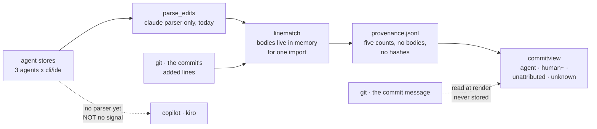

# ADR-AUTHORSHIP — the agent is measured, the human is what is left over

> The five laws in [ADR-LAWS](0001_laws.md) bind this record already and are **not**
> restated here. Cite this record in prose as its NAME, never by number.
>
> **This record was carved out of [ADR-CLAUDE](0004_claude.md) on 2026-08-14** and is the
> reason: authorship is cross-agent, and holding its decisions inside one agent's record
> encoded the very claim this record exists to correct.

---

## §1 · For humans

**In one line:** cage measures what the **agent** wrote by matching the agent's own
proposed lines against the commit, counts only — and never measures the human at all.

> **What is built, said plainly.** The claude line-match path, the four buckets, the
> provenance buffer and the notes distribution all run today. The `declared` column
> decided below **does not exist yet**, and the two corrected gap strings are still the
> old text in code. A record that reads as shipped when it is not is the defect class this
> project has already paid for — so this line stays until the code catches up.

The one thing worth knowing: a person's share is **never observed**, only left over. It
prints as `human~` and the tilde is the point. Lines nothing proposed print as
`unattributed`, and a commit cage cannot speak to prints as `unknown` — three different
absences, never one rounded to zero.

### For the meeting

- We can say *"an agent wrote N of the M lines this commit added"* for commits inside the
  window where the agent's own record still exists. Not a guess — a **verbatim line
  match** against what the agent proposed.
- **The window is the vendor's, not ours.** Claude Code deletes its transcripts after
  ~30 days, so commits older than that can never be matched — by this code or any future
  code. Regular capture is the entire defence.
- **We never infer authorship from the code itself.** No classifier, no style detector, no
  "this looks AI-written". The measured accuracy of that whole family is at or below
  guessing on exactly the kind of code a commit contains — the numbers are in §2.
- **Today only Claude Code has a parser. That is a gap, not a law.** Copilot's and Kiro's
  stores *do* carry the text of a proposed edit; nobody has written the reader yet.

### The flow



<details><summary>Same diagram, ASCII</summary>

```text
  agent stores  ---->  parse_edits  ---->  linematch  ---->  provenance.jsonl
  (3 agents x          (claude parser      (bodies in        (five counts,
   cli/ide)             only, today)        memory for        no bodies,
      |                                     one import)       no hashes)
      |                                         ^                  |
      |                                         |                  v
      |                            git . the commit's         commitview
      |                              added lines             agent | human~ |
      |                                                   unattributed | unknown
      |                                                            ^
      +-- no parser yet ----> copilot . kiro                       |
          (NOT no signal)                     git . the commit message
                                              read at render, never stored
```
</details>

### What we can say, and how much to trust it

| number | where it comes from | trust |
|---|---|---|
| lines an agent wrote in a commit | verbatim match of the agent's proposed lines against the commit's added lines | derived by cage |
| which files an agent proposed in | the agent's own edit records | vendor-recorded |
| the model that wrote it | the commit message's own trailer, read at render time | the commit's claim, not a measurement |
| **the human's share** | — | **absent by design: never measured, only the residual** |
| **any commit older than the vendor's window** | — | **absent: the source is deleted, and no later code can recover it** |
| **copilot and kiro** | — | **absent: no parser yet — their stores do carry edit text** |

### What we can't say, and why

- **A percentage for a commit outside the window.** The agent's record is gone; nothing
  can reconstruct it. This is the vendor's retention policy, not a cage gap.
- **That a human wrote anything.** The automated path may only ever produce `human~` or
  `unattributed`. A bare `human` requires a person to assert it.
- **A clean 100%.** Repeated edits to one file depress the match rate, because only the
  final state is committed. Measured at 44.3% repo-wide. That is the honest shape.
- **Anything about copilot's cloud coding agent.** Its logs are web-only with no read API
  — the one surface here that is structurally out of reach rather than merely unbuilt.

---

## §2 · For agents

### Context

- **Authorship has two arms and they fail differently.** The *historical* arm is bounded
  by vendor retention and is closed by decision; the *breadth* arm is bounded by how many
  parsers exist and is closed by work. Conflating them produced the defect below.
- **THE DEFECT THIS RECORD CORRECTS.** `authorcapture.COVERAGE_GAPS` stated copilot
  (*"its stores record usage and prompts, not the text of an edit"*) and kiro (*"its usage
  log records token counts only, with no tool-input payload"*) as **structural**
  exclusions, and ADR-CLAUDE §2 said *"Claude is the only agent whose store carries the
  text of a proposed edit."* All three were false. Two of the contradicting stores are
  files `importcmd` **already opens every sweep** for tokens and credits.
- **[ADR-COVERAGE](0002_coverage.md)'s own numbered veto had already fired** — *"a vendor
  exposes edit text for copilot or kiro ⇒ `COVERAGE_GAPS` loses that entry"* — and nobody
  noticed, because the trigger was written as a future vendor event when the text had been
  there all along. A veto phrased as *"when they ship it"* cannot fire on *"they already did."*
- **Retention inverts the obvious priority.** Claude, the only agent with a parser, has the
  **worst** historical reach of the three (~30 days, vendor-enforced). Kiro's IDE keeps its
  execution logs with no retention policy at all. A kiro parser would reach further back
  than the claude one ever can.
- **The metadata route does not exist for every agent.** Claude Code stamps a trailer by
  default; Copilot's VS Code default flipped on in 1.117 and back off in 1.119, having
  stamped commits with AI features *disabled* for two months; **kiro writes no trailer and
  sets no git identity at all.** For kiro, content matching is the only route that can ever
  work — there is no declaration to fall back to.

### Decision

**Authorship is measured on the agent only, in counts, with the human as a labelled
residual. Where the agent's record is gone, the share stays `unknown` — it is never
inferred from the code. Where a parser is merely unbuilt, the gap says so.**

- **Counts, never content.** Authorship persists five integers and nothing else
  (`schema.PROVENANCE_COUNT_FIELDS`): `suggested`, `kept`, `kept_modified`, `dropped`,
  `agent_lines`, plus a zero-bearing `residual_lines`. **No line body, and no line hash** —
  a hash is a membership oracle over the source. Bodies exist in process memory for the
  length of one import.
- **Commit *i* owns `(ts_{i-1}, ts_i]`**, upper bound inclusive; resolution is never
  against `HEAD`. Work after the newest commit is left unrecorded this sweep and picked up
  exactly once by the next import after its commit exists.
- **`human` is never written without an attestation.** The automated path produces only
  `human~` (files the session proposed in) or `unattributed` (files it did not). Unknown is
  first-class and is **never redistributed** to make a split total 100%.
- **The pre-window past stays `unknown`.** No option produces a defensible percentage
  there; inventing one to avoid a blank is precisely what the precision principle forbids.
- **The commit trailer is read at render time and NEVER stored.** It renders as its own
  `declared` column carrying the agent and the model string. `PROVENANCE_METHOD_TRUST`
  gains **no fourth rung** — persisting it as a `trailer` method is the signal this
  quarantine has failed. The trailer is re-derivable from git on every read, so storing it
  would duplicate a source cage can always reopen.
- **The `declared` footer states the failure in cluster terms, never as a coverage rate.**
  A trailer fails in clumps, and a *"85% coverage"* footnote smooths over exactly the
  non-randomness that makes it untrustworthy.
- **A gap entry says which store and why it is unread.** *"No parser yet"* with the store
  named — never a structural claim cage has not tested. Only **copilot · cloud coding
  agent** is genuinely structural.
- **Build order for the missing parsers, by reach per unit of work**: copilot · CLI (the
  file is already open every sweep) → kiro · IDE (the largest historical prize, nothing
  deletes it) → kiro · CLI (open the SQLite read-only) → copilot · VS Code. Each lands as
  one entry leaving `COVERAGE_GAPS` and nothing else.
- **Reading diffs is a separate permission** — `[authorship] capture` / `CAGE_AUTHORSHIP`,
  distinct from `[capture] enabled`.

### Consequences

- **The agent share can only be under-counted.** Inflation would require a human to type a
  ≥4-character line byte-identical to an agent proposal, in a file that same session
  proposed in, in that same commit. The safe direction is the one it fails in.
- **Coverage of any repo cage is pointed at is a rolling window, not a backlog.** A repo
  adopted today has a permanently `unknown` past. That is a property to state on the
  surface, not a debt to work off.
- **`commitview` now renders two adjacent questions in incomparable units** — a measured
  share and a self-declared presence. Readers will try to average them; the footer exists
  to stop that, and the columns must never be summed.
- **ADR-CLAUDE keeps the claude *parser* and loses the authorship *decisions*.** A copilot
  authorship parser no longer forces an edit to the claude record — which was the concrete
  absurdity the old ownership produced.
- **This record owns `COVERAGE_GAPS`'s contents**; ADR-COVERAGE keeps the cross-cutting
  rule the five gap tables obey, exactly as its README row already says.

> **⟲ Storage note (P3c, v0.51) — the authorship buffer is month-partitioned.**
> `ledger/provenance.jsonl` became `ledger/provenance/provenance-<month>.jsonl`, chosen
> from each **row's own `ts`** (never a write-time clock — authorship capture is routinely
> backdated, since it attributes commits rather than the present). This **reverses**
> `paths.shard()`'s explicit *"`provenance` is intentionally never partitioned (buffer)"*
> and PLAN §3.6.1's matching exemption; both record the reversal rather than dropping the
> sentence. The premise was right and the conclusion did not follow: **nothing flushes the
> buffer**, so it grew without bound and every read scanned it end to end.
>
> **Nothing about the record itself changed** — same schema, same enums, same
> counts-never-content guarantee, same CI-sole-writer distribution to
> `refs/notes/cage-provenance`, and `cage authorship verify` still always exits 0. The
> legacy file is **read forever and never rewritten**: frozen rows are never backfilled,
> which `residual_lines`' absent-vs-recorded-`0` version gate for `agent%` depends on.
>
> **All five readers span shards**, and they were enumerated rather than assumed:
> `ledger.provenance` · `originrecord.read_all`/`for_sha` · `chats.py`'s `agent%` ·
> `doctorbundle` (which reads the path **directly** and would have under-reported in a
> diagnostic bundle) · `notessync` (which merges by row id, so a partial read re-pushes or
> silently drops rows in the canonical note). A missed shard here does not raise or warn —
> **`agent%` reads counts rather than re-deriving them, so it surfaces as a different
> percentage**, which is why each reader has its own test.

### Alternatives rejected

- **Infer the share from the diff** (classifier, blame shape, whitespace stylometry). The
  benchmark numbers are decisive and irrelevant: 98.65% F1 in-domain, ROC-AUC 0.995 from
  leading-space and blank-line ratios. Out-of-domain the best binary detector scores
  **34.13 macro-F1 against a 45.73 random baseline — worse than guessing**, and **39.36 F1
  on hybrid human-edited AI code**, which is exactly what a commit contains. Five
  commercial detectors on code sit at 0.49–0.61 accuracy, one with a true-negative rate of
  0.0016. There is a proven lower bound on the false-accusation rate of any one-shot text
  detector. **Lost on measurement, not on taste.**
- **Infer from metadata alone** (bot accounts, trailers, config-file presence). A validated
  180M-repo census recovered 28,154 of 850,157 true agent commits — **3.3% recall, a 30×
  undercount**. High precision, unusable recall.
- **Archive raw transcripts** so the vendor's window stops being a wall. Violates
  counts-never-content — a transcript is prompts, responses and whole file bodies — and
  buys nothing cage lacks: provenance rows are permanent once written, so forward coverage
  is already complete with regular capture.
- **Bulk retroactive attestation** of the unmatched past. An attestation outranks every
  inference *by design*, so bulk-attesting months-old recall makes the most trusted rung
  the least reliable. Attestation stays per-sha and deliberate.
- **Persist the trailer as a fourth `method` rung.** It would place a *declaration* on the
  same ladder as a *measurement*, where one arithmetic slip promotes it into a share. The
  read-time rule makes the quarantine structural rather than a naming convention.
- **A `declared` coverage percentage in the footer.** Rejected because the signal fails in
  clusters; a rate implies the failures are spread.

### Reference

Measured on this repo 2026-08-14 — 166 commits, 2026-06-14 → 2026-08-14, from `git log`
and the 104 rows of the provenance buffer, all stamped `2026-08-14T16:40:25Z`
(the first real `authorcapture` sweep):

| finding | number |
|---|---|
| commits line-matched | **66 of 166** (39.8%) |
| oldest matched commit | **2026-07-16** — the vendor's ~30-day wall, not a code limit |
| agent share of added lines, on those 66 | **40,470 / 47,819 = 84.6%** |
| verbatim rate, `kept ÷ suggested` | **85.2%** — *above* ADR-CLAUDE's 68.7% matcher trigger |
| commits carrying a `Co-Authored-By` trailer | **141 of 166** (85.0%), back to the first commit |
| distinct model strings in those trailers | **7** — a provenance row records no model at all |
| commits with neither signal | **18**, of which **9 fall on one day** — the cluster finding |

Two counting traps, recorded because both were hit while producing the table above:
provenance rows are per `(sha, agent, session)` and reach **27 rows on one commit**, so
summing `lines_added` across rows triple-counts a commit's diff — dedupe per sha. And the
added-line denominator includes generated files; a share quoted without naming its
denominator is not reproducible.

Store evidence for the breadth arm, with its confidence stated per row rather than
averaged, is in `work/compare/agent-share-historical-backfill.compare.md` *Amendment*:
VS Code's before/after blob store confirmed at source; copilot CLI confirmed from the
schema shipped in its own package but **not yet from a live file**; kiro from two
independent third-party parsers, never from AWS.

### Veto condition (when to revisit)

**1 — Falsifiable triggers, numbered, each landing somewhere named.**

1. **Inferring the share from the diff** reopens on a published detector reporting **≥90%
   precision on hybrid human-edited AI code, measured on production repositories** with the
   formatter question tested. The current best on that exact cell is 39.36 F1. A benchmark
   score on synthetic data does not move this, and neither does an argument.
2. **The `declared` read-time rule** reopens only if the trailer must join to something git
   cannot re-derive — a signed attestation, a session id. Convenience is not a trigger.
3. **Archiving transcripts** reopens only if a vendor ships an **edits-only export with no
   prompt or response bodies**. A retention-policy change alone is not enough: the law is
   about content, not about time.
4. **The build order** reopens if Claude Code's `cleanupPeriodDays` default rises above
   **90 days** — the retention inversion is the entire argument for placing kiro second.
5. **The trailer parser** reopens if `Assisted-by:` displaces `Co-Authored-By:` in this
   repo's own commits; the parser is spelling-specific and the kernel already mandates the
   other spelling. Trigger: any commit here carrying the new spelling.
6. **A gap entry returns to structural** only with a probe cited. It never reverts to an
   unsourced claim — the failure this record was written to correct.

**2 — Contingent vs. invariant.**

- **Contingent (auto-revisits on evidence):** every `COVERAGE_GAPS` entry; the build
  order; the matcher and its `MIN_MATCH_CHARS` gate (both still triggered from ADR-CLAUDE,
  and both landing in `linematch.match_file` alone).
- **Invariant (moves only by ratified reversal of this record):** the human is never
  measured, only residual · unknown is never redistributed · no line body and no line hash
  is ever persisted · a declaration is never placed on the measurement ladder.

**3 — Deliberately not taken.**

- **A `declared` column for agents other than claude**, though the data supports it today.
  Copilot's trailer default moved twice in three releases and false-positived for two
  months; rendering it now would bank a signal whose meaning is still moving. Threshold:
  two consecutive VS Code releases with a stable default.
- **Signing the provenance note** (`git notes --ref` + GPG) before treating it as
  audit-grade, already flagged in `notessync`. Threshold: the first time a note crosses a
  trust boundary — a second machine, or CI consuming it as evidence rather than as a view.
- **Recomputing ADR-COVERAGE's matrix from the code tables.** Nothing does, so drift
  between that record and `COVERAGE_GAPS` is caught by review alone. That was how the
  defect above survived; naming it here is the interim mitigation, not a fix.
