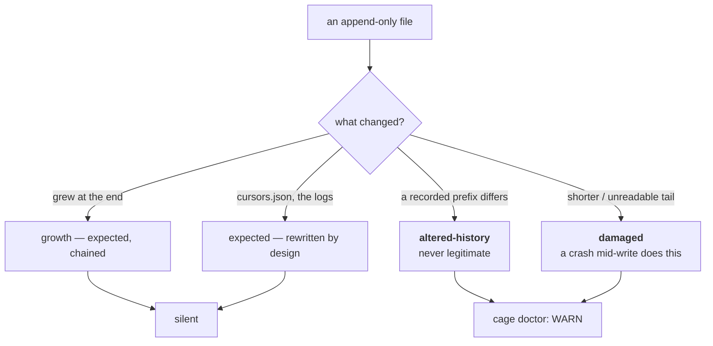

# ADR-INTEGRITY — proving nothing that was already written has changed

> The five laws in [ADR-LAWS](0001_laws.md) bind this record already and are **not**
> restated here. Cite this record in prose as its NAME, never by number.

---

## §1 · For humans

**In one line:** cage keeps a running fingerprint of every append-only file, so if
something that was already recorded ever changes, `cage doctor` says so — and that is all
it does.

The ledger's whole value rests on one promise: **a row, once written, is never edited.**
Every other guarantee — that a re-import dedupes, that history self-heals, that a number
you saw last month is the number you see today — is downstream of it. Nothing was checking
it.

### What it catches, and what it refuses to call tampering



<details><summary>Same diagram, ASCII</summary>

```text
   an append-only file
        |
        +-- grew at the end ................ growth — expected, chained  -> silent
        +-- a recorded PREFIX differs ...... ALTERED-HISTORY             -> doctor WARN
        +-- shorter / unreadable tail ...... DAMAGED                     -> doctor WARN
        +-- cursors.json, the logs ......... expected (rewritten by design) -> silent
```
</details>

**The two verdicts are never blended into one scary word.** *altered-history* means bytes
that were already recorded no longer hash the same — under append-only that is never
legitimate, and it is the only real tamper signal. *damaged* means truncated or unreadable,
which a crash mid-write produces and which `ledger.read` already tolerates **by design**.
Calling the second one tampering would turn a documented fail-open behaviour into an alarm.

### Three things it deliberately is not

- **It is not a gate.** Report-only, always exits 0. It never refuses a read, blocks a
  write, or changes an exit code.
- **It is not a security control.** Anyone who can edit the ledger can edit the manifest.
  It detects accident and drift, not an adversary — see the veto condition.
- **It is not on the hot path.** The chain advances once per `cage import`, never per row.

---

## §2 · For agents

### Context

- **Append-only is the load-bearing law** and it was unverified. A bad merge, a hand-edit,
  a "cleanup" script or a corrupted disk could rewrite recorded rows and every derived
  number would change with no signal at all.
- **A full-file digest per append is not viable.** Cage appends row-by-row on a hot,
  fail-open capture path over a multi-MB ledger; rehashing per row is O(n) per row.
- **`lockutil` is explicitly not built to be load-bearing.** Its contract is that the lock
  closes a wasted-work window and **proceeds unlocked** on a miss; the per-call-site
  id-dedupe is the correctness guarantee. A chain is order-dependent, so a naive design
  would silently promote that lock to a correctness role it does not fill.
- **`state/` files legitimately churn.** `cursors.json` is rewritten wholesale every
  import; the logs are size-managed by cleanup.

### Decision

**A hash chain over appended segments, checkpointed once per sweep, verified by replay,
reported by `cage doctor`, and never able to affect an exit code.**

- **`current = sha256(previous ‖ appended_bytes)`** (`cage/integrity.py`). O(delta) to
  advance. `GENESIS` is a fixed non-empty string so an empty file's chain is
  distinguishable from *never recorded*.
- **The chain advances at SWEEP boundaries, not per row.** `ledger.append_row` is
  **untouched**. Two reasons, both load-bearing: the hot path keeps its exact speed and
  fail-open shape, and the recorded segment list stays short — which matters because
  verification replays it.
- **Verification is O(n) and that is the correct trade.** `verify()` re-reads each file and
  replays the recorded segmentation. Appends must not be O(n); a `cage doctor` run already
  reads the ledger. Replaying rather than comparing one stored digest is what makes a
  change **anywhere** in the file detectable, not just at the tail.
- **A lock miss marks the segment `unverified`; it never breaks the chain.** A stated
  unknown, never a fabricated verdict — the house `—`-with-a-reason pattern. Fail-open
  survives and the chain never lies.
- **Two verdicts, reported separately:** `altered-history` and `damaged`. Plus two
  non-findings that matter as much: `unverified` (above) and `expected` (`BY_DESIGN`:
  `cursors.json`, the logs). **A report its reader learns to ignore is worse than no
  report**, and classifying designed churn as a finding is exactly how that happens.
- **Scope is ledger data *and* `state/`.** The question is *did something change what was
  already written*, and a rewritten cursor is as interesting to someone debugging a
  capture gap as a rewritten shard.
- **The manifest is `state/integrity.json`**, protected by `cleanup.NEVER`, and
  **excluded from its own hashing** — a manifest cannot hash itself; recording would change
  the bytes it just hashed.
- **Never read by a derived view.** Deleting the whole manifest moves zero numeric cells.
- **Determinism:** the chain is a function of file bytes only. A `ts` may be recorded as
  metadata and never enters a hash.

### Consequences

- **`cage doctor` never checkpoints.** Doctor's contract is that running it records
  nothing. It also would have been wrong on the merits: a check that advances the baseline
  it is about to compare against can never report the same finding twice. *(An early draft
  did exactly this and broke the bundle-determinism test — the test caught it, not review.)*
- A first run reports nothing rather than reporting everything: an entry with no recorded
  state is skipped, because *not yet checkpointed* is not a finding.
- A file that **shrank** is not chained further — its recorded state is preserved so the
  truncation can be reported, rather than the shorter file being quietly adopted as truth.
- Bytes appended **since** the last checkpoint are not replayed. They are growth, not
  history, and they will be chained at the next sweep.
- Someone who edits the ledger *and* re-runs `cage import` gets a clean report, because the
  chain advances over their edit. That is the accident/drift threat model working as
  specified, not a hole to plug — see the veto.

### Alternatives rejected

- **A full-file digest per append.** O(n) per row on a hot path over a 22k+ row ledger.
- **A digest per row.** Sound, and it makes the manifest as large as the ledger.
- **Making the lock load-bearing** so the chain is always exact. Rejected: `lockutil`
  proceeds unlocked by contract, and quietly depending on it would break fail-open in a way
  nothing tests. `unverified` states the gap instead.
- **Failing `cage doctor` on a mismatch.** Rejected on the `cage authorship verify`
  precedent. Cage cannot know whether a changed prefix was a corrupted disk or a maintainer
  who meant it, and a check that fails a build over an ambiguity is a check people disable.
- **Signing the manifest.** Rejected as out of threat model and not `$0`/stdlib-shaped;
  see the veto's trigger 1.
- **Reporting designed churn** (`cursors.json`, the logs). Rejected — it would fire on
  every run and train its reader to ignore the one report that matters.

### Reference

- **The constraint that decided the shape**, measured: the real ledger is 66,320 `calls`
  rows across six monthly shards plus 22,751 claude metric rows, multi-MB per file
  ([cross-check](../../work/regression/2026-08-14-calls-vs-metric-crosscheck.md)). A
  per-append full-file digest would rehash all of it per row.
- **The law being protected:** [ADR-LAWS](0001_laws.md), Law 3 — append-only, no row is
  ever mutated.
- **The report-only precedent:** `cage authorship verify`, report-only and always exit 0
  ([ADR-AUTHORSHIP](0009_authorship.md)).
- **The lock's stated contract:** `cage/lockutil.py` — fcntl → msvcrt → proceed-unlocked.

## Veto condition (when to revisit)

**1 · Falsifiable triggers, numbered, each landing somewhere named.**

1. **The threat model changes from accident to adversary.** This detects drift, not an
   attacker: anyone who can write the ledger can rewrite `state/integrity.json`. If cage is
   ever asked to make an *auditable* claim to a third party, this record is reopened and
   the answer is signing or an external anchor (the `refs/notes` CI-sole-writer pattern is
   the nearest existing shape), **not** a stronger hash here. **⚠ UNINSTRUMENTED:** nothing
   measures whether anyone wants that, and no number would tell us — this trigger is
   reopened by a stated need, never by data.
2. **Verification stops being cheap enough to run in `cage doctor`.** It is O(n) over the
   ledger by construction. **The number: if a `verify()` pass exceeds ~2s on a real
   ledger**, it moves behind an explicit flag rather than running on every doctor.
   **Measured 2026-08-15: 14 files, ~5 ms** on a ledger holding 22,802 claude metric rows —
   roughly 400× under the threshold. Not measured on a ledger 10× this one, and the growth
   is linear, so the trigger is real rather than theoretical.
3. **`unverified` becomes common rather than rare.** It exists for a lock miss, which
   should be exceptional. **The number: if more than 1 in 100 checkpointed segments carries
   it**, the lock is failing routinely and *that* is the finding — reopen `lockutil`, not
   this record. **Not currently counted; counting it is the first step if this is suspected.**

**2 · Contingent vs. invariant.**

- **Contingent (auto-revisits on the evidence above):** the segmentation granularity, where
  the checkpoint is called from, what is in `BY_DESIGN`, whether verification stays inline.
- **Invariant — moves only by ratified reversal of this record:**
  - **Report-only. It never changes an exit code, refuses a read, or blocks a write.**
  - **The lock is never load-bearing.** A miss yields `unverified`; it never breaks the
    chain and never makes an append wait on correctness it cannot guarantee.
  - **`ledger.append_row` stays off this path.** Integrity must never make the capture
    write path slower or less fail-open.
  - **Never read by a derived view.** Deleting the manifest moves zero numeric cells.
  - **The two verdicts stay separate.** `damaged` is not tampering, and merging them would
    make a tolerated truncated tail read as an attack.

**3 · Deliberately not taken.**

- **Chaining `refs/notes/cage-provenance`.** The canonical authorship store is already
  CI-sole-writer and git-object-addressed, so it has its own integrity story; adding a
  second one would be two mechanisms disagreeing. **Threshold: a notes ref gains a
  non-CI writer.**
- **A `cage integrity` command.** Not taken — the surface was cut back hard in v0.50 and
  this is a diagnostic, which is what `cage doctor` is for. **Threshold: someone needs the
  verdict in a script, i.e. wants a non-zero exit — which is the invariant above, so it
  would be a reversal rather than an addition.**
- **Recording *who* or *when* a prefix changed.** Only that it did. Anything more means
  retaining more than counts, and the file that would say who is the one that changed.
