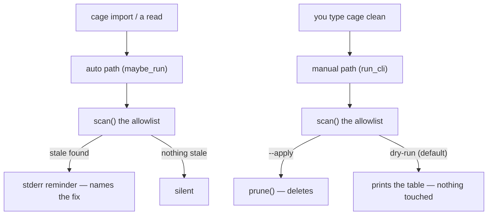

# ADR-CLEANUP — what `.cage/state/` debris may ever be deleted, and why only a typed command does it

> The five laws in [ADR-LAWS](0001_laws.md) bind this record already and are **not**
> restated here. Cite this record in prose as its NAME, never by number.

---

## §1 · For humans

**In one line:** `.cage/state/` fills up with diagnostic byproduct nothing else touches —
cage will tell you what is stale, but it only ever deletes something when you type
`cage clean --apply`.

`state/` is not the ledger. It is debug logs, capture breadcrumbs, session buffers, and
cursor bookkeeping — evidence about *how capture is going*, not usage data itself. None of
it is read by any reported number. But it grows, because nothing ever aged it out on its
own.

### The two paths, and why they diverge



<details><summary>Same diagram, ASCII</summary>

```text
   cage import / a read              you type `cage clean`
        |                                    |
   auto path (maybe_run)              manual path (run_cli)
        |                                    |
     scan() the allowlist                scan() the allowlist
        |                                    |
   stale? -- yes --> stderr reminder    --apply? -- yes --> prune() DELETES
        |                                    |
        no --> silent                    no (default) --> prints the table, nothing touched
```
</details>

**The auto path never deletes, on purpose, forever.** It runs piggybacked on `cage
import` and every read (throttled, fail-open, silent when nothing is eligible) and its
only output is a stderr line naming what's stale and the exact command to fix it. It never
executes that command itself.

### What may be cleaned, and what never can

| may be cleaned | never |
|---|---|
| aged rows in `debug.log` / `capture.log` / `usage-log` / `attest.jsonl` / `hooks-seen.jsonl` | `ledger/` (tool savings included) |
| stale `pending-*.jsonl` session buffers | `cage.toml` / `prices.toml` / legacy `policy.toml` |
| cursor entries whose source log is gone (safe — the next import re-reads) | `limits.json`, `outcomes`, and the fleet study's two leftovers (`machine.json`, `study.jsonl` — unwritten since v0.51, still undeletable) |
| leftover `state/*.tmp` | `imports.jsonl`, `integrity.json` — both unrecoverable audit trails |

The left column is a closed allowlist `scan()` enforces by only ever looking there — not a
convention a future change could accidentally widen. The right column is `cleanup.NEVER`,
asserted at `days=0` (maximally aggressive) so protection never depends on the rows
happening to be fresh.

### What it deliberately does not do

- **It does not run on a schedule.** Cage installs no scheduler, ever (ADR-LAWS Law 1). The
  auto path piggybacks on work you already triggered; nothing wakes up on its own.
- **It does not guess.** A row with no parseable `ts` is kept, never deleted — cleanup
  never deletes what it cannot date.
- **It does not confirm twice.** `cage clean --apply` is the confirmation; there is no
  second prompt, the same contract as `cage policy sync --apply`.

---

## §2 · For agents

### Context

- **Deletion is unrecoverable, so this was manual-only by design from v0.37** — the
  accepted trade-off was that `state/` grows unbounded for anyone who ignores the
  reminder, in exchange for never risking automated data loss. `maybe_run`'s auto path has
  only ever warned; `cleanup.prune`/`run_cli` were always the deletion code.
- **SURFACE-CUT (v0.50) deleted the whole `cage data` group**, and the manual trigger —
  `cage data cleanup --apply` — went with it. `cleanup.py` itself was deliberately kept
  (`importcmd.run` piggybacks `maybe_run` on every sweep; `cage doctor`'s state check calls
  `scan()` for visibility), so the allowlist, the never-list, and the auto-warn contract
  kept working and kept being tested. Only the door to actually delete was gone.
- **The result was a filed, known gap — STATE-RETENTION** (`work/OPEN-WORK.md`): the auto
  reminder kept firing with a runnable fix that did not exist, and `cage doctor`'s state
  check could only apologize, never point at a command.
- **`cleanup.run_cli` was already fully built and tested** before SURFACE-CUT — dry-run
  table by default, `--apply` executes, `(payload, text)` shaped for the CLI emit
  chokepoint. Restoring the verb was wiring, not new design.

### Decision

**Restore the manual path as its own top-level verb, `cage clean`, rather than reviving
any part of the deleted `data` group.**

- `cage clean` (dry-run, the house pattern) / `cage clean --apply` (executes) / `--days N`
  (override the retention window for one run) / `--json`. Dispatches straight to
  `cleanup.run_cli`, unchanged.
- **Runs regardless of `[cleanup] enabled`.** That switch (`policy.cleanup_enabled`) gates
  only the *automatic* reminder (`maybe_run`); an explicitly-typed command is always
  honored, never silently ignored because a policy switch happens to be off — the same
  reading `cleanup.py`'s module docstring already committed to for the (until now
  unreachable) manual path.
- **The auto reminder now names a real fix.** `_reminder_line` used to say "no command
  prunes them — delete by hand"; it now says `run \`cage clean --apply\` to prune them`,
  and `cage doctor`'s state check does the same instead of apologizing.
- **A single top-level verb, not a revived group.** SURFACE-CUT's flattening of `data` was
  itself a decision (fewer, clearer command paths); reviving one member of a dead group to
  host `clean` would be a quiet partial reversal of that decision with no reasoning of its
  own. `clean` has no siblings today, so it needs no group.

### Consequences

- `state/` finally has a real, typed fix a user (or a script) can run — the gap
  STATE-RETENTION filed is closed.
- The auto path's honesty is restored: a reminder that names a command must be able to
  trust that command exists, and now it can (`wiringscan`'s liveness contract, applied to
  cage's own prose).
- No change to the allowlist, the never-list, or the auto-vs-manual split — this is a
  wiring restoration, not a new deletion class or a new retention policy.
- ADR-CLI's command surface grows by one leaf; its counts and examples are updated in the
  same change ([docs/adr/0003_cli.md](0003_cli.md)).

### Alternatives rejected

- **Reviving the whole `data` group for one verb.** Rejected: SURFACE-CUT deliberately
  flattened `data` into top-level and grouped verbs; `clean` has no siblings that would
  justify re-introducing a group only it would live in.
- **Turning `[cleanup] enabled` into an auto-delete switch** (skip the CLI, delete on the
  throttle interval when enabled). Rejected: deletion is unrecoverable, and repurposing a
  flag someone already has set for the *warn* semantics into a *delete* semantics would
  silently start destroying their data on upgrade — the exact hazard manual-only design
  exists to avoid.
- **Folding pruning into `cage doctor --apply`.** Rejected: doctor's contract, restated in
  [ADR-INTEGRITY](0010_integrity.md), is that running it **records nothing** — it
  diagnoses. Adding a mutation there breaks that invariant for a second record just to
  avoid one new verb.

### Reference

`tests/test_cleanup.py` pins the allowlist (`test_every_allowlist_class_ages_out`), the
never-list at maximally-aggressive `days=0` (`test_never_list_survives_days_zero`), the
auto path's warn-never-delete contract and its now-runnable reminder
(`test_maybe_run_warns_but_never_deletes`), and — restored in this change — the CLI
dry-run/`--apply`/`--json`/`[cleanup] enabled`-is-ignored-by-a-typed-command paths through
`cli.main(["clean", ...])`.

### Veto condition (when to revisit)

1. **Falsifiable trigger, and it is currently UNMEASURED.** Cage phones home to nobody, so
   there is no telemetry on whether `cage clean` gets run. The proxy this record commits to
   watching instead: if a `work/regression/` cage-lab snapshot or a dogfood report
   (`work/dogfood/`) shows `cage doctor`'s state check reporting a large, persistently
   non-zero prune-candidate count across multiple runs on a real machine, that is evidence
   the manual verb is not reaching the people who need it, and the auto-delete alternative
   above should be re-argued with that measurement in hand — not from first principles.
2. **Contingent vs. invariant, labelled.** *Manual-only deletion* is **invariant** — it
   follows directly from ADR-LAWS Law 1 (no scheduler) and "deletion is unrecoverable";
   reversing it needs a ratified reversal of this record, not a convenience patch. *Which
   command hosts the verb* (top-level vs. grouped) is **contingent** — revisit if a second
   state-maintenance verb is ever proposed, at which point grouping both under a
   `maintenance` group beats accumulating more top-level names.
3. **Deliberately not taken.** A second confirmation flag on `cage clean --apply` (e.g. an
   itemized `--yes SECTION` like `cage policy sync --apply --yes`). Left open: today
   `--apply` alone is the whole confirmation, matching the rest of the CLI's dry-run/apply
   convention; a per-item confirmation is worth adding only if a future cleanable class
   turns out to need more caution than the current allowlist does.
