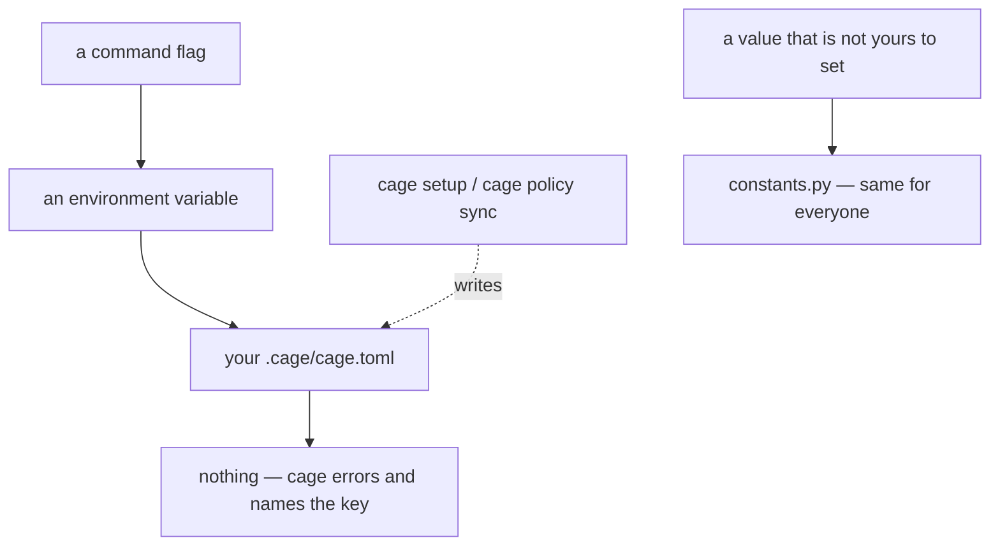

# ADR-CONFIG — the one file that holds your decisions, and the rule for what may be in it

> The five laws in [ADR-LAWS](0001_laws.md) bind this record already and are **not**
> restated here. Cite this record in prose as its NAME, never by number.

> **Status warning, read it first.** The decisions below are ratified. Most are **not in
> the code yet** — today's `cage.toml` still ships dead sections, still hides three live
> knobs, and still defaults through `constants.py`. Every gap is filed in
> [work/OPEN-WORK.md](../../work/OPEN-WORK.md). This record states the target so the next
> change moves toward one shape instead of inventing a second.

---

## §1 · For humans

**In one line:** `.cage/cage.toml` is the only place cage reads your decisions from, and
after this record every setting cage has is written there in full — cage never guesses a
value you did not state.

### Why that is a decision and not a detail

A setting with a hidden default lives in two places at once: the file you edit and the
code you don't. When they disagree, the file looks authoritative and the code wins. Cage
already had six settings in that shape and three more that existed only in code, with no
line in the file at all — none of it failed, and nothing could have caught it.

### How a value is resolved



<details><summary>Same diagram, ASCII</summary>

```text
   a command flag
        |  (absent)
   an environment variable
        |  (absent)
   your .cage/cage.toml
        |  (absent)
   nothing -- cage errors and names the key

   `cage setup` / `cage policy sync`  ---writes--->  your .cage/cage.toml
   a value that is not yours to set   --------->     constants.py (same for everyone)
```
</details>

### What may be a setting at all

| the change it makes | where it lives | example |
|---|---|---|
| changes what cage **does** | `cage.toml` — yours, per project | `[cleanup] days` — how long state debris is kept |
| changes what a number **means** | `constants.py` — a code change, reviewed | the minimum line length that counts as an agent-written line |
| cannot change | `schema.py` — enums | `measured` · `estimated` · `modeled` |

The middle row is the one that matters. If your project and mine set the same knob
differently and our reported numbers stop being comparable, it was never a knob.

### What this deliberately does not do

- It does not decide what any individual setting *means*. `[cleanup]` is
  [ADR-CLEANUP](0011_cleanup.md)'s, `[authorship]` is [ADR-AUTHORSHIP](0009_authorship.md)'s,
  `[sources]` and `[capture]` belong to the agent records. This record owns the file.
- It does not merge two config files. One resolved root, one `cage.toml`.
- It does not fill in a missing value at read time. `cage setup` and `cage policy sync`
  write; a read only ever reads.

---

## §2 · For agents

### Context

**`cage.toml` has been the project config since the `policy.toml` rename and no record
has ever owned it.** `policy` · `policysync` · `tomledit` · `cfgio` · `initcmd` all sat on
`tests/test_adr_ownership.py`'s `NO_RECORD` list, whose docstring makes that placement an
explicit claim: *"Adding a name here is a claim that the module encodes no decision; if it
does, it belongs in `OWNERS` instead."*

**That claim is false, and the drift census of 2026-08-15 measures how false** (numbers in
*Reference*). Three classes, none of which any test could see:

- **Live knobs absent from the shipped file** — `[capture] on_read`,
  `[capture] read_throttle_secs`, `[wiring] python_launcher`. Each has a real reader in
  `policy.py`/`agents.py`, each has an env override, none appears in `data/cage.toml`.
- **Shipped sections with zero readers** — `[budgets]` (USD keys, in a project whose Law 5
  is usage-never-cost), `[quality]`, `[display]`. All three are USAGE-ONLY casualties whose
  keys outlived their subsystems.
- **Surfaces teaching deleted config** — `explain_data.py` still ships the `[display] usd`
  explainer with its full precedence chain; `doctorcmd` still prints `bundled prices
  {prices_version}` in the doctor footer.

**The structural reason is a missing gate, not carelessness.** `test_cli_reference` gates
every command and flag bidirectionally against the live parser, and stops at the CLI
boundary. A config key is not a command, so the entire config surface is ungated — the
same failure class `wiringscan` exists to catch one layer down, in a layer nobody built a
detector for.

**And the defaults were already in two places.** `constants.py` documents a family it
names *"the DEFAULT_CONFIDENCE policy-preferred pattern"* — the constant is the fallback,
the `cage.toml` key wins when present. Six live members. That pattern is also the only
reason a missing key is currently survivable, so it cannot be reasoned about separately
from the strictness decision.

### Decision

**`cage.toml` is the complete, explicit and only declaration of a project's decisions.
Cage reads it, refuses when it is incomplete, and never fills a value in behind your back
at read time.**

- **Scope: this record owns the file, never the meaning of a key.** Resolution,
  precedence, the knob boundary, write discipline, migration and the shipped inventory are
  its. Every section's semantics stay with the record that owns the behaviour, and the
  pointer table below is the map. A restatement of a section's meaning here is a bug in
  this record, on the same terms a restated law is.

  | section | its meaning is owned by |
  |---|---|
  | `[capture]` · `[sources]` | the agent records — [ADR-CLAUDE](0004_claude.md) · [ADR-COPILOT](0005_copilot.md) · [ADR-KIRO](0006_kiro.md) · [ADR-CONSUMERS](0007_consumer.md) |
  | `[cleanup]` | [ADR-CLEANUP](0011_cleanup.md) |
  | `[authorship]` | [ADR-AUTHORSHIP](0009_authorship.md) |
  | `[ledger]` | [ADR-LAWS](0001_laws.md) |
  | `[wiring]` | [ADR-GRAPHIFY](0008_graphify.md) (the shim it selects) |
  | `[debug]` | [CLAUDE.md](../../CLAUDE.md), fail-open-but-never-silent |
  | `[meta]` | this record — it is the file's own bookkeeping |

- **The knob doctrine: a setting may change what cage DOES; never what a number MEANS.**
  A value that changes meaning belongs in `constants.py`, where it is reviewable and
  identical for everyone. The worked precedent is `constants.MIN_MATCH_CHARS`, already
  refused as a knob for exactly this reason.

- **`[tools] order` is demoted to a constant.** Reordering it re-attributes a measured
  saving from one tool to another — the same receipt, a different owner — which is the
  meaning half of the doctrine, not the behaviour half. It is removed from `cage.toml`
  rather than kept as an exception; see *Consequences* for what that costs.

- **No defaults, anywhere. The policy-preferred fallback pattern is abolished.** One
  number, one home. `constants.py` keeps only values that are not settings; every setting
  is declared in the file. A constant that exists to be overridden is a default in
  disguise.

- **A missing key is an error at read, and upgrades stay non-breaking via backfill.**
  `cage setup` and `cage policy sync` write any key the running version knows and the file
  lacks, stamping the shipped value. The read path errors only when backfill is impossible
  — an unwritable file, or a key with no defensible value. A release that adds a knob never
  breaks an existing project, and never silently invents one either.

- **Every key has an environment override, tables included.** Naming is
  `CAGE_<SECTION>_<KEY>`; the existing ad-hoc names are grandfathered by an alias map, not
  by exemption. **A table-valued env var replaces its whole section and is never merged**
  — merging an env-encoded table into a TOML table is where the ambiguity would live, and
  replace-only makes the override auditable in one read.

- **`[meta]` is the single exempt section.** `policy_version` is stamped by
  `cage policy sync`; `cage_version` is derived from `cage.__version__` and deliberately
  absent from the bundle. Cage writes it and cage reads it, so it takes no env override and
  its absence is not a user error. It stays in `cage.toml` rather than moving to `state/`
  because the file is git-tracked and its version stamp describes the file, not the machine.

- **`[sources]` is materialized at `cage setup` from the code registry, and an
  unmaterialized `[sources]` is an error.** Today an absent table captures nothing and says
  so; under this record it refuses instead. Freezing the registry at setup time is what
  makes an upgrade never silently change where cage looks.

- **An unknown key is warned and removed on sync** — named on stderr, then dropped. A key
  cage cannot interpret is either a typo or a retired setting, and both are better surfaced
  than carried forever.

- **Reads fail loud; writes stay fail-open.** A malformed `cage.toml` raises `CageError`
  at the CLI read chokepoint, as it already does. The two-regime split in
  [CLAUDE.md](../../CLAUDE.md) is unchanged — this record only removes the third,
  accidental regime where a broken file silently degraded to a bundled default.

- **Writes never destroy what cage does not understand.** `tomledit` stays the one
  comment-preserving writer: in-place value edits or a deterministic managed block, never a
  whole-file rewrite, re-parsed before replacing the file. A file of a shape cage did not
  write is refused, never coerced — the branch that conflating "nothing to preserve" with
  "a shape I don't understand" once deleted a user's whole file on the default path.

- **`[budgets]`, `[quality]` and `[display]` are deleted** — block, reader, `_SECTIONS`
  entry and explainer together. Decisions by deletion, recorded here because the writers
  outlived their readers and nothing else would say so.

### Consequences

- **The file becomes the complete inventory of every setting cage has.** That is what makes
  the missing-key error enforceable at all — a strict read against an incomplete shipped
  file would just be a trap.
- **The file gets longer, and every release that adds a knob now owes a backfill path.**
  Accepted: a longer file that is true beats a short one with six values hiding in code.
- **A project whose real pipeline differs from the shipped order can no longer say so.**
  `[tools] order` was the one place cage learned an ordering it cannot observe; with it
  demoted, cage asserts an order rather than being told one. This is the sharpest cost of
  the doctrine and it has its own veto trigger below.
- **A table-valued env var is a config format inside a config format**, and it cannot be
  validated the way the TOML is. Bounded, not solved, by replace-only semantics.
- **Ownership moves.** `policy` · `policysync` · `tomledit` · `cfgio` · `initcmd` leave
  `NO_RECORD` for `OWNERS` under this record, in both `tests/test_adr_ownership.py` and the
  table in [README.md](README.md) — the two copies drift with no test catching it, so they
  are edited together.
- **The config surface gains its first gate.** The record's claims are falsifiable only
  with one: every section shipped in `data/cage.toml` is read by `policy`, every key with a
  reader is shipped, every documented env var is consulted, and every key names a section in
  the pointer table. Without it this record is prose and the census below repeats.
- **[ADR-CLI](0003_cli.md) is unaffected.** No command or flag changes; `cage query` gains
  config entries and loses the `[display] usd` one.

### Alternatives rejected

- **No file-level record — let each block's owning ADR document its own keys.** Rejected:
  it is where the surface already was, and it is what produced the census. Resolution,
  precedence, strictness and the knob boundary are properties of the *file*, and a property
  of the file described in seven records is described in none.
- **Keep the policy-preferred fallback pattern for existing keys, apply strictness only to
  new ones.** Rejected: a key with a fallback can never trigger the missing-key error, so
  the file would carry two permanent classes of key and every reader would have to know
  which class it was holding.
- **Hard error on a missing key with no backfill.** Rejected: it reverses the
  never-a-breaking-change decision below, and it makes every release that adds a knob break
  every existing project until a command is run.
- **Environment overrides only where a machine-level override is genuinely needed.**
  Rejected: "genuinely needed" is a judgement call, and exercising it case by case is
  precisely how the current ad-hoc set of five accumulated.
- **Move `[meta]` to `state/` so `cage.toml` holds only user decisions.** Rejected: the
  stamp describes a git-tracked file, so in `state/` it would become per-machine and the
  sync recommendation would differ between two clones of the same repo.
- **Keeping `[tools] order` as a named exception to the doctrine** (its value being a fact
  about the user's pipeline rather than an interpretation). Rejected on ratification: an
  exception argued from intent rather than from effect is the shape every future exception
  would copy.

### Reference

**The drift census, 2026-08-15, over `cage/` at the current working tree.** Reproducible —
each row is a grep against live code, not a claim from a doc:

| finding | evidence |
|---|---|
| `[budgets]` has no production reader | `policy.budgets()`; its only call site in the repo is one assertion in `tests/test_substrate.py` |
| `[quality]` has no reader | the only `quality` references outside `policy.py` are `verbmap` entries recording that `cage task quality` was removed |
| `[display]` has no reader | `display.py` states in past tense that its policy switch **was** `[display] usd`; the section remains in `policy._SECTIONS` |
| a shipped explainer teaches a deleted knob | `explain_data.py` still carries the `[display] usd = true` entry with the chain `flag > env CAGE_USD > policy` |
| the doctor footer prints a dead key | `doctorcmd` renders `· bundled prices {prices_version}` |
| three live knobs are absent from the shipped file | `policy.capture_on_read_enabled` (`[capture] on_read`), `[capture] read_throttle_secs`, `[wiring] python_launcher` — all with readers and env vars, none in `data/cage.toml` |
| defaults live in two places | six members of the *"DEFAULT_CONFIDENCE policy-preferred pattern"* family in `constants.py`, three of whose comments still name the pre-rename `policy.toml` |

**The worked example for the knob doctrine** is already in the shipped file:
`constants.MIN_MATCH_CHARS` is documented as deliberately not a knob, *"it changes what
agent/human/unknown MEAN, which is not a per-project choice."* The doctrine generalizes a
call already made and field-tested, rather than inventing a principle.

### Veto condition (when to revisit)

1. **Falsifiable triggers, numbered — and one of them is currently UNMEASURED.**
   - **The census is the instrument, and it is re-runnable.** If the gate described in
     *Consequences* ships and then reports a **non-zero** count of unshipped-but-read keys
     or shipped-but-unread sections on `main`, the strictness decision is not being held by
     the gate and the gate is wrong, not the decision.
   - **`[tools] order`'s demotion is UNMEASURED, deliberately named as such.** Cage has no
     telemetry and cannot know how many projects run a non-default pipeline order. The
     proxy this record commits to: **one** real project — in `work/regression/` or a
     dogfood snapshot — whose actual tool ordering differs from `constants`' fixed order
     reopens the demotion, and the fix lands as a re-promotion to `cage.toml` with the
     exception reasoning that was rejected above. One is the right number because a single
     counter-example is enough to prove cage is asserting an ordering it cannot observe.
   - **A backfill that cannot run reopens the strictness decision at the read path**, not
     at `policy sync`: if a real environment is found where `cage setup`/`policy sync`
     cannot write (a read-only checkout, a container with the repo mounted read-only), the
     missing-key error becomes unrunnable-by-design and the read path needs a stated
     degraded mode rather than an error nobody can clear.

2. **Contingent vs. invariant, labelled.**
   - **Invariant** — *one file, one resolved root, no merge*; *no defaults at read time*;
     *this record owns the file and never a key's meaning*; *writes never destroy an
     unrecognized shape*. These follow from the laws and from measured failures; reversing
     one needs a ratified reversal of this record.
   - **Contingent** — *`[tools] order` as a constant* (trigger above); *env-var naming and
     the grandfather alias map* (revisit if a rename would break more users than the
     inconsistency costs); *the unknown-key warn-and-remove* (revisit if a downstream tool
     is ever found writing keys into `cage.toml` deliberately).

3. **Deliberately not taken.** **A JSON-Schema-style declared schema for `cage.toml`,
   validated at load.** It would subsume the gate, the missing-key error and the
   unknown-key sweep in one mechanism, and it is the obvious next step. It is declined for
   now on the `$0`/stdlib-only rule — every off-the-shelf validator is a dependency, and a
   hand-rolled one is a second config language to maintain. The threshold that would
   reopen it: the gate in *Consequences* growing past roughly a third check, at which point
   the checks are a schema already and should be written as one.
