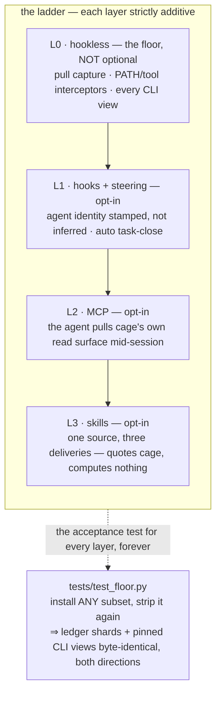

# ADR-LADDER — four layers, one mandatory floor, each layer above it strictly additive

> The five laws in [ADR-LAWS](0001_laws.md) bind this record already and are **not**
> restated here. Cite this record in prose as its NAME, never by number.

---

## §1 · For humans

**In one line:** cage exposes itself to an agent in four layers — only the bottom one is
required — and the standing test is: strip every layer above it, or add any subset back,
and not one derived number moves.

### The flow



<details><summary>Same diagram, ASCII</summary>

```text
   L0  hookless (the floor, NOT optional)
        pull capture . PATH/tool interceptors . every CLI view
        |
        v
   L1  hooks + steering (opt-in)
        agent identity stamped, not inferred . auto task-close
        |
        v
   L2  MCP (opt-in)
        the agent pulls cage's own read surface mid-session
        |
        v
   L3  skills (opt-in)
        one source, three deliveries -- quotes cage, computes nothing

   ============================================================
   tests/test_floor.py: install ANY subset, strip it again =>
   ledger shards + pinned CLI views byte-identical, both directions.
   This is the acceptance test for every layer, forever.
   ============================================================
```
</details>

### What we can say, and how much to trust it

| claim | where it comes from | trust |
|---|---|---|
| L0 alone captures and derives correctly, per agent | `tests/test_floor.py`, parametrized over `agents.SURFACES`, run every suite | derived by cage, continuously verified |
| Adding or stripping L1/L2/L3 moves zero ledger bytes | same test, round-tripped in both directions | derived by cage, continuously verified |
| An MCP tool's output equals the CLI's own stdout, byte for byte | `tests/test_mcp_layer.py` — asserted as equality, not substring presence | derived by cage |
| Every hook event exits 0 even when its own dependency raises | `tests/test_hooks_layer.py`, `cage/hookcmd.py` | derived by cage |
| Which agent fired an L1 hook, for a CLI session | `state/attest.jsonl`, joined on `args_hash` | vendor-recorded (the hook payload), cage-stamped |

### What we can't say, and why

- **Which agent produced a fact inside a VS Code session.** Hooks are CLI-only — they do
  not fire under a VS Code extension. This is the vendor's platform, not a cage gap, and
  every L1-derived fact says so wherever it is shown.
- **Whether a paid call was blocked before it happened.** `budget.check`'s only caller —
  `cage hook budget`, exit 2 under `on_exceed = "block"` — went with the money subsystem
  (ADR-CLEANUP's sibling removal, USAGE-ONLY). Every hook event exits 0 now.
- **Which savings row an attested hook's agent identity belongs to.** `state/attest.jsonl`
  is written by every L1 hook and read by nothing today (a live ADR-LAWS `UNREAD-FACTS`
  entry) — L1 fixed only half of `cage insights adoption`'s agent-blindness.
- **A Kiro session's true start.** Kiro ships no session-start event; its single
  `agentStop` hook self-backfills what it can infer, or declines — never a guess by
  proximity to the most recent task.

---

## §2 · For agents

### Context

- Before this ladder, cage's agent-facing surface was one undifferentiated thing:
  capture, MCP and (a pre-hookless, later-deleted) skill machinery with no stated
  boundary between what was required and what was convenience. The v0.36 hookless
  rebuild deleted the skill/steering code outright; nothing rebuilt it for eleven
  releases, and the README kept advertising it the whole time.
- **Three findings drove the shape:**
  1. L1's headline capabilities were not new features — they were shipped features
     that structurally could not work without a hook. A pull-capture shim runs as a
     subprocess with no agent identity to stamp, and nobody was closing tasks by hand.
  2. L2 shipped with six read tools, but the two that answered *"is this tool worth
     keeping"* were not among them — the product question was invisible to an agent
     mid-session.
  3. Only L3 can carry method-tag honesty into an agent's own reasoning. An MCP call
     hands back a JSON number; nothing forces an agent to notice it is `modeled`, not
     `measured`. A skill can be instructed to relay a refusal verbatim; a raw tool
     response cannot instruct anything.
- **The floor had never been proven before it was extended.** `tests/test_floor.py`
  was written *before* L1/L2/L3, specifically so each layer would be judged against a
  fixed target rather than a moving one.
- **Reality corrected the design within weeks of it shipping**, and this record
  reflects the correction rather than the original build:
  - P1 (L2) added `cage_verdict` and `cage_compare`. Both are gone — USAGE-ONLY took
    `verdict` with the money subsystem, SURFACE-CUT took `compare` with the whole
    task-comparison family. The MCP surface today is two tools: `cage_why` (the one
    read no other surface answers) and `cage_task_outcome` (the one write the whole
    ladder depends on). `cage/mcpserver.py`'s own docstring states the count as "a
    floor, not a trend" — nine, then five, then two.
  - P2 (L1)'s auto task-close was justified by unblocking `compare`/`estimate`/
    `calibration`/NET-1 — all four were deleted whole by SURFACE-CUT and USAGE-ONLY,
    weeks after L1 shipped. Auto-close still runs and still writes `outcome="auto"`
    to `tasks.jsonl`; its original consumers are gone, and nothing in this record
    reopens that as a reason to remove the writer (a reader's deletion never
    licenses stopping the writer it read — a separate, already-standing rule).
  - P2 also gave `budget.check` its first real caller. That caller, and the `BLOCK`
    exit code it used, were removed with the money subsystem. Every hook event exits
    0 unconditionally today; the ladder's original "L1 can stop a paid call before it
    happens" promise no longer holds and is not restated here as current.

### Decision

**Cage's agent-facing surface is a four-layer ladder — L0 hookless (mandatory, the
floor) → L1 hooks + steering → L2 MCP → L3 skills — each layer strictly additive, and
none may ever become a dependency of the layer below it.**

- **L0 is not optional.** Pull capture (`cage import`, capture-on-read), the PATH/tool
  interceptor twins, and every CLI view. This *is* cage; nothing above it exists
  without it, and it must keep working with every layer above stripped away.
- **L1** (`cage setup --hooks`, opt-in; plain `cage setup` is the off-switch) exists
  for exactly two things L0 structurally cannot do: **agent identity, stamped rather
  than inferred** — a hook runs inside the agent, so it can *state* which one fired it
  — and **auto task-close on the session boundary**, writing `outcome="auto"`, which
  is closed for cost-comparison purposes and **invisible** to the ok/redo outcome
  store (`.cage/outcomes.json`) — a session ending is not a job well done, and
  stamping `ok` would inflate the success rate of every session that merely finished.
  L1 is **CLI-only**: it does not fire under a VS Code extension, and every fact it
  produces is a CLI-session fact, said so wherever it is shown.
- **L2** (`cage mcp`) is the agent *pulling* cage's own read surface mid-session.
  Every tool renders through the CLI's own composer and its own renderer, so a
  refusal (`INSUFFICIENT DATA`, a coverage gap, a method-tag caveat) crosses the
  boundary **byte-identically** — asserted as equality with the CLI's stdout, never
  as substring presence. An agent reading an empty result as *zero* is the one
  outcome a tool must never produce. `cage_task_outcome` is the **only** write tool
  in the whole ladder, on purpose — the read/write asymmetry is the design; a second
  write tool is not added by analogy.
- **L3** (`cage setup --skills`, opt-in and separate from `--hooks` — a team may want
  either without the other) is procedural knowledge, never a second copy of a number.
  One `Doc` per skill, rendered from a Python literal at setup time into three
  deliveries (Claude skill · Copilot prompt · Kiro steering) — never three
  hand-maintained copies. **The governing rule, mechanically enforced
  (`steering.lint`): a skill never computes a number — it runs cage and quotes it.**
  Every `cage …` a skill names is checked against the live parser, so a skill
  teaching a dead verb fails the same way a dead verb in prose already does elsewhere.
- **The acceptance gate is `tests/test_floor.py`, forever, not just at launch.**
  Per agent (`agents.SURFACES`, parametrized — an agent missing from the run is a
  failure, never a narrower pass): a project with **zero** wiring artifacts imports
  that agent's real session log to the corpus's exact expected rows, and every
  pinned derived view renders. `agents.install` on the same already-captured project
  must then leave the ledger shards and every pinned view's stdout **byte-identical**,
  and stripping the wiring again must too. **A new layer or artifact is wired into
  the floor by adding a row to `_WIRING_ARTIFACTS` — never by relaxing an assertion.**
- **Every layer's wiring is committed to git, idempotent and byte-identical.** Two
  teammates running `cage setup` must not produce a churning diff; foreign entries in
  a shared file are never touched; a teammate without cage installed gets silence,
  not breakage. Only the ledger records, `out/`, `state/` stay gitignored — team-level
  numbers are the separate `refs/notes/cage-ledger` mechanism, never a committed
  ledger.
- **Three agents, every tier.** A layer ships only when Claude Code, Copilot and Kiro
  all have it, or the gap is named as a limit in the output — `agents.HOOK_GAPS` for
  L1 (Kiro has no session-start; Copilot has no verified pre-tool event, so it gets
  identity and auto-close but no attestation and no budget hook), `agents.
  HOOK_SURFACE_LIMIT` / `HOOK_SHELL_LIMIT` for the two limits that are not per-agent.
  A gap silently narrowing one agent's coverage is the same failure class this
  project has already paid for once (`ADOPT-COV`'s half B), one layer up.

### Consequences

- **Capture already worked with zero layers before this record; that property is now
  regression-tested rather than assumed.** Any future layer inherits the same
  obligation: prove it against `tests/test_floor.py` before it ships, not after.
- **The MCP tool count is explicitly a floor, not a trend, and this record does not
  own which tools exist.** Two of the ladder's original nine tools survive; the other
  seven left with two separate, unrelated decisions (USAGE-ONLY, SURFACE-CUT). This
  ADR is not invalidated by that churn — it governs the *shape* of the layer, not its
  current membership.
- **`state/attest.jsonl` is a standing UNREAD-FACTS line under ADR-LAWS.** L1 buys
  half of `cage insights adoption`'s agent attribution (half A) at the cost of a
  written fact nothing yet reads. That is a stated trade, not an oversight to close
  reflexively — closing it is its own decision with its own trigger (see Veto below).
- **Auto task-close keeps running for a narrower reason than it launched with.** Its
  original consumers (`compare`/`estimate`/`calibration`/NET-1) are gone; a task
  record with no close is a gap independent of which view eventually reads it, and
  removing the writer now would need its own justification under the standing
  reader-vs-writer rule — this record does not supply one.
- **Kiro is structurally one hook-event short of the other two, permanently.** Not a
  bug to close with more inference — a vendor absence, named in `agents.HOOK_GAPS`,
  and `agentStop`'s self-backfill-or-decline behaviour is the ceiling of what is
  possible without guessing by proximity.
- **Every layer's committed-wiring rule inherits the portability discipline other
  records already carry** (the Kiro path-free MCP form, `.cage/bin/cage-run` in every
  committed hook/MCP file) — this record does not re-derive those, it depends on them
  holding.

### Alternatives rejected

- **Making any layer above L0 mandatory.** Rejected structurally: a mandatory L1
  would mean removing hooks changes a number, which `tests/test_floor.py` exists
  specifically to prove never happens.
- **Reviving the pre-hookless skill/steering machinery as-is.** Its premise — "cage
  already ships a skill" — was false by the time L3 was designed; rebuilt from
  nothing under `steering.py`'s one-source-three-deliveries renderer instead of
  patched back to life.
- **A fourth agent, or a layer that only ships on some agents by default.** Out of
  scope for this record; `agents.SURFACES` being three agents is a separate,
  standing product invariant this ladder consumes rather than sets.
- **A network dependency or a scheduler anywhere in L0.** Cage installs no OS
  scheduler by a separate, still-binding decision; L0 stays pull-only regardless of
  what any layer above it adds. Continuous capture stays a named, unresolved item
  (`CONTINUOUS-CAPTURE`) precisely because this alternative was rejected, not because
  nobody thought of it.
- **A second MCP write tool, added by analogy with `cage_task_outcome`.** The
  read/write asymmetry — one read tool answering the one question no other surface
  answers, one write tool the whole ladder depends on — is the design. The module
  docstring states the rejection explicitly, to head off exactly this instinct on a
  future change.
- **Wiring both of Copilot's hook locations.** GitHub loads and combines
  repo-level `.github/hooks/*.json` and user-level `~/.copilot/hooks/*.json`; wiring
  both double-fires the same event. Repo-level wins because it is the one a teammate
  gets on clone — the same portability property Claude's committed hook file already
  has — and the user-level copy is actively stripped, not merely left unwired.
- **Templating the three per-agent wire modules (`claudewire`/`copilotwire`/
  `kirowire`) into one generator.** Rejected for the same reason ADR-GRAPHIFY
  rejected templating its shim twins: Claude's `hooks[]` container, Copilot's
  repo-level JSON file, and Kiro's one-hook-per-file shape diverge enough that a
  shared template would be three templates wearing one name.

### Reference

- **The gate itself:** `tests/test_floor.py` — the four claims (zero-wiring capture,
  add-a-layer-moves-nothing, remove-a-layer-moves-nothing, no skill/prompt/steering
  asset ships by default) asserted per agent, byte-identical on the pinned view set.
- **Per-layer suites:** `tests/test_hooks_layer.py` (opt-in, two-way switch,
  byte-identical reinstall, no machine path in any committed hook file, every wired
  verb live in the parser, no double capture, every event exits 0, every gap named)
  · `tests/test_mcp_layer.py` (every tool's output asserted equal to the CLI's own
  stdout) · `tests/test_skills_layer.py` (`steering.lint`'s banned-arithmetic check,
  every named `cage …` resolved against the live parser, body-byte equality of one
  source across three deliveries).
- **The live tables a gap is read from:** `cage/agents.py` — `HOOK_EVENTS`,
  `HOOK_GAPS`, `HOOK_SURFACE_LIMIT`, `HOOK_SHELL_LIMIT`.
- **The current MCP surface's own history, stated in code:** `cage/mcpserver.py`'s
  module docstring — "nine, then five... a floor, not a trend."
- **The live explainer:** `cage query agent-layers` (`cage/explain_data.py`) —
  the same ladder description, rendered live at the terminal.
- **Built from** the 2026-08-02 agent-surface program — named for the trail, not
  cited as grounding for any claim above: archived as
  `v0.41-agent-surface-layers.proposal.md` / `.handoff.md` / `.prompt.md`.

### Veto condition (when to revisit)

**1 · Falsifiable triggers, numbered.**

1. **The floor gate is the primary trigger, and it is continuous rather than
   threshold-gated.** Any commit on which `tests/test_floor.py` goes red, for any
   agent, in either direction (adding a layer or stripping one), is an automatic
   reopen of "is this layer really additive" for whichever layer changed — no volume
   threshold applies; the test runs every suite, not on a sample.
2. **Kiro's missing session-start.** Revisit auto-close's Kiro behaviour only if Kiro
   ships a session-start-equivalent hook upstream — until then, `agentStop`'s
   self-backfill-or-decline is the ceiling of what is possible, not a target to
   close by inference.
3. **`state/attest.jsonl`'s UNREAD-FACTS status.** Reopens when a second reader is
   built — closing `cage insights adoption`'s half-B `NO_LINK`, or any future
   hook-derived view — or is explicitly deferred with its own line in
   `work/OPEN-WORK.md` under ADR-LAWS, per the standing "a reader may be deleted; the
   writer it read is a separate decision" rule. It is not reopened by this record
   alone.

**2 · Contingent vs. invariant.**

- **Contingent (auto-revisits on evidence, owned by other records):** which tools
  L2 exposes (ADR-CLI/ADR-CLEANUP/USAGE-ONLY territory — this record does not
  reopen when a tool is added or removed) · which skills L3 ships (`steering.DOCS`
  grows without touching this ADR) · whether Copilot ever gets a verified pre-tool
  hook event (`HOOK_GAPS` narrows; the ladder itself does not move).
- **Invariant (moves only by ratified reversal of this ADR):** L0 works alone,
  forever, and no layer above it may become a dependency of a lower one · every
  layer's wiring is committed, idempotent and byte-identical, never machine-local ·
  a layer ships on all three agents or names the gap in output, never silently
  narrower for one · `cage_task_outcome` is the only write tool in the ladder · a
  skill never computes a number.

**3 · Deliberately not taken.**

- **Making L1 mandatory once hook shapes are field-verified on real installs.**
  Hooks are CLI-only forever — a vendor platform fact, not a maturity gap that
  verification closes — so mandating L1 would silently break every VS Code session
  regardless of how well-verified the CLI path becomes. No threshold reopens this.
- **A fourth agent.** No trigger is named because none is a live candidate; adding
  one is a different record's decision to make, not a gap in this one.
- **A scheduler or network call anywhere in L0**, even if L1–L3 all eventually
  depend on fresher data. The pull-only law belongs to a different record
  (ADR-LAWS/ADR-CLI) and is not reopened by anything in this one.
