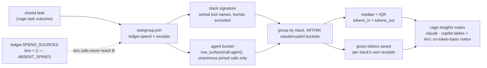

# ADR-MATRIX — a token-cost view across tool combinations, honest about a tool with no receipts yet

> The five laws in [ADR-LAWS](0001_laws.md) bind this record already and are **not**
> restated here. Cite this record in prose as its NAME, never by number.

---

## §1 · For humans

**In one line:** one row per tool combination actually *observed* on a closed task —
`agent-only`, `agent + graphify`, and eventually `agent + graphify + caveman` — computed
**independently for claude and copilot** (never blended into one cross-agent number),
tokens only. **Kiro has no token table at all** — Kiro's on-disk store gives cage
nothing summable, so this view states that plainly instead of ever showing a number for
it. A tool with zero receipts renders as an honestly-empty row, never a faked or
modeled number sitting inside a measured table.

### The flow



<details><summary>Same diagram, ASCII</summary>

```text
   closed task (cage task outcome)
        |
        v
   taskgroup.join  --  ledger.spend() + receipts
        |                    ^
        |                    |  ledger.SPEND_SOURCES["kiro"] = ()  (ABSENT_SPINES)
        |                    |  kiro calls never reach this join — structural, not a
        |                    |  TASK-GRAIN-SPINE-contingent gap
        +--> stack signature  --  sorted tool names, human excluded
        |
        +--> agent bucket  --  row_surface(call.agent), unanimous joined calls only
        |
        v
   group by stack, WITHIN claude/copilot buckets
        |
        +--> median + IQR of tokens_in + tokens_out  --\
        |                                                >--> cage insights matrix
        +--> gross tokens saved, per stack's own receipts /    (claude · copilot tables
                                                                 + kiro: no-token-basis
                                                                 notice, never a table)
```
</details>

### What it will look like

**PROPOSED shape — not GATED, not CAPTURED.** `cage/matrixview.py` does not exist
(MATRIX-BUILD, `OPEN-WORK.md`), so this is not byte-pinned to a golden the way
[ADR-CLI](0003_cli.md)'s output blocks are — it is the target rendering this record
commits to, to be gated the same way (`tests/test_output_spec.py` +
`tests/test_adr_output_blocks.py`) the day it ships.

```text
$ cage insights matrix
Tool-combination matrix · closed tasks only · tokens, never priced · per agent, never blended

── claude ───────────────────────────────────────────────────────────────────────────
stack                        tasks   tok in    tok out   tokens (median)  iqr (q1–q3)      saved (gross)
---------------------------  -----   -------   --------  ---------------  ---------------  -------------
agent-only                      33   150,220     49,880          201,340  164,900–248,100               —
agent + graphify                 16    81,040     25,660          106,900   84,200–128,900         33,120
agent + graphify + caveman        0         —          —                —                —               —

── copilot ──────────────────────────────────────────────────────────────────────────
stack                        tasks   tok in    tok out   tokens (median)  iqr (q1–q3)      saved (gross)
---------------------------  -----   -------   --------  ---------------  ---------------  -------------
agent-only                       6    24,110      8,340           32,900   28,100–37,600               —
agent + graphify                  3     9,880      3,220           13,050    9,900–15,400          4,210
agent + graphify + caveman        0         —          —                —                —               —

· copilot also records a vendor CREDITS figure on some rows (COPILOT-CREDITS,
  `schema.make_call`/`make_copilot_metric`'s `credits` field) — real, but not this
  table's basis and not shown here; tokens power `ledger.spend()` for copilot
  (`SPEND_SOURCES["copilot"]`), credits do not. Never blended into the columns above.

── kiro ─────────────────────────────────────────────────────────────────────────────
Kiro has no token spend basis on this install — permanent, not a day-one gap.

`ledger.spend()` — what this whole view is built on — excludes Kiro by design
(`ledger.ABSENT_SPINES["kiro"] = "no IDE token store on this install"`): the one file
that could carry a summable count (`tokens_generated.jsonl`) was field-probed
2026-08-14 and found non-summable (28 rows, 0 out-tokens, a repeated identical block),
so cage refuses to build a spine from it rather than print a fabricated figure.
Kiro's real usage is recorded in **credits**, a different unit
(`ledger.credits`/`schema.make_credit`) this tokens-only view does not read.

Kiro tasks that DO close still show up in the `unattributed` count below — they have
no joined calls to derive an agent bucket from — but this view cannot label them
"kiro" today. `cage query kiro-credits` for Kiro's real, credits-denominated usage.

── unattributed (2 closed tasks) ───────────────────────────────────────────────────
Joined calls that named more than one agent, or none at all — never split across the
tables above by guess. `cage insights matrix --csv` / `--json` carry these rows too.

· stack = the sorted tool receipts OBSERVED on a task's joined calls (taskgroup.join,
  GROUP_KEYS="stack") — never a configured pipeline. `human` excluded.
· agent bucket = every joined call's own `agent` field, mapped through
  `agents.row_surface`. A task lands in claude/copilot only when its joined calls
  **unanimously** name one surface; disagreement or absence goes to "unattributed",
  never a majority-vote guess. Never read from `tasks.jsonl`'s own `agents` field — no
  live writer populates it today (TASK-AGENTS-FIELD-DEAD, `OPEN-WORK.md`); fixing that
  is also the one path that would let a zero-call kiro task be correctly counted as
  "kiro" here instead of folding into `unattributed` (see §2 Decision).
· tokens (median)/iqr are MEASURED — recorded tok in + tok out on closed tasks only.
· saved is GROSS — excludes the cost of USING the tool. `cage query gross-vs-net`
· "agent + graphify + caveman": 0 tasks everywhere — caveman files no receipts yet, so
  no task can join this row. UNOBSERVED, not zero-saving — never read this as "caveman
  saves nothing."

── modeled (pre-adoption — never blended into any table above) ──

tool      method    status
--------  --------  ------------------------------------------------------------
caveman   modeled   INSUFFICIENT-DATA — no receipts and no corpus source yet

Now run:  cage insights matrix --agent copilot   ·   cage insights graphify   ·   cage query gross-vs-net
```

Once caveman ships receipts and a row is real, the modeled block above simply stops
rendering — there is nothing left to project once a stack is measured.

### What it looks like on day one, before TASK-GRAIN-SPINE is fixed

**This blocks claude and copilot equally — kiro's block is separate and does not go
away when this one closes.** `cage insights commits` — the other live consumer of
`taskgroup.join` — already ships a golden fixture where every commit's `tok in`/
`tok out` render `—` and the footer states *"N commit(s) unattributed — no joinable
call"* (`tests/fixtures/goldens/A1.txt`, [ADR-CLI](0003_cli.md)). The matrix inherits
the identical join, so it inherits the identical day-one shape for its two token
tables:

```text
$ cage insights matrix
No closed tasks joinable to a tool combination yet — claude or copilot.

· 0 of N closed tasks joined a call — claude and copilot have carried no `task` field
  on a call row since their metric-tree cutover (P5 / KIRO-CALLS-LEG); only a
  consumer/custom row (`cage.meter` library usage) still does. TASK-GRAIN-SPINE.
· This blocks the claude and copilot tables equally — it is not a per-agent gap
  between the two of them.
· Kiro is not part of this count and never will be by fixing TASK-GRAIN-SPINE — see
  the kiro block above. Its gap is `ledger.ABSENT_SPINES`, a different, permanent fact.

next: cage task outcome TASK_ID   close a task manually so it can join a call
      cage query gross-vs-net     what "gross" means once a stack does show
```

This block is proposed alongside the populated one above, not a substitute for it — the
honest state a fresh install actually sees is this one, and `matrixview.py` should
render it rather than bare empty tables (the same reasoning
[`insights chats`](0003_cli.md) applies to its own empty-ledger state). The kiro block
in the populated mock-up above renders unconditionally, regardless of TASK-GRAIN-SPINE —
it is not part of either day-one or steady-state; it is simply always that text.

### What we can say, and how much to trust it

| number | source | trust |
|---|---|---|
| tasks per stack, per agent (claude/copilot only) | `taskgroup.closed_tasks` + `join`, bucketed by joined calls' `agent` | derived by cage |
| tokens (median / IQR) | `ledger.spend` — `tokens_in`+`tokens_out` | vendor-recorded, rolled up by cage |
| saved (gross) | `ledger.receipts` — tool savings rows | derived by cage, only for a tool that has filed at least one receipt |
| agent bucket | `agents.row_surface` over each joined call's own `agent` field | derived by cage, unanimous-only |
| kiro token figures | — | **never present** — `ledger.SPEND_SOURCES["kiro"] = ()`, structural |
| `agent + graphify + caveman` row | — | absent, with the reason (below) |

### What we can't say, and why

- **Caveman's row is `0 tasks`, not a saving estimate.** Caveman has no receipt writer
  yet — that is caveman's limitation, not this view's. A `0` here must never be read as
  "caveman saves nothing."
- **No dollar figure, ever.** This surface never resolves a `display`/`prices` context —
  the usage-never-cost law binds every view cage ships, this one included.
- **A stack signature is what was observed, not what was configured.** A task run with
  graphify installed but never invoked still reads `agent-only`. This view cannot see
  intent, only receipts.
- **An agent bucket is what the joined CALLS say, not what the task claims.** A task
  whose joined calls disagree on agent (or carry none) is `unattributed` — it is never
  guessed by proximity, label, or majority.
- **Kiro is not "claude/copilot with a smaller sample" — it is a different measurement
  regime, permanently, not a gap this record's other fixes close.** `ledger.spend()`,
  what `taskgroup.join` is built on, contains zero Kiro rows by design
  (`ledger.ABSENT_SPINES`) — Kiro's real usage lives in **credits**
  (`ledger.credits`/`schema.make_credit`), a different unit this tokens-only view was
  never asked to read (Arpit's original ask, `work/compare/tool-combination-matrix.
  compare.md`, was tokens-only). This is stronger than the TASK-GRAIN-SPINE gap that
  blocks claude/copilot day-one: TASK-GRAIN-SPINE closes with a code fix and the claude/
  copilot tables start populating; kiro's block does not move when that happens — it
  moves only if Kiro ships a real, summable on-disk token store, or this record is
  reopened to add a separate, clearly-labeled credits table (Veto §5, deliberately not
  designed here).
  - **A closed kiro task is not invisible, just unlabeled here.** If a kiro task has
    receipts (say, a graphify saving) but — as always — zero joined calls, it still
    counts in `unattributed`, indistinguishable from a claude/copilot task whose join
    genuinely failed. The one path to fix that mislabeling without inventing a credits
    table: fix TASK-AGENTS-FIELD-DEAD (`OPEN-WORK.md`) so `tasks.jsonl`'s own `agents`
    field is actually populated at close time, and let this view fall back to reading
    it **only** when the joined-calls derivation found zero evidence (§2 Decision). That
    would put a zero-call kiro task in a correctly-labeled "kiro: N tasks, tokens `—`
    (no basis)" line instead of `unattributed` — still no token number, but honestly
    counted and named.
- **Coverage is not equal across claude and copilot either — two separate reasons,
  both named, never blended:**
  - **Getting a task closed at all.** Claude's hooks (`session-start`, `session-end`,
    `tool`) make auto-close plausible once TASK-GRAIN-SPINE is fixed. Copilot's hook
    names are cage's own and unverified against any vendor doc, and even firing they
    carry no session id in the shape cage reads — auto-close closes zero Copilot tasks.
    Manual `cage task outcome` is the reliable path for copilot today (and for kiro,
    which has no `session-start` trigger at all and whose one hook declines to
    auto-close, `agents.HOOK_GAPS` — moot for its token table, but still true for
    whether a kiro task closes and can be counted in `unattributed`/a future kiro line).
  - **Whether `+graphify` can ever appear once a task IS closed.** kiro's **IDE**
    surface can never show it — its store persists no assistant output at all (0/26
    probed, 2026-08-07), so there is no command and no result to detect
    (`graphifytx.GRAPHIFY_COVERAGE`). This is now moot for kiro's *token* figures (it
    never had any), but still shapes whether a kiro task's *receipts* show `+graphify`
    at all, which matters the day TASK-AGENTS-FIELD-DEAD makes a labeled kiro line
    possible. copilot's two surfaces do capture `+graphify` cleanly today.
  - **Caveman's per-agent coverage is an open question**, not yet a documented gap —
    it has no design, so there is nothing to name here yet (see Veto condition §3).

---

## §2 · For agents

### Context

- SURFACE-CUT (v0.50.0) deleted `cage insights matrix`/`compare` along with the whole
  money-priced reporting surface it belonged to (`CHANGELOG.md` `## v0.50.0`). The join
  engine underneath, `taskgroup.py`, was **not** deleted — `commitjoin.py` still depends
  on it, so it stayed live and fed by real data the whole time.
- **`taskgroup.join`'s task-id join currently has almost nothing to join, for claude and
  copilot alike — TASK-GRAIN-SPINE (`OPEN-WORK.md`), not something this record
  introduces.** Since the P5/KIRO-CALLS-LEG ledger restructure (2026-08-15) moved
  claude, copilot and kiro onto per-producer metric trees, none of their rows carry a
  `task` field — only a `calls` row does, and per `taskcorr.py`'s own docstring, "the
  raw agent logs carry no task id, so an imported call row lands with `task=""`."
  `hookcmd._open_tasks` states the same fact in the live auto-close path: *"`calls` is
  the only kind carrying a `task`, and claude/copilot stopped writing it; KIRO-CALLS-LEG
  moved kiro's rows out too... An open task is therefore only findable for a
  consumer/custom row."* This is not hypothetical — `cage insights commits`, the other
  live consumer of this join, already ships a golden fixture
  (`tests/fixtures/goldens/A1.txt`) where every commit's tokens render `—`, unjoined.
  `taskcorr.py`'s heuristic correlation pass exists to patch this but ships **disabled
  by default** and, even enabled, consumed by no live view yet.
- **Second, separate finding — Arpit caught this reviewing the per-agent mock-up,
  2026-08-15: Kiro is not merely blocked by TASK-GRAIN-SPINE, it has NO token spine at
  all, structurally, and never did.** `ledger.py`'s own `SPEND_SOURCES` table —
  `{"claude": ("request",), "copilot": ("chat", "cli-delta"), "kiro": ()}` — gives Kiro
  an *empty* tuple, and `ledger.ABSENT_SPINES = {"kiro": "no IDE token store on this
  install"}` names why: Kiro's only candidate on-disk token store, `devdata.sqlite`, is
  "not present on a real Kiro install," and the fallback file
  (`tokens_generated.jsonl`) was field-probed 2026-08-14 and found "28 rows totalling
  1,576 in / 0 out, model `\"agent\"` on every row, and a byte-identical 6-row block
  repeated — it is not summable, so a spine built on it would be a fabricated number,
  not a measured one" (`ledger.py` comment above `ABSENT_SPINES`). `spend()`'s own loop
  confirms the mechanism: `if agents.row_surface(r.get("agent")) in SPEND_SOURCES:
  continue` suppresses any stray Kiro `calls` row outright, and the metric-reader loop
  below it does `if not allowed: continue  # ABSENT_SPINES — no token store; never a
  fabricated zero row`. Kiro's real usage lives in `ledger.credits` /
  `schema.make_credit` — a **credits** unit, deliberately excluded from `spend()`
  (`ledger.CUMULATIVE_SOURCES["kiro"]`: *"kiro-CLI usage is credits, read by
  ledger.credits — never tokens"*). This is a structural, install-level fact about
  Kiro's own on-disk stores, not a join-contract gap TASK-GRAIN-SPINE closing would fix
  — the original per-agent mock-up (same-day, earlier revision of this record) showed a
  populated "kiro" token table, which was wrong: `taskgroup.join`'s calls come from
  `ledger.spend()`, and Kiro contributes zero rows to it, always.
- Arpit asked (2026-08-15) for exactly this question: token cost/savings by tool
  combination, across `agent-only` / `agent+graphify` / a proposed future
  `agent+graphify+caveman` (caveman: an unbuilt Tier-2 compressor). Compare doc
  [work/compare/tool-combination-matrix.compare.md](../../work/compare/tool-combination-matrix.compare.md)
  (`MATRIX-REVIVAL`) laid out the fork; **verdict B accepted by Arpit, 2026-08-15.**
- **Same-day amendment, 2026-08-15:** Arpit asked that the matrix work "for claude,
  kiro, copilot independently" — combinations of 2 or 3 tools (`agent+graphify`,
  `agent+graphify+caveman`), computed per agent, never pooled into one cross-agent row.
  Recorded as claude/copilot tables plus an explicit, permanent kiro exception (this
  Context section, above) once the SPEND_SOURCES finding surfaced.
- **New finding, made while designing the per-agent split: `tasks.jsonl`'s own `agents`
  field is write-path dead.** `taskgroup.stats()` already reads
  `trow.get("agents") or []` (line 127) as if it were populated, but every live caller
  of `tasks.record()` omits `agents=` — `hookcmd._session_end`
  (`tasks.record(root, tid, outcome=AUTO)`, line 147) has the agent identity in hand
  (it is a required hook argument) and still does not stamp it; `clicmds.close_task`
  (line 197) and `clicmds.cmd_task_time` (line 230) never pass it either. So
  `taskgroup.stats()`'s `"agents"` output is `[]` on every real task today. Filed
  separately as **TASK-AGENTS-FIELD-DEAD** (`OPEN-WORK.md`) rather than fixed as part
  of MATRIX-BUILD, per the SURFACE-CUT rule that a reader's needs and a writer's
  correctness are separate decisions — but now has a second, stronger reason to matter:
  it is the only realistic path to ever labeling a zero-call kiro task correctly in
  this view (Decision, below), since kiro tasks structurally never produce a joined
  call to derive an agent bucket from.
- **Precedent for deriving an agent set live from joined rows instead of trusting a
  stored field:** `commitview.py` already does exactly this for authorship —
  `"agents": sorted({p.get("agent", "") for p in prov_rows} - {""})` (line 285) reads
  the provenance rows a commit actually joined, never a cached label on the commit
  itself. This record's agent-bucketing rule is the same pattern applied to
  `taskgroup.join`'s calls instead of `commitjoin`'s provenance rows.
- Why this is its own record rather than a section inside ADR-CLI, departing from the
  precedent that `chats.py`/`commitview.py` carry no dedicated ADR: the load-bearing
  decision here is not "add a view," it is a **cross-tool honesty rule** — how a
  savings-producing tool with zero receipts is represented so it can never look like a
  measured zero-saving, how an agent-blind join is turned into a per-agent one without
  ever guessing, and (as of this correction) how a whole agent with no token unit at
  all is represented without silently going missing or getting a fabricated number.
  That is the same class of decision ADR-GRAPHIFY made for its four-route dedup, not a
  rendering choice ADR-CLI's existing scope already covers. Confirmed with Arpit
  directly, 2026-08-15, rather than defaulted to the ADR-CLI-owns-it pattern.

### Decision

**A new, narrow, tokens-only view — `cage insights matrix` — built entirely on
already-measured data, rendered as two independent per-agent tables (claude, copilot),
an explicit permanent no-data notice for kiro, and an `unattributed` bucket, with a hard
rule that a tool with no receipts renders as an honestly-empty row, never a modeled
placeholder sitting inside a measured table.**

- Module `cage/matrixview.py` (not yet built) computes, per **(agent bucket, stack
  signature)** pair, for **claude and copilot only**: `n` closed tasks, median/IQR of
  `tokens_in`+`tokens_out` (the same `statistics.quantiles` estimator
  `graphifymodel._dist` already uses), and gross tokens saved from `ledger.receipts`.
- Stack signature is `taskgroup`'s own existing definition, unchanged: the sorted set of
  `tool` values on a closed task's joined receipts, `human` excluded, empty ⇒
  `agent-only`.
- **Agent bucket is derived, never stored by default, and requires unanimity — with one
  explicitly-scoped fallback for the zero-evidence case.** For a closed task's joined
  calls (`taskgroup.join_rows`'s own `calls` list — already computed for the stack
  signature's tokens), take `{agents.row_surface(c.get("agent")) for c in calls} -
  {"", "lib"}`.
  - Exactly one member ⇒ that task's bucket (claude or copilot; a kiro member cannot
    occur here — `ledger.spend()` never emits one).
  - More than one member ⇒ `unattributed` (calls from more than one surface joined the
    same task, most plausibly via the session-window fallback).
  - **Zero members** ⇒ fall back to `tasks.jsonl`'s own `agents` field
    (`trow.get("agents")`) **only in this case** — if it names exactly one surface, use
    it; otherwise `unattributed`. This fallback is currently a no-op in practice
    (TASK-AGENTS-FIELD-DEAD: the field is never written today) but is the named,
    designed mechanism by which a kiro task — which will *always* hit this zero-call
    branch, since Kiro contributes nothing to `ledger.spend()` — could ever be counted
    as "kiro: N tasks" instead of silently inflating `unattributed`. It never overrides
    a call-derived bucket; it only fills the gap when calls gave zero evidence at all.
  - This mirrors the stack-signature rule's own spirit — derive from what actually
    joined first — while giving the one population (kiro) that structurally never joins
    a call a real, if still tokenless, way to be named rather than lost.
- **Kiro renders no token table.** `matrixview.py` prints a fixed, unconditional notice
  (§1's "kiro" block) rather than three empty rows — an empty table with a `0` in every
  cell would read as "kiro used nothing," when the true state is "cage cannot measure
  this in tokens on this install." A `0`-row table and a no-data notice are different
  claims, and this view must never blur them. If the `agents`-field fallback above
  someday finds kiro tasks, the notice becomes a one-line count (task total, receipts if
  any) with every token column still `—` — never a fabricated token figure standing in
  for credits.
- `taskgroup.group`'s `GROUP_KEYS` gains no new member for this — agent is a pre-filter
  on the row set (two separate calls into the existing `stats()`/`group()` pair, one
  per agent bucket, plus one pass for `unattributed`), not a fourth grouping key blended
  into the stack table. Keeping it a pre-filter, not a key, is what guarantees the
  tables can never be silently re-summed by a future `--by agent` flag that forgets the
  no-blend rule.
- No `prices` import, ever, and no `display` context resolved — the same discipline
  `commitview.py` already states for itself ("no USD on this surface, by design"). No
  `credits` field either, on this view, for the same reason `tokens` and `credits` are
  never averaged anywhere else in cage: they are different units.
- A tool with zero receipts (today: caveman) never enters any measured table as a row
  with fabricated numbers. It is either absent from every table entirely, or — once it
  has ≥`MIN_ESTIMATE_N` receipts of its own — surfaced in a separately labelled
  `modeled` section, never blended into any agent's measured rows.
- `--agent claude|copilot` filters to one table (`--agent kiro` prints the same fixed
  notice §1 shows, not an error — kiro is a real, named agent, just one with nothing to
  tabulate here); bare `cage insights matrix` prints both tables, the kiro notice, and
  `unattributed`. `--csv`/`--json` carry `unattributed` rows too — the CSV/JSON contract
  never drops a bucket a text reader would otherwise see, same discipline as every other
  `--csv` view in `csvout.py`. Kiro is represented in `--csv`/`--json` output as a
  documented sentinel (e.g. a `"basis": "absent"` row), never simply missing without
  explanation.

### Consequences

- Commits cage to a second consumer of `taskgroup.join` beside `commitjoin` — any future
  change to the join contract now has two call sites to keep in sync, not one.
- Reopens task `label`/`outcome` as a read fact — it is currently on OPEN-WORK's
  `UNREAD-FACTS` list precisely because `compare`/`calibration` (its old readers) were
  deleted; this view is that gap's remedy.
- Rules out ever reviving `compare.py`'s USD path under this name. Dollar-priced
  comparison, if ever wanted again, is a reversal of USAGE-ONLY — not an extension of
  this record.
- A caveman row that stays `0 tasks` indefinitely, in every table, is the **expected**,
  honest state, not a bug — the veto condition below names when that becomes worth
  acting on.
- **MATRIX-BUILD inherits TASK-GRAIN-SPINE as a real dependency for claude and
  copilot, not a footnote.** Shipped against today's ledger, this view renders the
  near-empty day-one state for both tables (§1) until that item closes — building
  `matrixview.py` does not itself fix the join, and must not silently paper over the
  gap with a timestamp-proximity guess (`_open_tasks` already refuses that pattern;
  this view refuses it too). MATRIX-BUILD's own OPEN-WORK entry names this explicitly.
- **TASK-GRAIN-SPINE and Kiro's ABSENT_SPINES gap are two different dependencies and
  must never be conflated as one "coverage" problem.** TASK-GRAIN-SPINE is a join-
  contract defect with a known fix and a close condition; the claude/copilot tables
  populate the day it lands. Kiro's gap is a fact about what Kiro itself persists on
  disk — fixing TASK-GRAIN-SPINE moves it not at all. Only a real Kiro token store
  shipping, or a deliberately separate credits-basis view (Veto §5), moves it.
- **Once TASK-GRAIN-SPINE closes, claude/copilot coverage still diverges** — closing a
  task at all favors claude (full hook set) over copilot (manual `cage task outcome`
  required in practice, per §1). This view surfaces that divergence; it does not create
  it, and it must never average it away into one blended number.
- **The per-agent split multiplies the render surface, deliberately.** One table becomes
  up to five sections (claude, copilot, kiro-notice, `unattributed`, `modeled`) — every
  one of them renders even when the underlying data is empty (a table with 0 rows still
  prints its header and a `0 tasks` state, per the day-one block in §1; kiro's notice
  prints unconditionally), because a section silently missing from the output is
  indistinguishable from a section with nothing to show, and this record's whole
  discipline is not tolerating that ambiguity anywhere else.
- **`unattributed`'s count is a health signal for the claude/copilot join, but ONLY
  once TASK-AGENTS-FIELD-DEAD is fixed — until then it has a permanent, unrelated
  floor from every closed kiro task**, which always hits the zero-joined-calls branch
  and (with the fallback field unpopulated) always lands in `unattributed` today. A
  reader must not treat `unattributed` as pure noise-signal before that field is fixed;
  it is a mix of two populations (true join failures, and every kiro task) with no way
  to separate them until then.
- Fixing TASK-AGENTS-FIELD-DEAD later (stamping `agents=[agent]` in
  `hookcmd._session_end` and `clicmds.close_task`) is now **more than a nice-to-have for
  this view** — it is the one designed mechanism (Decision, above) by which a kiro task
  is ever correctly counted instead of diluting `unattributed`. It remains additive for
  claude/copilot (their bucketing never needs it, since calls already resolve them) —
  the urgency is kiro-specific.

### Alternatives rejected

- **Leave it cut, answer the question via `cage query`.** Rejected — the data already
  exists and nothing reads it; "explain a number" and "compute one" are different jobs,
  and this question has no number to explain yet.
- **Fold into `cage insights commits --by-stack`.** Rejected — conflates the per-commit
  grain with the per-closed-task grain: two different joins wearing one flag.
- **Resurrect `compare.py` unmodified.** Rejected outright — it priced totals in USD via
  `prices.call_usd`, exactly what SURFACE-CUT and USAGE-ONLY removed cage from doing.
- **Model caveman's row today from graphify's own history band, so no combination ever
  prints `0 tasks`.** Rejected — that credits caveman with graphify's measured behavior,
  which is fabrication, not projection. `graphifymodel.history_band` stays scoped to
  `tool == "graphify"`.
- **Read `tasks.jsonl`'s own `agents` field as the primary source for the per-agent
  split.** Rejected as a *primary* source — it is write-path dead today
  (TASK-AGENTS-FIELD-DEAD): every live caller of `tasks.record()` omits `agents=`, so
  the field is `[]` on every real row. It is kept as the documented **fallback only for
  the zero-joined-calls case** (Decision, above), where it is the sole route to ever
  naming a kiro task — but deriving from joined calls first, always, is what keeps
  claude/copilot's numbers grounded in the same measured data as everything else in this
  view.
- **Attribute a mixed-agent task to whichever agent has the most joined calls
  (majority vote).** Rejected — a silent tie-break or majority rule is exactly the class
  of guess `_open_tasks` already refuses for session matching and `chats.py` already
  refuses for `agent%`; a task touched by two agents is a real, nameable fact
  (`unattributed`), not noise to average away.
- **Add `agent` to `taskgroup.GROUP_KEYS` so one call to `group()` returns every bucket
  at once.** Rejected — `GROUP_KEYS` is shared with `commitjoin`'s consumers via the
  same module; widening it couples a matrix-only concept (agent bucket, derived from
  calls) into a key set `commitjoin` never asked for. A pre-filter in `matrixview.py`
  keeps the coupling one-directional.
- **Build a Kiro token figure from `tokens_generated.jsonl` directly, bypassing
  `ledger.spend()`'s exclusion.** Rejected outright — this is the exact fabrication
  `ledger.ABSENT_SPINES`'s own comment already rejected at the ledger layer (28 rows,
  0 out-tokens, a repeated identical 6-row block, "not summable, so a spine built on it
  would be a fabricated number, not a measured one"). This view inherits that refusal;
  it does not get to relitigate it one layer up.
- **Convert kiro's credits to an approximate token figure so its table has numbers
  too.** Rejected — `schema.make_credit`'s whole reason to exist is that credits and
  tokens are not fungible without a real, vendor-published rate, and `make_call`'s own
  `credits` docstring already rejected "derive credits from tokens by token share" for
  the inverse conversion. A cage-invented tokens-per-credit constant would be exactly
  the same category of fabrication, just aimed the other direction.

### Reference

- `cage/taskgroup.py` module docstring — the stack-signature definition and
  `GROUP_KEYS = ("stack", "scope", "label")`, both pre-existing and unchanged by this
  decision; `taskgroup.py` line 127 — the existing but dead `"agents"` field in
  `stats()`'s own output, evidence for TASK-AGENTS-FIELD-DEAD.
- `cage/ledger.py`'s `SPEND_SOURCES`, `ABSENT_SPINES`, and `CUMULATIVE_SOURCES` — the
  live-code evidence that Kiro contributes zero rows to `ledger.spend()`, permanently,
  by design, and that Kiro's real usage is a **credits** figure read by
  `ledger.credits`, never `spend()`. `spend()`'s own docstring and loop (`if not
  allowed: continue  # ABSENT_SPINES — no token store; never a fabricated zero row`) —
  the mechanism this record's kiro notice is grounded in.
- `cage/schema.py`'s `make_credit` (Kiro-CLI's credits row) and `make_call`'s `credits`
  parameter docstring (COPILOT-CREDITS) — why credits and tokens are never
  interconverted anywhere in cage, the same discipline this record's kiro block and
  copilot caveat both inherit.
- `cage/graphifymodel.py` — the live precedent for a labelled, refusable `modeled` band
  that is never summed into a measured total (`history_band`, `repo_ceiling`).
- `cage/compress.py` module docstring — "The learned Tier-2 compressor is a pluggable
  adapter over this same receipt shape," the stated integration point a future caveman
  would use.
- `CHANGELOG.md` `## v0.50.0` — what SURFACE-CUT actually deleted and why (a live
  source; the decision record itself is archived and is named only, never cited, per
  [docs/adr/README.md](README.md)).
- [work/compare/tool-combination-matrix.compare.md](../../work/compare/tool-combination-matrix.compare.md) —
  the fork, the fact table, and the accepted verdict this record ratifies.
- `cage/taskcorr.py` module docstring and `cage/hookcmd.py`'s `_open_tasks` — live-code
  evidence for the TASK-GRAIN-SPINE claim: claude, copilot and kiro calls carry no
  `task` field since the P5/KIRO-CALLS-LEG cutover, and the correlation pass that could
  patch it ships disabled by default.
- `tests/fixtures/goldens/A1.txt` (via [ADR-CLI](0003_cli.md)'s `insights commits`
  example) — the measured, already-shipping proof that an unjoined task/commit renders
  `—`, not a guess: this view inherits that exact behavior from the same join.
- `cage/graphifytx.py`'s `GRAPHIFY_COVERAGE` — the per-agent × surface table this
  record's §1 per-agent caveat is grounded in, in particular kiro-IDE's structural zero
  — now understood as a caveat about kiro's *receipts*, since kiro never had a *token*
  figure to begin with.
- `cage/agents.py`'s `HOOK_EVENTS`/`HOOK_GAPS` — why closing a task at all is
  claude-favored today (full hook set) versus copilot (manual `cage task outcome`);
  `agents.row_surface`/`_ROW_AGENT_SURFACE` — the exact mapping this view's agent-bucket
  rule reuses (`"claude-code"` → `"claude"`; everything else identity).
- `cage/schema.py`'s `CALL_FIELDS` and `make_call`'s `agent` parameter (default `"lib"`)
  — the per-call field this view's agent bucket is derived from; `RECEIPT_FIELDS`
  carries no `agent` field at all, confirming a receipt's agent must come from its
  task's joined calls, never the receipt row itself.
- `cage/hookcmd.py` line 147 (`_session_end`) and `cage/clicmds.py` lines 197
  (`close_task`) and 230 (`cmd_task_time`) — the three live `tasks.record()` call sites,
  none passing `agents=`, the evidence for TASK-AGENTS-FIELD-DEAD.
- `cage/commitview.py` line 285 — the precedent this record's agent-bucketing rule
  follows: derive an agent set live from the rows a commit/task actually joined, never
  from a cached field.

### Veto condition (when to revisit)

1. **Falsifiable trigger — contingent.** If `agent + graphify + caveman` stays at `0
   tasks`, in every table, for 90 days after caveman ships its first receipt-writing
   code (mirroring `constants.CLEANUP_DEFAULT_DAYS`'s own 90-day bar for "long enough
   to mean something"), the three-way row is dropped back to a two-column view
   (`agent-only`, `agent + graphify`) in each table until a real third combination is
   actually observed. **Not yet instrumented** — no code exists to measure this until
   the view ships; stated as aspirational, not assumed true.
2. **Invariant.** No dollar figure ever appears on this surface. Moves only by a
   ratified reversal of USAGE-ONLY, never by extending this record.
3. **Deliberately not taken.** A day-one "is caveman worth building" projection, the way
   `graphifymodel.repo_ceiling` answers that for graphify pre-adoption. Left open because
   caveman has no defined corpus/counterfactual yet to bound such a projection — the day
   caveman's own design names one, this ADR gains a `history_band`/`repo_ceiling` twin,
   not a redesign.
4. **Falsifiable trigger — contingent, added 2026-08-15, narrowed same-day after the
   kiro correction.** If `unattributed` regularly exceeds the sum of the claude/copilot
   tables **after** TASK-AGENTS-FIELD-DEAD is fixed (so kiro tasks are no longer its
   permanent floor) and real volume exists, the unanimous-joined-calls bucketing rule is
   too coarse and this record's Decision is reopened. Before that fix, a nonzero
   `unattributed` baseline from kiro tasks alone is expected and is **not** this
   trigger. **Not yet instrumented**, same as trigger 1.
5. **Deliberately not taken.** A separate, credits-denominated companion table for Kiro
   (and optionally a second one surfacing copilot's own `credits` field alongside its
   tokens) — named here so it is not silently ruled out, but not designed: it is a
   different unit from everything else this record measures, needs its own honesty
   rules (a credits figure has no `saved`/gross-vs-net analogue defined anywhere in cage
   today), and was not part of Arpit's tokens-only ask. If wanted, it is a new decision
   with its own fact table, not an extension bolted onto this one.
