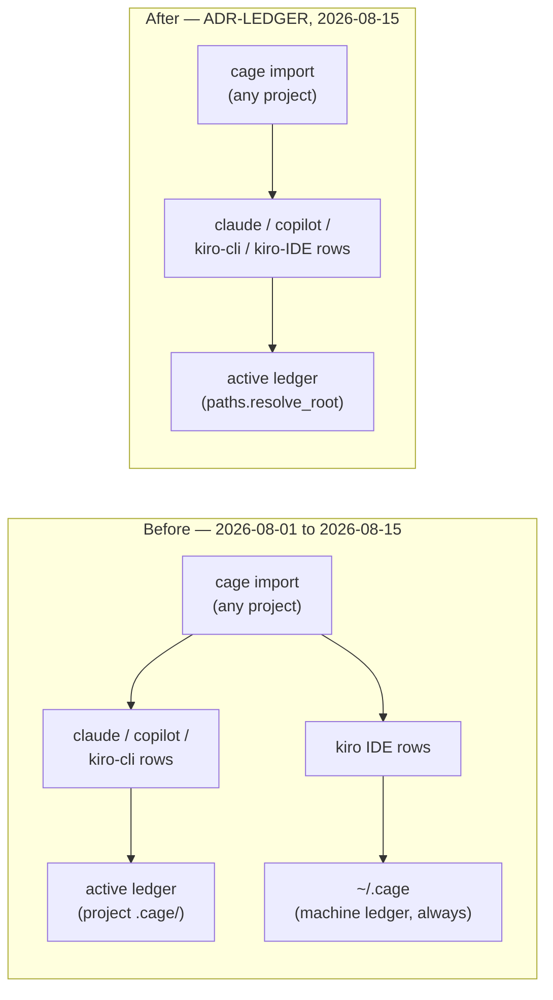

# ADR-LEDGER — one active ledger per run, no exceptions

> The five laws in [ADR-LAWS](0001_laws.md) bind this record already and are **not**
> restated here. This record narrows Law 2's own text — see that record's Law 2, updated
> in the same change as this one. Cite this record in prose as its NAME, never by number.

---

## §1 · For humans

**In one line:** whichever ledger is active for a `cage import` run — the project's, or
`~/.cage` when no project is found — now captures *everything*, including Kiro's IDE
tokens; nothing is diverted to a separate machine-only ledger anymore.

From 2026-08-01 to 2026-08-15, Kiro's IDE token log was the one deliberate exception to
"one sink per run": because that log carries no project field of its own, its rows were
always written to `~/.cage`, never to whichever project ledger was actually active. That
was a considered choice, grounded in a real measurement (a fresh workspace's ledger
picked up 22 rows that belonged to a *different* workspace). It is now reversed: **every
source captures into the active ledger, full stop.** The row that used to hide in
`~/.cage` now shows up in the project you were actually working in when you ran
`cage import` — at the cost of also showing up again in any *other* project's ledger
that happens to import the same machine-wide log.

### For the meeting

- **The rule is now the same for every agent, with zero carve-outs.** `cage import`
  resolves one ledger for the run and every configured source — Claude, Copilot, Kiro CLI,
  Kiro IDE — writes into it. There is no second, hidden write anywhere in the capture path.
- **This trades a known-good guarantee for a simpler mental model.** The old rule made
  cross-project double-counting *structurally impossible* for Kiro IDE rows. The new rule
  makes it possible again — accepted, not overlooked — in exchange for "check `.cage/` in
  the project you're in and you'll see everything cage captured there," with no second
  place to look.
- **Nothing about what a Kiro IDE row can say changed.** It still carries no project, a
  constant `session="kiro"`, and usually a `0` output-token count. Landing in a project
  ledger is not new information about where the work happened — it is the same
  machine-wide fact, just stored somewhere different.
- **The reversal is total, not partial.** `paths.kiro_ledger` — the one function that
  used to answer "which ledger does Kiro IDE write to" — now always answers "the one this
  run resolved," the same answer every other agent's routing already gave.

### The flow



<details><summary>Same diagram, ASCII</summary>

```text
  BEFORE (2026-08-01 to 2026-08-15)
    cage import (any project)
        |-- claude / copilot / kiro-cli rows --> active ledger (project .cage/)
        +-- kiro IDE rows --------------------> ~/.cage (machine ledger, ALWAYS)

  AFTER (ADR-LEDGER, 2026-08-15)
    cage import (any project)
        +-- claude / copilot / kiro-cli / kiro-IDE rows --> active ledger
                                                              (paths.resolve_root:
                                                               --ledger/CAGE_BASE ->
                                                               nearest project .cage/ ->
                                                               ~/.cage)
```
</details>

### What we can say, and how much to trust it

| number | where it comes from | trust |
|---|---|---|
| which ledger a run wrote to | `paths.resolve_root` — unchanged by this record | vendor-independent, cage's own resolution logic |
| that a Kiro IDE row lands in the active ledger | `paths.kiro_ledger` always returns the run's `root` | mechanism, not inference — true by construction |
| **that a Kiro IDE row's presence proves the work happened in that project** | — | **absent: the row carries no project field; presence in a ledger is not provenance** |

### What we can't say, and why

- **Whether a Kiro IDE row imported into project A also sits in project B's ledger.**
  Cage does not cross-reference ledgers to detect this — that is a machine-wide log,
  read independently by however many projects import it, and each import is a complete,
  correct read of its own ledger. Detecting duplication *across* ledgers is out of scope
  for this record (see Known gaps).
- **A per-project Kiro IDE total.** Unchanged from ADR-KIRO: the source itself has no
  project dimension, so no number derived from it earns `measured` at project grain,
  regardless of which ledger it's stored in.

---

## §2 · For agents

### Context

- **The originating measurement.** [work/regression/2026-08-01-finding-kiro-rows-double-count-across-ledgers.md](../../work/regression/2026-08-01-finding-kiro-rows-double-count-across-ledgers.md)
  found 22 of 28 rows captured for one workspace were actually turns from a different
  workspace — the evidence that grounded ADR-KIRO's original routing decision. **That
  measurement is not disputed by this record.** The cost it documents is real and is
  explicitly re-accepted here, not argued away.
- **The exception was itself the problem.** ADR-LAWS Law 2 states "exactly one active
  sink per run, never a double-write" as a cross-cutting invariant, and ADR-KIRO carved
  out the one place cage broke it — with its own lock ordering, its own cursors, its own
  manifest, entirely to avoid writing Kiro IDE rows into two places whose union nobody
  asked for. That mechanism worked, but it meant **"the active ledger" was not actually
  where everything cage captured lived** — a user reading `cage import`'s own summary
  line, or opening `.cage/ledger/` in their project, would not find Kiro IDE rows there
  even when Kiro was correctly configured and correctly capturing, because those rows
  were, by design, somewhere else.
- **The direct trigger.** A live debugging session (2026-08-15): a user asked a question
  in Kiro inside a project directory, ran `cage import`, and the row did not appear
  where they were looking (`.cage/` in that project). Investigation confirmed capture
  was working correctly — the row landed in `~/.cage`, exactly as ADR-KIRO specified.
  The routing was not broken; it was *surprising*, and the user's explicit call, having
  had the mechanism explained, was that "surprising but correct" is the wrong trade for
  a tool whose entire value proposition is "look in one place and trust what you see."
- **What did NOT change.** Kiro CLI's `conversations_v2` routing is untouched — it was
  never part of the exception this record reverses, because it already resolves against
  the active ledger's workspace scoping (`paths.kiro_cli_workspace`), the same as every
  other project-attributable source. This record's entire surface area is the IDE half.

### Decision

**Every configured source captures into the run's one resolved ledger. There is no
per-agent routing exception anywhere in the capture path.**

- **`paths.kiro_ledger(root)`** — formerly the function that resolved Kiro IDE's separate
  machine sink (`global_home()`, or `root` itself only when running with an explicit
  `CAGE_BASE`) — now **always returns `root`**. It is kept as a stable call site rather
  than deleted outright, so a caller asking "where does Kiro IDE write" gets an answer
  that is trivially and permanently correct, without needing to know this record exists.
- **`paths.kiro_routed(root)`** — formerly the function answering "is there a separate
  sink, and if so where" — now **always returns `None`**. Every read-side consumer that
  branched on this (`chats.kiro_routed_line`, `doctorcmd`'s capture-timeline check) was
  written to treat `None` as "not routed away, nothing to explain" — so both go correctly
  inert with no code change of their own required. Their stale comments/docstrings were
  updated in this same change per the standing documentation rule.
- **`importcmd._kiro_leg` and `importcmd._drop_routed_kiro_state` are deleted**, not just
  made unreachable. They existed only to serve the routed exception: a self-contained
  second capture leg with its own lock, cursors, health and manifest bookkeeping against
  a *different* root than the sweep's own. With `paths.kiro_routed` always `None`, nothing
  ever called either function again; leaving dead code that looks load-bearing is worse
  than removing it, because a future reader has to re-derive that it's unreachable instead
  of being told.
- **`import_kiro` (the sweep's own per-agent runner) is unchanged in shape.** It already
  ran `run_agent(root, "kiro", ...)` against whatever `root` it was handed — the special
  case lived entirely in `run()`'s decision about *which* root to hand it for Kiro, and in
  the separate `_kiro_leg` invocation alongside that. Removing both means Kiro simply
  falls through the same loop as claude and copilot, with the same `root` they get.
- **No change to what is captured, only where it lands.** `transcript.parse_kiro_ide_log_metrics`
  is untouched — same file, same four fields, same line-index+hash dedupe, same
  `source="ide-log"` kind (KIRO-CALLS-LEG, unaffected). This record is exclusively about
  the sink a row is written to, never about what a row contains.

### Consequences

- **Cross-project duplication of Kiro IDE rows is now possible, and undetected.** The
  same underlying turn, imported from two different projects' `cage import` runs, is
  stored as a separate row in each ledger. Cage does not merge, flag, or warn about this
  — each ledger's own read is internally correct; only a cross-ledger view could see the
  duplication, and cage has no such view (see Known gaps).
- **`cage import`'s own summary and `.cage/ledger/kiro/` in a project now show Kiro IDE
  activity whenever Kiro was used and imported from that project** — closing the exact
  surprise that triggered this record. A user who runs `cage import` in a project after
  using Kiro there sees the row where they're looking.
- **The machine ledger (`~/.cage`) loses its one distinguishing role.** Before this
  record, `~/.cage` was the sole home of Kiro IDE facts even when a project ledger
  existed elsewhere on the same machine. Now it behaves exactly like any other resolved
  root: active only when no project `.cage/` is found, or when named explicitly.
- **`importcmd.py` loses a code path with real complexity** (~80 lines: a second lock
  acquisition, a second cursor/health/manifest cycle, a second import_id) — one fewer
  place a future capture bug can hide, at the cost of the guarantee that complexity
  bought.
- **ADR-KIRO's former invariant — "a source with no project dimension is not stored at
  project level" — is reversed by this record**, per that invariant's own stated
  mechanism ("moves only by ratified reversal of this ADR"). ADR-KIRO's text is updated
  in the same change to strike that line rather than silently drop it.

### Alternatives rejected

- **Keep the routed exception, but surface it more loudly** (e.g. a louder `cage import`
  summary line naming where Kiro rows actually went). Rejected: this treats the symptom
  a user hit, not the cause — "everything is in one place except this one agent" is a
  standing surprise no amount of better messaging fully removes, and the user explicitly
  asked for the simpler invariant instead.
- **Route Kiro IDE rows to BOTH the active ledger and the machine ledger.** Rejected on
  Law 2 itself: "never a double-write" is not a style preference, it exists specifically
  to prevent the same turn being counted as present in two places with no way to tell
  they're the same fact. This would reintroduce that failure mode deliberately.
- **Detect and dedupe cross-project duplication at read time**, so the active-ledger
  routing could ship without accepting the cost. Rejected as out of scope for this
  change: it requires a cross-ledger read at view time, which none of cage's current
  renderers do (each resolves and reads exactly one ledger), and building that machinery
  was not part of what was asked. Left open — see Known gaps.
- **Make routing configurable** (a policy flag choosing per-agent behavior). Rejected:
  cage's routing has always been a mechanism, not a setting a user tunes per run — a
  configurable sink would mean two users' `.cage/` layouts are no longer comparable by
  the same set of rules, which is precisely the kind of drift ADR-CONFIG's "what may be
  a setting at all" gate exists to keep out.

### Reference

- **The field-probe measurement this record's accepted cost rests on** (unchanged from
  ADR-KIRO, re-cited here because this record is the one now accepting the cost it
  documents): [work/regression/2026-08-01-finding-kiro-rows-double-count-across-ledgers.md](../../work/regression/2026-08-01-finding-kiro-rows-double-count-across-ledgers.md) —
  workspace-off 22 rows, workspace-on 28, of which 22 were the same turns from another
  workspace.
- **The live debugging session that triggered this record** (2026-08-15): a user's
  `cage import` after a Kiro IDE turn in a project directory did not show the row in
  that project's `.cage/` — traced to correct-but-surprising routing per ADR-KIRO,
  discussed with the user, and reversed by direct instruction the same day.
- **ADR-KIRO**, whose routing decision this record reverses, and which carries the full
  two-store context (IDE vs. CLI) this record does not repeat: [ADR-KIRO](0006_kiro.md).
- **ADR-LAWS**, Law 2, updated in the same change to remove the routed-exception clause
  this record retires: [ADR-LAWS](0001_laws.md).

### Veto condition (when to revisit)

**1 · Falsifiable triggers, numbered.**

1. **Cross-project duplication becomes measured, not theoretical, harm.** If a user
   reports (or a lab measurement shows) that duplicated Kiro IDE rows across two or more
   project ledgers materially distort a number they rely on — not merely "the row
   appears twice if you go looking for it," but a total or average a real workflow
   depends on — this record's decision reopens with that measurement named.
2. **A cross-ledger dedupe view gets built.** If cage ever grows a view that reads more
   than one ledger at once (explicitly out of scope today — no such reader exists), the
   duplication this record accepts becomes detectable, and the accepted-cost framing
   should be revisited against what that view can now show.
3. **Kiro's IDE log gains a real project/workspace field.** Orthogonal to this record's
   own decision (this record is about *where rows land*, not *what they contain*), but
   the moment IDE rows are genuinely project-attributable, per-project routing stops
   being a policy question and becomes simply correct — see ADR-KIRO's own veto
   condition for that trigger.

**2 · Contingent vs. invariant.**

- **Contingent (auto-revisits on evidence above):** whether cross-project duplication is
  accepted or actively prevented; whether a cross-ledger dedupe view exists.
- **Invariant (moves only by ratified reversal of this record):** **every configured
  source captures into the run's one resolved ledger — no per-agent routing exception,
  ever, regardless of what dimensions that source's rows do or don't carry.** This is
  the line ADR-KIRO's former invariant occupied before this record reversed it; it does
  not revert to a per-agent carve-out without an equally explicit ratification naming
  the specific agent and the specific evidence.

**3 · Deliberately not taken.**

- **A `cage doctor` warning for likely cross-project duplication** (e.g. flagging when
  the same Kiro IDE row-id appears in more than one project's ledger, if a user opts
  into scanning for it). Left open, not built: it would require reading outside the
  active ledger, which no doctor check does today. **Threshold to reopen:** a user asks
  for this by name, or trigger 1 above fires.
- **A `--no-kiro-ide` or similar per-run opt-out**, letting a user who cares about the
  duplication cost exclude Kiro IDE from a specific ledger's imports. Left open:
  `[sources.kiro]` in `cage.toml` already allows disabling the source entirely per
  project, which covers the same need at the config layer without a new flag.
  **Threshold to reopen:** a user asks for run-level (not config-level) granularity.
