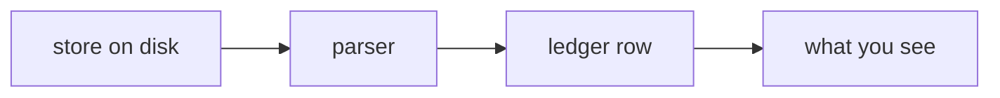

# ADR-<NAME> — <what cage meters here, in one clause>

> Copy to `000N_<name>.md`, keep both sections, delete these quote blocks.
> The five laws in [README.md](README.md) bind this record already — **restate none of
> them.** Cite a law only where this agent bends, tests, or nearly broke it.
> Cite in prose as **ADR-<NAME>**, never "ADR 000N" (see README).
>
> **⚠️ Frontmatter is a plain `key: value` block, not free prose, and a bare colon
> breaks it.** Never write `word: ` (colon immediately followed by a space, or by the
> end of a line) inside a `status` or `update-rule` value — it reads as the start of a
> new field to any real parser and to `tests/test_adr_frontmatter.py`, which fails the
> suite the moment it appears. Use an em dash (`—`) or a comma instead: `"such a
> change — it reassigns…"`, never `"such a change: it reassigns…"`. This has broken
> two records already (`0002_coverage.md`, `0009_authorship.md`) — the test exists so
> a third time is caught before merge, not found on the next read.

---

## §1 · For humans

> One screen. Lead with the answer. No module names, no field names. A reader who stops
> after the first two lines has the useful part.

**In one line:** <what cage gets from this agent, and how much to trust it>.

### The flow

> A Mermaid block, then the SAME diagram as ASCII in a `<details>` block. Both are
> required — Mermaid renders on GitHub, ASCII survives a terminal `cat` and a diff.
> **They are hand-paired, like the shim twins.** Change one, change the other in the same
> edit; a drifted pair is worse than one diagram.



<details><summary>Same diagram, ASCII</summary>

```text
  store on disk  ->  parser  ->  ledger row  ->  what you see
```
</details>

### What we can say, and how much to trust it

> A table: **number · where it comes from · trust**. Trust is one of *vendor-recorded* ·
> *derived by cage* · *absent, with the reason*. Never a percentage of confidence.

### What we can't say, and why

> Every absence, one line each, each naming **whose limitation it is**. An absence that
> is the vendor's is not a cage gap and must not read as one. Never write `0` for absent.

---

## §2 · For agents

> Dense on purpose. Everything binding lives here.

### Context

> The forces. Field-proven facts beat speculation — cite them. What broke, what is in
> tension, why the obvious option is not the chosen one.

### Decision

> The verdict in bold, once, then specifics as points. Present tense.

### Consequences

> What this commits the codebase to and what it now rules out — including the ones that
> cut against the decision.

### Alternatives rejected

> One point each, with **why each lost**. This is what stops a future agent re-proposing
> a dead idea.

### Reference

> **Required — an ADR that only asserts is incomplete.** A measurement, a probe, a
> worked example. Ground the claim; don't assert it.

### Veto condition (when to revisit)

> **Required.** Three parts:
> 1. **A falsifiable trigger, numbered** where the decision is volume- or
>    measurement-gated. Name the number *and* where the change lands. A veto reopenable
>    only by a measurement, never an argument. Say so explicitly when a trigger is not
>    yet instrumented — a veto you cannot compute is aspirational.
> 2. **Contingent vs. invariant, labelled.** Contingent auto-revisits on evidence;
>    invariant moves only by ratified reversal of this ADR.
> 3. **Deliberately not taken** — an option declined but left genuinely open, with its
>    own threshold, so its absence reads as a choice and not an oversight.
